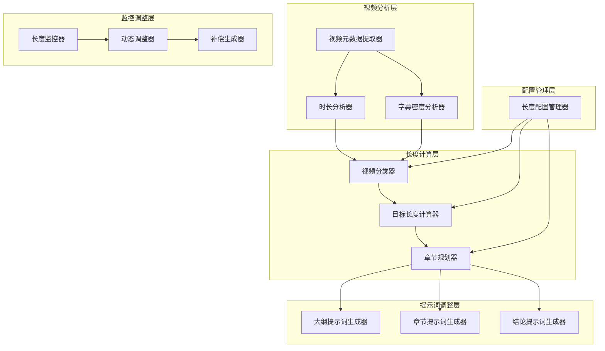
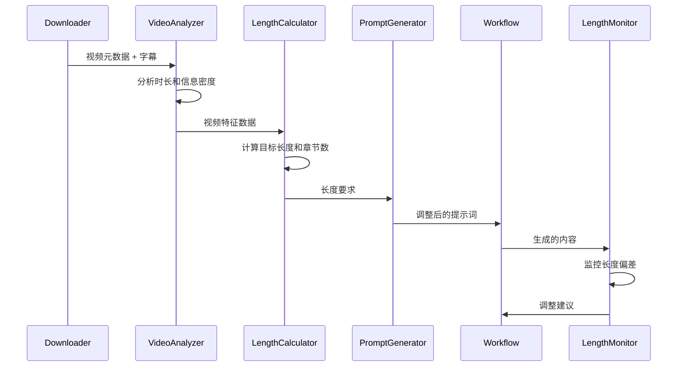

# 自适应内容长度生成设计文档

## 概述

本设计文档描述了如何实现一个自适应的内容长度生成系统，使生成的文章长度能够根据YouTube视频的实际特征（时长、信息密度等）进行动态调整，而不是固定在20k-30k字范围内。

## 架构设计

### 核心组件架构



### 数据流设计



## 组件设计

### 1. 视频分析器 (VideoAnalyzer)

**职责**：分析视频的基本特征，为长度计算提供数据基础。

```python
@dataclass
class VideoAnalysisResult:
    duration_minutes: float
    subtitle_word_count: int
    words_per_minute: float
    video_category: str  # short/medium/long/extra_long
    density_level: str   # low/medium/high
    complexity_score: float

class VideoAnalyzer:
    def analyze(self, metadata: VideoMetadata, subtitle_text: str) -> VideoAnalysisResult:
        """分析视频特征"""
        pass
    
    def _categorize_by_duration(self, duration: float) -> str:
        """根据时长分类视频"""
        if duration < 20:
            return "short"
        elif duration < 60:
            return "medium"
        elif duration < 120:
            return "long"
        else:
            return "extra_long"
    
    def _calculate_density(self, word_count: int, duration: float) -> tuple[float, str]:
        """计算信息密度"""
        wpm = word_count / duration
        if wpm < 100:
            return wpm, "low"
        elif wpm < 200:
            return wpm, "medium"
        else:
            return wpm, "high"
```

### 2. 长度计算器 (LengthCalculator)

**职责**：基于视频分析结果计算目标文章长度和章节规划。

```python
@dataclass
class LengthTarget:
    target_length: int
    min_length: int
    max_length: int
    chapter_count: int
    avg_chapter_length: int

class LengthCalculator:
    def __init__(self, config: LengthConfig):
        self.config = config
    
    def calculate_target_length(self, analysis: VideoAnalysisResult) -> LengthTarget:
        """计算目标长度"""
        # 基础长度计算
        base_ratio = self.config.get_base_ratio(analysis.video_category)
        base_length = int(analysis.subtitle_word_count * base_ratio)
        
        # 密度调整
        density_multiplier = self.config.get_density_multiplier(analysis.density_level)
        adjusted_length = int(base_length * density_multiplier)
        
        # 计算章节数量
        chapter_count = self._calculate_chapter_count(adjusted_length)
        
        return LengthTarget(
            target_length=adjusted_length,
            min_length=int(adjusted_length * 0.8),
            max_length=int(adjusted_length * 1.2),
            chapter_count=chapter_count,
            avg_chapter_length=adjusted_length // chapter_count
        )
    
    def _calculate_chapter_count(self, target_length: int) -> int:
        """计算合适的章节数量"""
        if target_length < 15000:
            return random.randint(8, 12)
        elif target_length < 25000:
            return random.randint(12, 16)
        elif target_length < 35000:
            return random.randint(16, 20)
        else:
            return random.randint(20, 25)
```

### 3. 动态提示词生成器 (DynamicPromptGenerator)

**职责**：根据长度目标动态调整提示词内容。

```python
class DynamicPromptGenerator:
    def __init__(self, base_prompt: str, length_target: LengthTarget):
        self.base_prompt = base_prompt
        self.length_target = length_target
    
    def generate_outline_prompt(self, transcript: str) -> str:
        """生成大纲提示词"""
        length_instruction = self._get_length_instruction()
        chapter_instruction = self._get_chapter_instruction()
        
        return f"""
{self.base_prompt}

{length_instruction}
{chapter_instruction}

请基于以下字幕内容生成大纲：
{transcript}
"""
    
    def generate_chapter_prompt(self, chapter_index: int, chapter_title: str, 
                              outline: str, transcript: str) -> str:
        """生成章节提示词"""
        chapter_length_target = self.length_target.avg_chapter_length
        detail_level = self._get_detail_level()
        
        return f"""
{self.base_prompt}

当前章节目标长度：{chapter_length_target}字（允许范围：{int(chapter_length_target * 0.8)}-{int(chapter_length_target * 1.2)}字）
内容详细程度：{detail_level}

请为第{chapter_index}章节"{chapter_title}"生成内容...
"""
    
    def _get_length_instruction(self) -> str:
        """获取长度指导说明"""
        return f"""
目标文章总长度：{self.length_target.target_length}字
章节数量：{self.length_target.chapter_count}个
平均每章节长度：{self.length_target.avg_chapter_length}字
"""
    
    def _get_detail_level(self) -> str:
        """根据目标长度确定详细程度"""
        if self.length_target.target_length < 15000:
            return "简洁精炼，重点突出核心观点"
        elif self.length_target.target_length < 30000:
            return "适度详细，包含关键论证和案例"
        else:
            return "深度详细，全面展开论述和分析"
```

### 4. 长度监控器 (LengthMonitor)

**职责**：在生成过程中监控长度，并提供调整建议。

```python
@dataclass
class LengthStatus:
    current_length: int
    target_length: int
    progress_ratio: float
    deviation_ratio: float
    adjustment_needed: bool
    adjustment_type: str  # "expand", "compress", "maintain"

class LengthMonitor:
    def __init__(self, length_target: LengthTarget):
        self.length_target = length_target
        self.chapter_lengths = []
    
    def monitor_chapter(self, chapter_content: str, chapter_index: int) -> LengthStatus:
        """监控单个章节长度"""
        chapter_length = len(chapter_content)
        self.chapter_lengths.append(chapter_length)
        
        current_total = sum(self.chapter_lengths)
        expected_progress = (chapter_index + 1) / self.length_target.chapter_count
        expected_length = int(self.length_target.target_length * expected_progress)
        
        deviation_ratio = (current_total - expected_length) / expected_length
        
        return LengthStatus(
            current_length=current_total,
            target_length=expected_length,
            progress_ratio=expected_progress,
            deviation_ratio=deviation_ratio,
            adjustment_needed=abs(deviation_ratio) > 0.3,
            adjustment_type=self._get_adjustment_type(deviation_ratio)
        )
    
    def _get_adjustment_type(self, deviation_ratio: float) -> str:
        """确定调整类型"""
        if deviation_ratio > 0.3:
            return "compress"
        elif deviation_ratio < -0.3:
            return "expand"
        else:
            return "maintain"
```

### 5. 配置管理器 (LengthConfigManager)

**职责**：管理长度计算相关的配置参数。

```python
@dataclass
class LengthConfig:
    # 基础长度比例
    base_ratios: Dict[str, float] = field(default_factory=lambda: {
        "short": 0.7,      # 短视频：70%
        "medium": 0.8,     # 中等视频：80%
        "long": 0.9,       # 长视频：90%
        "extra_long": 1.0  # 超长视频：100%
    })
    
    # 密度调整系数
    density_multipliers: Dict[str, float] = field(default_factory=lambda: {
        "low": 1.2,    # 低密度：增加20%
        "medium": 1.0, # 中密度：保持不变
        "high": 0.8    # 高密度：减少20%
    })
    
    # 章节长度范围
    chapter_ranges: Dict[str, tuple[int, int]] = field(default_factory=lambda: {
        "short": (8, 12),
        "medium": (12, 16),
        "long": (16, 20),
        "extra_long": (20, 25)
    })

class LengthConfigManager:
    def __init__(self, config_path: str = "config/length_config.yaml"):
        self.config_path = config_path
        self.config = self._load_config()
    
    def _load_config(self) -> LengthConfig:
        """加载配置"""
        if os.path.exists(self.config_path):
            with open(self.config_path, 'r') as f:
                data = yaml.safe_load(f)
                return LengthConfig(**data)
        return LengthConfig()
    
    def update_config(self, **kwargs):
        """更新配置"""
        for key, value in kwargs.items():
            if hasattr(self.config, key):
                setattr(self.config, key, value)
        self._save_config()
```

## 集成设计

### 工作流集成

修改现有的 `DeepSummaryWorkflow` 类，集成长度自适应功能：

```python
class AdaptiveDeepSummaryWorkflow(DeepSummaryWorkflow):
    def __init__(self, task_id: str, model_name: str, transcript: str, 
                 video_metadata: VideoMetadata):
        super().__init__(task_id, model_name, transcript, video_metadata)
        
        # 新增组件
        self.video_analyzer = VideoAnalyzer()
        self.length_calculator = LengthCalculator(LengthConfigManager().config)
        self.length_monitor = LengthMonitor(None)  # 稍后初始化
        
        # 分析视频并计算目标长度
        self.analysis_result = self.video_analyzer.analyze(video_metadata, transcript)
        self.length_target = self.length_calculator.calculate_target_length(self.analysis_result)
        self.length_monitor = LengthMonitor(self.length_target)
        
        # 创建动态提示词生成器
        self.prompt_generator = DynamicPromptGenerator(self.base_prompt, self.length_target)
    
    async def _generate_outline(self) -> Optional[str]:
        """生成大纲（使用动态提示词）"""
        await self._log(f"目标文章长度: {self.length_target.target_length}字，章节数: {self.length_target.chapter_count}个")
        
        prompt = self.prompt_generator.generate_outline_prompt(self.transcript)
        # ... 其余逻辑保持不变
    
    async def _generate_single_chapter(self, index: int, chapter_title: str, 
                                     outline_content: str) -> str:
        """生成单个章节（使用动态提示词和长度监控）"""
        prompt = self.prompt_generator.generate_chapter_prompt(
            index, chapter_title, outline_content, self.transcript
        )
        
        chapter_content = await self.summarizer.generate_content(prompt)
        
        # 监控长度
        status = self.length_monitor.monitor_chapter(chapter_content, index)
        if status.adjustment_needed:
            await self._log(f"章节{index+1}长度偏差{status.deviation_ratio:.1%}，建议{status.adjustment_type}")
        
        return chapter_content
```

## 错误处理

### 异常情况处理

1. **无法获取视频时长**：使用字幕长度估算
2. **字幕过短或过长**：设置最小/最大长度限制
3. **生成内容严重偏离目标**：触发重新生成机制
4. **配置文件损坏**：使用默认配置并记录警告

```python
class LengthAdaptationError(Exception):
    """长度自适应相关错误"""
    pass

def safe_length_calculation(analysis: VideoAnalysisResult, config: LengthConfig) -> LengthTarget:
    """安全的长度计算，包含异常处理"""
    try:
        calculator = LengthCalculator(config)
        return calculator.calculate_target_length(analysis)
    except Exception as e:
        logger.warning(f"长度计算失败，使用默认策略: {e}")
        # 返回默认的中等长度目标
        return LengthTarget(
            target_length=20000,
            min_length=16000,
            max_length=24000,
            chapter_count=15,
            avg_chapter_length=1333
        )
```

## 测试策略

### 单元测试

1. **VideoAnalyzer测试**：验证不同时长和密度的视频分析结果
2. **LengthCalculator测试**：验证长度计算的准确性和边界情况
3. **DynamicPromptGenerator测试**：验证提示词生成的正确性
4. **LengthMonitor测试**：验证长度监控和调整建议的准确性

### 集成测试

1. **端到端测试**：使用不同类型的真实视频测试完整流程
2. **长度验证测试**：验证生成内容的长度是否符合预期
3. **质量保证测试**：确保长度调整不影响内容质量

### 性能测试

1. **计算性能**：确保长度计算不显著增加处理时间
2. **内存使用**：监控新增组件的内存占用
3. **并发处理**：验证多任务并行处理时的稳定性

## 部署考虑

### 配置管理

1. 提供默认配置文件模板
2. 支持环境变量覆盖配置
3. 提供配置验证和热重载功能

### 监控和日志

1. 记录每个视频的长度计算过程
2. 统计长度目标达成率
3. 监控异常情况和性能指标

### 向后兼容

1. 保持现有API接口不变
2. 新功能作为可选特性，默认启用
3. 提供降级机制，出现问题时回退到固定长度模式