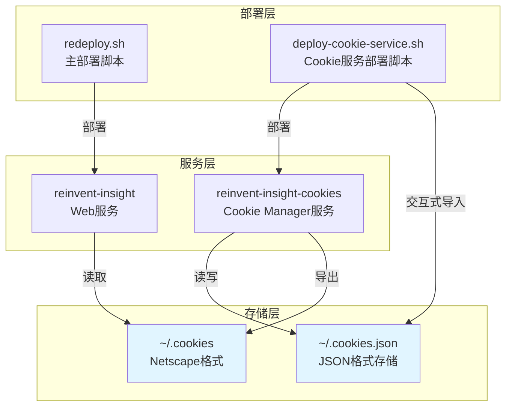
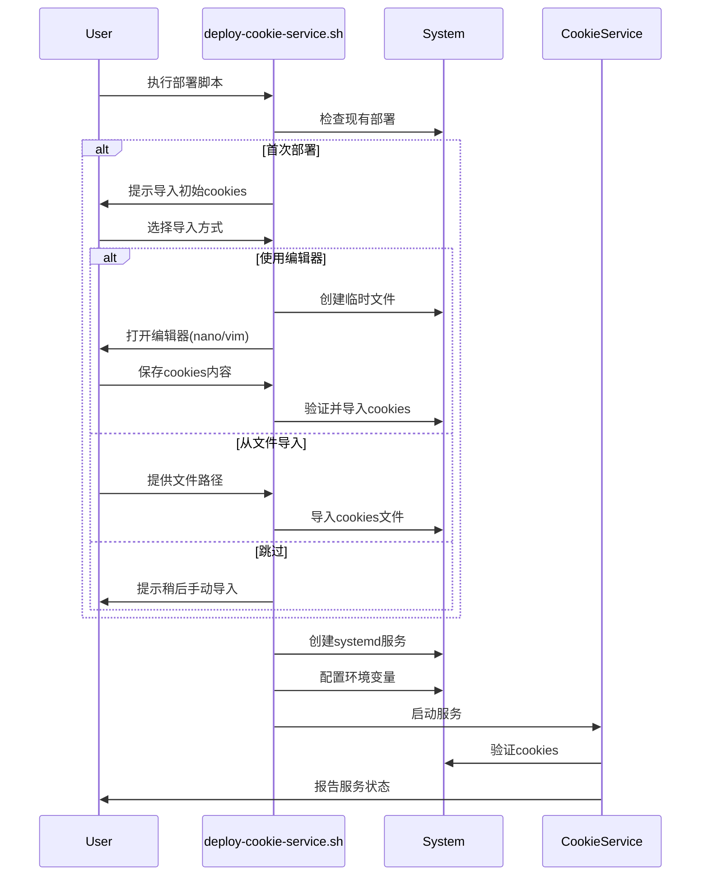

# Design Document

## Overview

本设计文档描述了如何重构 Cookie 服务的部署和配置架构，将 Cookie 服务从主部署脚本中分离，统一 Cookie 文件存储位置，并提供交互式的初始配置体验。

核心目标：
- 创建独立的 Cookie 服务部署脚本（deploy-cookie-service.sh）
- 统一 Cookie 存储位置到用户主目录（~/.cookies 和 ~/.cookies.json）
- 提供交互式的初始 Cookie 导入功能
- 简化主部署脚本，移除 Cookie 服务相关代码
- 保持向后兼容性

## Architecture

### 系统架构图



### 部署流程



## Components and Interfaces

### 1. deploy-cookie-service.sh（新建）

独立的 Cookie 服务部署脚本。

**功能模块：**

- **环境检查模块**
  - 检查 Python 环境
  - 检查 Playwright 依赖
  - 检查系统权限

- **Cookie 导入模块**
  - 交互式编辑器选择（nano/vim）
  - 从文件导入
  - 格式验证
  - 自动导入到系统

- **服务部署模块**
  - 创建虚拟环境
  - 安装依赖
  - 配置 systemd 服务
  - 启动服务

- **状态报告模块**
  - 显示服务状态
  - 显示 Cookie 信息
  - 提供管理命令

**命令行参数：**
```bash
--skip-cookie-import    # 跳过初始cookie导入
--cookie-file PATH      # 从指定文件导入cookies
--port PORT            # 指定服务端口（如果需要）
--dry-run              # 演练模式
```

**关键函数：**

```bash
# 检查环境依赖
check_dependencies() {
    # 检查 Python 3.8+
    # 检查 pip
    # 检查 Playwright
}

# 交互式导入 cookies
interactive_cookie_import() {
    # 显示导入选项
    # 1. 使用 nano 编辑
    # 2. 使用 vim 编辑
    # 3. 从文件导入
    # 4. 跳过（稍后手动导入）
}

# 使用编辑器导入
import_with_editor() {
    # 创建临时文件
    # 打开编辑器
    # 验证格式
    # 导入到系统
}

# 从文件导入
import_from_file() {
    # 验证文件存在
    # 检测格式
    # 导入到系统
}

# 部署服务
deploy_cookie_service() {
    # 创建虚拟环境
    # 安装包
    # 配置 systemd
    # 启动服务
}

# 显示部署信息
show_deployment_info() {
    # 服务状态
    # Cookie 信息
    # 管理命令
}
```

### 2. redeploy.sh（修改）

移除 Cookie 服务相关代码，保持简洁。

**移除的内容：**
- `start_cookie_service()` 函数
- Cookie 服务的 systemd 配置代码
- Playwright 浏览器安装代码
- Cookie 服务状态检查代码

**保留的内容：**
- Web 服务部署流程
- 数据备份和恢复
- 权限管理
- 服务管理

**新增提示：**
在部署完成信息中添加 Cookie 服务部署指引：

```bash
echo "Cookie 服务部署:"
echo "  如需启用 YouTube Cookie 自动刷新功能，请运行："
echo "  ./deploy-cookie-service.sh"
```

### 3. config.py（修改）

更新 Cookie 文件路径配置。

**修改前：**
```python
COOKIES_FILE = PROJECT_ROOT / ".cookies"
COOKIE_STORE_PATH = PROJECT_ROOT / ".cookies.json"
```

**修改后：**
```python
# Cookie 文件路径 - 使用用户主目录
COOKIES_FILE = Path.home() / ".cookies"
COOKIE_STORE_PATH = Path.home() / ".cookies.json"
```

**向后兼容处理：**
```python
# 如果旧位置存在文件，提示迁移
def check_legacy_cookie_paths():
    """检查并提示迁移旧的 cookie 文件"""
    legacy_cookies = PROJECT_ROOT / ".cookies"
    legacy_store = PROJECT_ROOT / ".cookies.json"
    
    if legacy_cookies.exists() or legacy_store.exists():
        logger.warning("检测到旧的 cookie 文件位置")
        logger.info(f"请将 cookie 文件迁移到: {COOKIES_FILE}")
        logger.info(f"请将 cookie 存储迁移到: {COOKIE_STORE_PATH}")
```

### 4. cookie_store.py（修改）

更新默认路径，支持用户主目录。

**修改 CookieStore 初始化：**
```python
def __init__(self, store_path: Optional[Path] = None, netscape_path: Optional[Path] = None):
    """
    初始化 Cookie Store
    
    Args:
        store_path: JSON 格式的 cookie 存储路径（默认 ~/.cookies.json）
        netscape_path: Netscape 格式的 cookie 导出路径（默认 ~/.cookies）
    """
    if store_path is None:
        store_path = Path.home() / ".cookies.json"
    if netscape_path is None:
        netscape_path = Path.home() / ".cookies"
    
    self.store_path = Path(store_path)
    self.netscape_path = Path(netscape_path)
    
    # 确保父目录存在
    self.store_path.parent.mkdir(parents=True, exist_ok=True)
    self.netscape_path.parent.mkdir(parents=True, exist_ok=True)
```

### 5. cookie_models.py（修改）

更新配置模型的默认路径。

**修改 CookieManagerConfig：**
```python
class CookieManagerConfig(BaseModel):
    """Cookie Manager 配置"""
    
    # Cookie 存储路径
    cookie_store_path: Path = Field(
        default_factory=lambda: Path.home() / ".cookies.json"
    )
    netscape_cookie_path: Path = Field(
        default_factory=lambda: Path.home() / ".cookies"
    )
    
    # ... 其他配置保持不变
```

## Data Models

### Cookie 文件位置

```
用户主目录 (~/)
├── .cookies              # Netscape 格式（供 yt-dlp 使用）
└── .cookies.json         # JSON 格式（完整存储，包含元数据）
```

### Cookie 导入临时文件

```
/tmp/
└── cookie_import_XXXXXX.txt  # 临时编辑文件
```

### 部署脚本配置

```bash
# 默认配置
COOKIE_SERVICE_NAME="reinvent-insight-cookies"
COOKIE_STORE_PATH="$HOME/.cookies.json"
NETSCAPE_COOKIE_PATH="$HOME/.cookies"
VENV_NAME=".venv-cookie-service"
```

## Error Handling

### 1. Cookie 导入错误

**场景：** 用户输入的 cookie 格式无效

**处理：**
```bash
validate_cookie_format() {
    local cookie_file=$1
    
    # 检查文件是否为空
    if [ ! -s "$cookie_file" ]; then
        print_error "Cookie 文件为空"
        return 1
    fi
    
    # 检查是否包含 YouTube 域名
    if ! grep -q "youtube.com" "$cookie_file"; then
        print_warning "未找到 YouTube 域名的 cookies"
        echo -n "是否继续？(y/N): "
        read -r confirm
        [[ "$confirm" =~ ^[Yy]$ ]] || return 1
    fi
    
    return 0
}
```

### 2. 服务启动失败

**场景：** Cookie 服务启动失败

**处理：**
```bash
start_cookie_service() {
    # 启动服务
    sudo systemctl start "$COOKIE_SERVICE_NAME"
    
    # 等待并检查状态
    sleep 3
    
    if ! systemctl is-active --quiet "$COOKIE_SERVICE_NAME"; then
        print_error "Cookie 服务启动失败"
        print_info "查看日志: sudo journalctl -u $COOKIE_SERVICE_NAME -n 50"
        
        # 显示最近的错误
        sudo journalctl -u "$COOKIE_SERVICE_NAME" -n 10 --no-pager
        
        return 1
    fi
    
    print_success "Cookie 服务启动成功"
}
```

### 3. 依赖缺失

**场景：** Playwright 或其他依赖未安装

**处理：**
```bash
check_and_install_dependencies() {
    # 检查 Playwright
    if ! python3 -c "import playwright" 2>/dev/null; then
        print_warning "Playwright 未安装"
        echo -n "是否现在安装？(y/N): "
        read -r confirm
        
        if [[ "$confirm" =~ ^[Yy]$ ]]; then
            pip install playwright
            python3 -m playwright install chromium
        else
            print_error "Playwright 是必需的依赖"
            exit 1
        fi
    fi
}
```

### 4. 路径迁移

**场景：** 旧的 cookie 文件在项目目录

**处理：**
```python
def migrate_legacy_cookies():
    """迁移旧的 cookie 文件到新位置"""
    legacy_cookies = PROJECT_ROOT / ".cookies"
    legacy_store = PROJECT_ROOT / ".cookies.json"
    
    new_cookies = Path.home() / ".cookies"
    new_store = Path.home() / ".cookies.json"
    
    migrated = False
    
    if legacy_cookies.exists() and not new_cookies.exists():
        shutil.copy2(legacy_cookies, new_cookies)
        logger.info(f"已迁移 .cookies 到 {new_cookies}")
        migrated = True
    
    if legacy_store.exists() and not new_store.exists():
        shutil.copy2(legacy_store, new_store)
        logger.info(f"已迁移 .cookies.json 到 {new_store}")
        migrated = True
    
    if migrated:
        logger.info("Cookie 文件迁移完成")
        logger.info("旧文件已保留，可以手动删除")
```

## Testing Strategy

### 1. 部署脚本测试

**测试场景：**
- 全新部署（无现有 cookies）
- 更新部署（已有 cookies）
- 不同编辑器选择（nano/vim）
- 从文件导入
- 跳过导入
- 演练模式（--dry-run）

**测试方法：**
```bash
# 测试全新部署
./deploy-cookie-service.sh --dry-run

# 测试从文件导入
./deploy-cookie-service.sh --cookie-file test_cookies.txt --dry-run

# 测试跳过导入
./deploy-cookie-service.sh --skip-cookie-import --dry-run
```

### 2. Cookie 路径测试

**测试场景：**
- 验证新路径正确使用
- 验证旧路径迁移提示
- 验证文件权限正确

**测试代码：**
```python
def test_cookie_paths():
    """测试 cookie 路径配置"""
    from reinvent_insight.config import COOKIES_FILE, COOKIE_STORE_PATH
    
    # 验证路径在用户主目录
    assert COOKIES_FILE == Path.home() / ".cookies"
    assert COOKIE_STORE_PATH == Path.home() / ".cookies.json"
    
    # 验证 CookieStore 使用正确路径
    store = CookieStore()
    assert store.netscape_path == Path.home() / ".cookies"
    assert store.store_path == Path.home() / ".cookies.json"
```

### 3. 服务集成测试

**测试场景：**
- Cookie 服务独立启动
- Web 服务读取共享 cookies
- Cookie 刷新后 Web 服务可用

**测试步骤：**
```bash
# 1. 部署 Cookie 服务
./deploy-cookie-service.sh --cookie-file test_cookies.txt

# 2. 验证服务运行
systemctl status reinvent-insight-cookies

# 3. 验证 cookie 文件生成
ls -la ~/.cookies ~/.cookies.json

# 4. 部署 Web 服务
./redeploy.sh

# 5. 验证 Web 服务可以读取 cookies
curl http://localhost:8001/api/health
```

### 4. 向后兼容性测试

**测试场景：**
- 现有部署升级
- 旧 cookie 文件迁移
- 配置文件兼容性

**测试方法：**
```bash
# 1. 创建旧格式的 cookie 文件
echo "test" > ~/reinvent-insight-prod/reinvent_insight-0.1.0/.cookies

# 2. 运行新部署
./deploy-cookie-service.sh

# 3. 验证迁移提示
# 4. 验证服务正常运行
```

## Implementation Notes

### 优先级

1. **高优先级**
   - 创建 deploy-cookie-service.sh 脚本
   - 更新 config.py 路径配置
   - 修改 redeploy.sh 移除 Cookie 服务代码

2. **中优先级**
   - 实现交互式 Cookie 导入
   - 添加路径迁移提示
   - 更新文档

3. **低优先级**
   - 自动迁移工具
   - 高级配置选项

### 兼容性考虑

- 保留旧的 cookie 文件不删除，只提示迁移
- 新旧路径同时支持读取（优先新路径）
- 提供迁移脚本供用户选择使用

### 安全考虑

- Cookie 文件权限设置为 600（仅所有者可读写）
- 临时文件使用安全的随机名称
- 编辑器退出后清理临时文件
- 不在日志中输出 cookie 内容

### 用户体验

- 清晰的交互提示
- 彩色输出区分不同类型的信息
- 提供示例和帮助信息
- 错误时给出明确的解决建议
