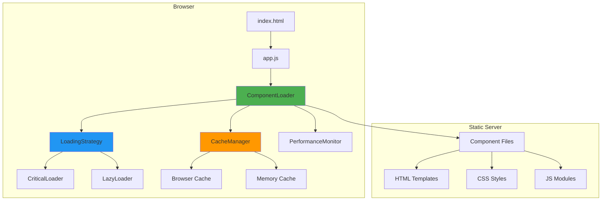
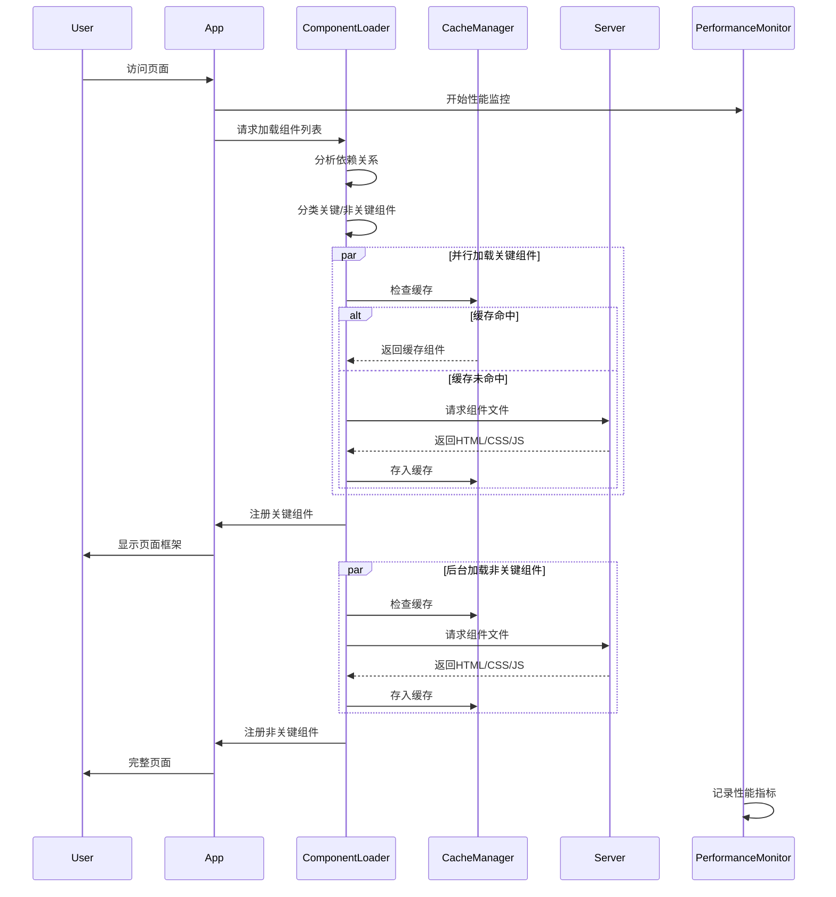

# Design Document

## Overview

本设计文档描述了前端组件加载性能优化的技术方案。当前系统使用动态组件加载机制，但存在以下性能问题：

1. **串行加载**：组件按顺序逐个加载，导致总加载时间等于所有组件加载时间之和
2. **重复请求**：每次页面刷新都重新请求所有组件文件，未充分利用浏览器缓存
3. **缺乏优先级**：所有组件同等对待，关键组件无法优先加载
4. **依赖处理低效**：依赖组件的加载和注册过程串行化

本设计通过以下策略解决这些问题：
- 实现真正的并行加载机制
- 添加浏览器缓存支持和版本管理
- 实现关键组件优先加载
- 优化依赖解析和加载流程
- 添加性能监控和诊断工具

## Architecture

### 系统架构图



### 加载流程图



## Components and Interfaces

### 1. ComponentLoader (增强版)

**职责**：组件加载的核心协调器，管理组件的加载、缓存和注册

**接口**：

```javascript
class ComponentLoader {
  /**
   * 批量注册组件（并行加载）
   * @param {Object} app - Vue应用实例
   * @param {Array} components - 组件配置数组
   * @param {Object} options - 加载选项
   * @returns {Promise<Array>} 加载结果
   */
  static async registerComponents(app, components, options = {
    parallel: true,           // 是否并行加载
    prioritize: true,         // 是否优先加载关键组件
    useCache: true,           // 是否使用缓存
    onProgress: null,         // 进度回调
    timeout: 10000            // 超时时间（毫秒）
  })
  
  /**
   * 加载单个组件（支持缓存）
   * @param {string} name - 组件名称
   * @param {string} path - 组件路径
   * @param {string} fileName - 文件名
   * @param {Object} options - 加载选项
   * @returns {Promise<Object>} 组件定义
   */
  static async loadComponent(name, path, fileName, options = {})
  
  /**
   * 并行加载多个组件
   * @param {Array} components - 组件配置数组
   * @param {Object} options - 加载选项
   * @returns {Promise<Array>} 组件定义数组
   */
  static async loadComponentsParallel(components, options = {})
  
  /**
   * 预加载组件（不注册）
   * @param {Array} components - 组件配置数组
   * @returns {Promise<void>}
   */
  static async preloadComponents(components)
  
  /**
   * 清空缓存
   * @param {string} [name] - 可选的组件名称，不提供则清空所有
   */
  static clearCache(name = null)
}
```

### 2. CacheManager (新增)

**职责**：管理组件的内存缓存和浏览器缓存策略

**接口**：

```javascript
class CacheManager {
  /**
   * 获取缓存的组件
   * @param {string} key - 缓存键
   * @returns {Object|null} 组件定义或null
   */
  static get(key)
  
  /**
   * 设置组件缓存
   * @param {string} key - 缓存键
   * @param {Object} component - 组件定义
   * @param {Object} options - 缓存选项
   */
  static set(key, component, options = {
    ttl: 3600000,            // 缓存时间（毫秒）
    version: null            // 版本号
  })
  
  /**
   * 检查缓存是否有效
   * @param {string} key - 缓存键
   * @returns {boolean}
   */
  static isValid(key)
  
  /**
   * 清空缓存
   * @param {string} [key] - 可选的缓存键
   */
  static clear(key = null)
  
  /**
   * 获取缓存统计信息
   * @returns {Object} 统计信息
   */
  static getStats()
}
```

### 3. LoadingStrategy (新增)

**职责**：实现不同的加载策略（关键组件优先、懒加载等）

**接口**：

```javascript
class LoadingStrategy {
  /**
   * 分类组件为关键和非关键
   * @param {Array} components - 组件配置数组
   * @returns {Object} { critical: [], nonCritical: [] }
   */
  static categorizeComponents(components)
  
  /**
   * 关键组件优先加载策略
   * @param {Object} app - Vue应用实例
   * @param {Array} components - 组件配置数组
   * @param {Object} options - 加载选项
   * @returns {Promise<Array>}
   */
  static async loadCriticalFirst(app, components, options = {})
  
  /**
   * 懒加载策略
   * @param {Object} app - Vue应用实例
   * @param {Array} components - 组件配置数组
   * @param {Object} options - 加载选项
   * @returns {Promise<Array>}
   */
  static async loadLazy(app, components, options = {})
  
  /**
   * 预测性加载策略（基于用户行为）
   * @param {Object} app - Vue应用实例
   * @param {Array} components - 组件配置数组
   * @param {Object} context - 上下文信息
   * @returns {Promise<Array>}
   */
  static async loadPredictive(app, components, context = {})
}
```

### 4. PerformanceMonitor (新增)

**职责**：监控和记录组件加载性能指标

**接口**：

```javascript
class PerformanceMonitor {
  /**
   * 开始监控
   * @param {string} label - 监控标签
   */
  static start(label)
  
  /**
   * 结束监控并记录
   * @param {string} label - 监控标签
   * @returns {number} 耗时（毫秒）
   */
  static end(label)
  
  /**
   * 记录组件加载指标
   * @param {string} componentName - 组件名称
   * @param {Object} metrics - 指标数据
   */
  static recordComponentLoad(componentName, metrics = {
    loadTime: 0,
    cacheHit: false,
    fileSize: 0,
    error: null
  })
  
  /**
   * 获取性能报告
   * @returns {Object} 性能报告
   */
  static getReport()
  
  /**
   * 导出性能数据
   * @param {string} format - 导出格式 ('json' | 'csv')
   * @returns {string} 导出数据
   */
  static export(format = 'json')
  
  /**
   * 清空性能数据
   */
  static clear()
}
```

### 5. 组件配置增强

**扩展组件配置以支持优先级和依赖声明**：

```javascript
// 组件配置示例
const componentConfig = {
  name: 'app-header',
  path: '/components/common/AppHeader',
  fileName: 'AppHeader',
  
  // 新增字段
  critical: true,              // 是否为关键组件
  priority: 1,                 // 优先级（1-10，数字越小优先级越高）
  dependencies: [              // 依赖组件
    'toast-container',
    'login-modal'
  ],
  preload: false,              // 是否预加载
  lazy: false,                 // 是否懒加载
  version: '1.0.0'            // 版本号
};
```

## Data Models

### ComponentMetadata

```javascript
{
  name: string,              // 组件名称
  path: string,              // 组件路径
  fileName: string,          // 文件名
  critical: boolean,         // 是否关键
  priority: number,          // 优先级
  dependencies: string[],    // 依赖列表
  version: string,           // 版本号
  loadTime: number,          // 加载时间
  cacheHit: boolean,         // 是否缓存命中
  error: Error|null          // 加载错误
}
```

### CacheEntry

```javascript
{
  key: string,               // 缓存键
  component: Object,         // 组件定义
  version: string,           // 版本号
  timestamp: number,         // 缓存时间戳
  ttl: number,              // 生存时间
  hits: number,             // 命中次数
  size: number              // 大小（字节）
}
```

### PerformanceMetrics

```javascript
{
  totalLoadTime: number,     // 总加载时间
  componentCount: number,    // 组件数量
  cacheHitRate: number,      // 缓存命中率
  averageLoadTime: number,   // 平均加载时间
  slowestComponent: {        // 最慢组件
    name: string,
    loadTime: number
  },
  errors: Array<{            // 错误列表
    component: string,
    error: string,
    timestamp: number
  }>,
  timeline: Array<{          // 加载时间线
    component: string,
    startTime: number,
    endTime: number,
    duration: number
  }>
}
```

## Error Handling

### 错误类型

1. **NetworkError**: 网络请求失败
2. **ParseError**: 组件文件解析失败
3. **DependencyError**: 依赖组件加载失败
4. **TimeoutError**: 加载超时
5. **CacheError**: 缓存操作失败

### 错误处理策略

```javascript
// 1. 组件加载失败 - 降级处理
try {
  component = await loadComponent(name, path, fileName);
} catch (error) {
  if (error instanceof NetworkError) {
    // 尝试从缓存加载
    component = CacheManager.get(cacheKey);
    if (!component) {
      // 使用占位符组件
      component = createPlaceholderComponent(name);
    }
  } else if (error instanceof TimeoutError) {
    // 记录超时并继续
    PerformanceMonitor.recordError(name, error);
    component = createPlaceholderComponent(name);
  } else {
    // 其他错误 - 跳过该组件
    console.error(`Failed to load component ${name}:`, error);
    return null;
  }
}

// 2. 依赖加载失败 - 跳过父组件
if (dependencyLoadFailed) {
  console.warn(`Skipping ${componentName} due to dependency failure`);
  return null;
}

// 3. 批量加载失败 - 部分成功
const results = await Promise.allSettled(loadPromises);
const successful = results.filter(r => r.status === 'fulfilled');
const failed = results.filter(r => r.status === 'rejected');

if (failed.length > 0) {
  console.warn(`${failed.length} components failed to load`);
  // 继续使用成功加载的组件
}
```

### 用户友好的错误提示

```javascript
// 加载超时提示
if (loadTime > TIMEOUT_THRESHOLD) {
  showToast('组件加载较慢，请检查网络连接', 'warning');
  // 提供重试选项
  showRetryButton();
}

// 关键组件加载失败
if (criticalComponentFailed) {
  showErrorModal({
    title: '页面加载失败',
    message: '关键组件加载失败，请刷新页面重试',
    actions: [
      { label: '刷新页面', action: () => location.reload() },
      { label: '清除缓存', action: () => clearCacheAndReload() }
    ]
  });
}
```

## Testing Strategy

### 单元测试

**测试目标**：
- CacheManager的缓存逻辑
- LoadingStrategy的组件分类
- PerformanceMonitor的指标记录
- ComponentLoader的依赖解析

**测试框架**：Jest或Vitest

**测试用例示例**：

```javascript
describe('CacheManager', () => {
  test('should cache component correctly', () => {
    const component = { name: 'test', template: '<div>test</div>' };
    CacheManager.set('test-key', component);
    expect(CacheManager.get('test-key')).toEqual(component);
  });
  
  test('should invalidate expired cache', () => {
    const component = { name: 'test', template: '<div>test</div>' };
    CacheManager.set('test-key', component, { ttl: 100 });
    
    // 等待缓存过期
    setTimeout(() => {
      expect(CacheManager.isValid('test-key')).toBe(false);
    }, 150);
  });
});

describe('LoadingStrategy', () => {
  test('should categorize components correctly', () => {
    const components = [
      { name: 'header', critical: true },
      { name: 'footer', critical: false },
      { name: 'sidebar', critical: true }
    ];
    
    const { critical, nonCritical } = LoadingStrategy.categorizeComponents(components);
    expect(critical).toHaveLength(2);
    expect(nonCritical).toHaveLength(1);
  });
});
```

### 集成测试

**测试目标**：
- 完整的组件加载流程
- 缓存和网络请求的交互
- 错误处理和降级逻辑

**测试用例示例**：

```javascript
describe('Component Loading Integration', () => {
  test('should load components in parallel', async () => {
    const startTime = Date.now();
    await ComponentLoader.registerComponents(app, testComponents, {
      parallel: true
    });
    const endTime = Date.now();
    
    // 并行加载应该比串行快
    expect(endTime - startTime).toBeLessThan(SERIAL_LOAD_TIME);
  });
  
  test('should use cache on second load', async () => {
    // 第一次加载
    await ComponentLoader.registerComponents(app, testComponents);
    
    // 第二次加载应该使用缓存
    const startTime = Date.now();
    await ComponentLoader.registerComponents(app, testComponents);
    const endTime = Date.now();
    
    expect(endTime - startTime).toBeLessThan(100); // 应该很快
    expect(CacheManager.getStats().hitRate).toBeGreaterThan(0.9);
  });
});
```

### 性能测试

**测试目标**：
- 加载时间是否满足需求（<2秒）
- 缓存命中率
- 内存使用情况

**测试工具**：
- Chrome DevTools Performance
- Lighthouse
- WebPageTest

**性能基准**：

```javascript
const PERFORMANCE_BENCHMARKS = {
  firstLoad: {
    target: 3000,      // 首次加载 < 3秒
    warning: 2000      // 警告阈值 2秒
  },
  cachedLoad: {
    target: 1000,      // 缓存加载 < 1秒
    warning: 500       // 警告阈值 0.5秒
  },
  cacheHitRate: {
    target: 0.8,       // 缓存命中率 > 80%
    warning: 0.6       // 警告阈值 60%
  },
  componentLoadTime: {
    target: 500,       // 单个组件 < 500ms
    warning: 300       // 警告阈值 300ms
  }
};
```

### 端到端测试

**测试目标**：
- 真实用户场景下的页面加载
- 不同网络条件下的表现
- 浏览器兼容性

**测试框架**：Playwright或Cypress

**测试用例示例**：

```javascript
test('page loads quickly on fast network', async ({ page }) => {
  await page.goto('/');
  
  // 等待主要内容可见
  await page.waitForSelector('.app-visible', { timeout: 3000 });
  
  // 检查加载时间
  const loadTime = await page.evaluate(() => {
    return performance.timing.loadEventEnd - performance.timing.navigationStart;
  });
  
  expect(loadTime).toBeLessThan(3000);
});

test('page loads with degraded performance on slow network', async ({ page }) => {
  // 模拟慢速网络
  await page.route('**/*', route => {
    setTimeout(() => route.continue(), 500);
  });
  
  await page.goto('/');
  
  // 应该显示加载提示
  await expect(page.locator('#loading-indicator')).toBeVisible();
  
  // 最终应该加载成功
  await page.waitForSelector('.app-visible', { timeout: 10000 });
});
```

## Implementation Notes

### 关键实现细节

1. **并行加载实现**：
   - 使用`Promise.all()`同时发起所有组件的HTML、CSS、JS请求
   - 使用`Promise.allSettled()`处理部分失败的情况
   - 限制并发数量避免浏览器连接数限制（通常6-8个）

2. **缓存策略**：
   - 内存缓存：使用Map存储已加载的组件定义
   - 浏览器缓存：通过Cache-Control头控制静态文件缓存
   - 版本管理：在文件URL中添加版本号或哈希值

3. **关键组件识别**：
   - 手动标记：在组件配置中设置`critical: true`
   - 自动识别：分析首屏渲染所需的组件
   - 优先级队列：按priority值排序加载

4. **性能优化技巧**：
   - 使用`requestIdleCallback`在空闲时预加载非关键组件
   - 使用`IntersectionObserver`实现可见性懒加载
   - 压缩组件文件减少传输大小
   - 使用HTTP/2多路复用提升并发性能

### 向后兼容性

- 保持现有ComponentLoader API不变
- 新功能通过options参数启用
- 提供降级方案支持旧浏览器

### 开发环境特殊处理

```javascript
const isDevelopment = process.env.NODE_ENV === 'development';

if (isDevelopment) {
  // 禁用缓存便于调试
  CacheManager.disable();
  
  // 启用详细日志
  PerformanceMonitor.setVerbose(true);
  
  // 添加热重载支持
  if (module.hot) {
    module.hot.accept();
  }
}
```
