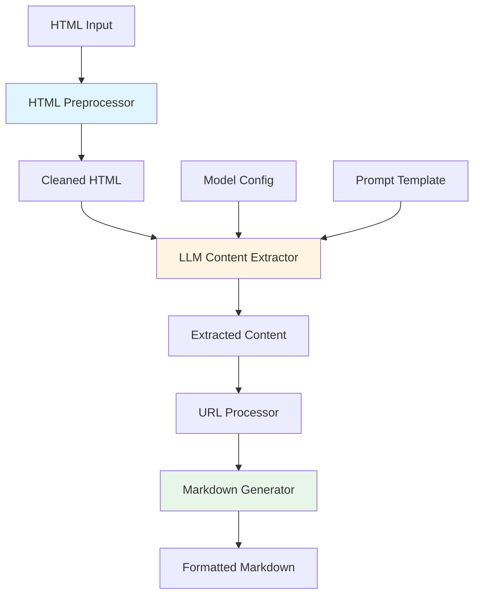

# Design Document: HTML to Markdown Converter

## Overview

HTML to Markdown Converter 是一个智能的网页内容提取和转换模块，能够将HTML网页转换为格式化的Markdown文档。该模块采用"代码预处理 + LLM智能判断"的混合策略：

- **代码预处理层**：使用Python库快速去除HTML中的冗余内容（JavaScript、CSS、注释等）
- **LLM智能层**：使用Gemini模型智能识别正文、标题、相关图片，过滤广告和无关内容
- **格式化层**：将提取的内容转换为精美的Markdown格式

这种设计既保证了处理效率，又保证了内容识别的通用性和准确性。

## Architecture

### 系统架构图



### 处理流程

1. **HTML预处理**：去除JavaScript、CSS、注释、SVG等冗余内容
2. **LLM内容提取**：使用Gemini模型智能识别标题、正文、图片，过滤广告
3. **URL处理**：将相对路径转换为绝对URL
4. **Markdown生成**：格式化输出为标准Markdown文档

## Components and Interfaces

### 1. HTMLPreprocessor

**职责**：预处理HTML，去除冗余内容

```python
class HTMLPreprocessor:
    """HTML预处理器，去除冗余内容"""
    
    def preprocess(self, html: str) -> str:
        """
        预处理HTML内容
        
        Args:
            html: 原始HTML字符串
            
        Returns:
            清理后的HTML字符串
        """
        pass
    
    def _remove_scripts(self, soup: BeautifulSoup) -> None:
        """移除所有script标签"""
        pass
    
    def _remove_styles(self, soup: BeautifulSoup) -> None:
        """移除所有style标签和style属性"""
        pass
    
    def _remove_comments(self, soup: BeautifulSoup) -> None:
        """移除HTML注释"""
        pass
    
    def _remove_svg_canvas(self, soup: BeautifulSoup) -> None:
        """移除SVG和Canvas元素"""
        pass
```

**依赖**：
- `beautifulsoup4`: HTML解析
- `lxml`: 高性能HTML解析器

### 2. LLMContentExtractor

**职责**：使用LLM智能提取内容

```python
@dataclass
class ExtractedContent:
    """提取的内容数据类"""
    title: str                      # 文章标题
    content: str                    # 正文内容（Markdown格式）
    images: List[ImageInfo]         # 相关图片列表
    metadata: Dict[str, Any]        # 元数据（作者、日期等）


@dataclass
class ImageInfo:
    """图片信息数据类"""
    url: str                        # 图片URL
    alt: str                        # alt文本
    caption: Optional[str] = None   # 图片说明


class LLMContentExtractor:
    """LLM内容提取器"""
    
    def __init__(self, model_client: BaseModelClient):
        """
        初始化提取器
        
        Args:
            model_client: 模型客户端（来自统一配置系统）
        """
        self.model_client = model_client
        self.prompt_template = self._load_prompt_template()
    
    async def extract(
        self, 
        html: str,
        base_url: Optional[str] = None
    ) -> ExtractedContent:
        """
        从HTML中提取内容
        
        Args:
            html: 预处理后的HTML
            base_url: 网页的基础URL（用于图片路径转换）
            
        Returns:
            提取的内容对象
        """
        pass
    
    def _build_prompt(self, html: str) -> str:
        """构建LLM提示词"""
        pass
    
    def _parse_llm_response(self, response: str) -> ExtractedContent:
        """解析LLM返回的JSON响应"""
        pass
```

**依赖**：
- `model_config.BaseModelClient`: 统一模型客户端接口
- Prompt模板文件

### 3. URLProcessor

**职责**：处理和转换图片URL

```python
class URLProcessor:
    """URL处理器"""
    
    def __init__(self, base_url: Optional[str] = None):
        """
        初始化URL处理器
        
        Args:
            base_url: 网页的基础URL
        """
        self.base_url = base_url
    
    def process_image_url(self, url: str) -> str:
        """
        处理图片URL
        
        Args:
            url: 原始图片URL（可能是相对路径）
            
        Returns:
            处理后的绝对URL
        """
        pass
    
    def is_valid_url(self, url: str) -> bool:
        """检查URL是否有效"""
        pass
    
    def is_data_uri(self, url: str) -> bool:
        """检查是否为data URI"""
        pass
```

**依赖**：
- `urllib.parse`: URL解析和拼接

### 4. MarkdownGenerator

**职责**：生成格式化的Markdown文档

```python
class MarkdownGenerator:
    """Markdown生成器"""
    
    def generate(
        self, 
        content: ExtractedContent,
        output_path: Optional[Path] = None
    ) -> str:
        """
        生成Markdown文档
        
        Args:
            content: 提取的内容
            output_path: 输出文件路径（可选）
            
        Returns:
            Markdown文本
        """
        pass
    
    def _format_title(self, title: str) -> str:
        """格式化标题"""
        pass
    
    def _format_images(self, images: List[ImageInfo]) -> str:
        """格式化图片列表"""
        pass
    
    def _validate_markdown(self, markdown: str) -> bool:
        """验证Markdown格式"""
        pass
```

### 5. HTMLToMarkdownConverter (主接口)

**职责**：协调各组件，提供统一的转换接口

```python
class HTMLToMarkdownConverter:
    """HTML到Markdown转换器（主接口）"""
    
    def __init__(self, task_type: str = "html_to_markdown"):
        """
        初始化转换器
        
        Args:
            task_type: 任务类型（用于获取模型配置）
        """
        self.preprocessor = HTMLPreprocessor()
        self.model_client = get_model_client(task_type)
        self.extractor = LLMContentExtractor(self.model_client)
        self.url_processor = URLProcessor()
        self.generator = MarkdownGenerator()
    
    async def convert_from_file(
        self,
        html_path: Union[str, Path],
        output_path: Optional[Union[str, Path]] = None,
        base_url: Optional[str] = None
    ) -> str:
        """
        从HTML文件转换为Markdown
        
        Args:
            html_path: HTML文件路径
            output_path: 输出Markdown文件路径（可选）
            base_url: 网页的基础URL（用于图片路径转换）
            
        Returns:
            Markdown文本
        """
        pass
    
    async def convert_from_url(
        self,
        url: str,
        output_path: Optional[Union[str, Path]] = None
    ) -> str:
        """
        从URL获取HTML并转换为Markdown
        
        Args:
            url: 网页URL
            output_path: 输出Markdown文件路径（可选）
            
        Returns:
            Markdown文本
        """
        pass
    
    async def convert_from_string(
        self,
        html: str,
        output_path: Optional[Union[str, Path]] = None,
        base_url: Optional[str] = None
    ) -> str:
        """
        从HTML字符串转换为Markdown
        
        Args:
            html: HTML字符串
            output_path: 输出Markdown文件路径（可选）
            base_url: 网页的基础URL（用于图片路径转换）
            
        Returns:
            Markdown文本
        """
        pass
```

## Data Models

### ExtractedContent

```python
@dataclass
class ExtractedContent:
    """提取的内容数据类"""
    title: str                          # 文章标题
    content: str                        # 正文内容（Markdown格式）
    images: List[ImageInfo]             # 相关图片列表
    metadata: Dict[str, Any]            # 元数据
    
    def to_dict(self) -> Dict[str, Any]:
        """转换为字典"""
        pass
    
    @classmethod
    def from_dict(cls, data: Dict[str, Any]) -> 'ExtractedContent':
        """从字典创建"""
        pass
```

### ImageInfo

```python
@dataclass
class ImageInfo:
    """图片信息数据类"""
    url: str                            # 图片URL（绝对路径）
    alt: str                            # alt文本
    caption: Optional[str] = None       # 图片说明
    position: Optional[int] = None      # 在文章中的位置
    
    def to_markdown(self) -> str:
        """转换为Markdown图片语法"""
        pass
```

### ConversionResult

```python
@dataclass
class ConversionResult:
    """转换结果数据类"""
    markdown: str                       # 生成的Markdown文本
    content: ExtractedContent           # 提取的内容对象
    stats: Dict[str, Any]               # 统计信息
    
    def save(self, path: Union[str, Path]) -> None:
        """保存Markdown到文件"""
        pass
```

## Correctness Properties

*A property is a characteristic or behavior that should hold true across all valid executions of a system-essentially, a formal statement about what the system should do. Properties serve as the bridge between human-readable specifications and machine-verifiable correctness guarantees.*

### Property 1: Script标签移除完整性

*For any* HTML containing script tags, after preprocessing, all script tags and their content should be removed while preserving other HTML structure.

**Validates: Requirements 2.1**

### Property 2: Style移除完整性

*For any* HTML containing style tags or style attributes, after preprocessing, all CSS styling should be removed while preserving the HTML structure and text content.

**Validates: Requirements 2.2**

### Property 3: HTML注释移除

*For any* HTML containing comments, after preprocessing, all HTML comments should be removed.

**Validates: Requirements 2.3**

### Property 4: SVG和Canvas移除

*For any* HTML containing SVG or Canvas elements, after preprocessing, these complex graphic elements should be removed.

**Validates: Requirements 2.4**

### Property 5: HTML结构保持性

*For any* valid HTML, after preprocessing, the resulting HTML should still be parseable and the text content should be preserved.

**Validates: Requirements 2.5**

### Property 6: 图片alt文本保留

*For any* image extracted by LLM that has alt text in the original HTML, the extracted ImageInfo should preserve this alt text.

**Validates: Requirements 3.5**

### Property 7: API重试机制

*For any* API call failure, the system should retry up to 3 times before raising an exception.

**Validates: Requirements 5.4**

### Property 8: Markdown格式有效性

*For any* extracted content, the generated Markdown should be syntactically valid and parseable by standard Markdown parsers.

**Validates: Requirements 6.1**

### Property 9: 图片Markdown语法正确性

*For any* extracted content containing images, the generated Markdown should use standard image syntax `` with proper alt text.

**Validates: Requirements 6.5**

### Property 10: 标题层级正确性

*For any* generated Markdown document, the title hierarchy should be properly structured with correct heading levels.

**Validates: Requirements 7.1**

### Property 11: 链接格式正确性

*For any* generated Markdown containing links, the link syntax should be correct and follow the standard `[text](url)` format.

**Validates: Requirements 7.3**

### Property 12: 返回值完整性

*For any* successful conversion, the system should return an object containing both the Markdown content and metadata (title, image count, etc.).

**Validates: Requirements 8.3**

### Property 13: 异常类型正确性

*For any* error condition, the system should raise an appropriate exception type (HTMLParseError, ContentExtractionError, etc.) with a clear error message.

**Validates: Requirements 8.4**

### Property 14: 相对URL转换正确性

*For any* relative image URL and valid base URL, the URL processor should produce a valid absolute URL by correctly joining the base URL and relative path.

**Validates: Requirements 9.1, 9.2**

### Property 15: URL查询参数保留

*For any* image URL containing query parameters, the URL processor should preserve these parameters in the processed URL.

**Validates: Requirements 9.3**

### Property 16: Data URI保留

*For any* image URL that is a data URI (starts with "data:"), the URL processor should preserve it unchanged.

**Validates: Requirements 9.4**

### Property 17: 多语言字符处理

*For any* HTML containing Chinese, English, or other language characters, the system should correctly process and preserve these characters in the output Markdown.

**Validates: Requirements 10.4**

## Error Handling

### 异常层次结构

```python
class HTMLToMarkdownError(Exception):
    """基础异常类"""
    pass


class HTMLParseError(HTMLToMarkdownError):
    """HTML解析错误"""
    pass


class ContentExtractionError(HTMLToMarkdownError):
    """内容提取错误"""
    pass


class LLMProcessingError(HTMLToMarkdownError):
    """LLM处理错误"""
    pass


class URLProcessingError(HTMLToMarkdownError):
    """URL处理错误"""
    pass


class MarkdownGenerationError(HTMLToMarkdownError):
    """Markdown生成错误"""
    pass
```

### 错误处理策略

1. **HTML解析错误**：
   - 尝试使用宽松模式解析
   - 记录警告日志
   - 如果完全无法解析，抛出`HTMLParseError`

2. **LLM处理错误**：
   - 利用模型配置系统的重试机制（最多3次）
   - 记录详细的错误上下文
   - 如果重试失败，抛出`LLMProcessingError`

3. **内容为空**：
   - 检查提取的内容是否为空或过短
   - 如果为空，抛出`ContentExtractionError`并提示可能的原因

4. **URL处理错误**：
   - 对于无效的图片URL，记录警告但继续处理
   - 跳过无法处理的图片
   - 不中断整体转换流程

5. **文件IO错误**：
   - 捕获文件读写异常
   - 提供清晰的错误消息
   - 建议用户检查文件路径和权限

## Testing Strategy

### Unit Testing

使用`pytest`进行单元测试，覆盖各个组件：

1. **HTMLPreprocessor测试**：
   - 测试script标签移除
   - 测试style标签和属性移除
   - 测试HTML注释移除
   - 测试SVG/Canvas移除
   - 测试HTML结构保持

2. **URLProcessor测试**：
   - 测试相对路径转绝对路径
   - 测试data URI保留
   - 测试URL验证
   - 测试边界情况（空URL、无效URL）

3. **MarkdownGenerator测试**：
   - 测试标题格式化
   - 测试图片语法生成
   - 测试Markdown验证
   - 测试特殊字符转义

### Property-Based Testing

使用`hypothesis`进行属性测试：

1. **Property 1: HTML预处理保持结构完整性**
   - 生成随机HTML文档
   - 验证预处理后仍可解析
   - 验证标签层次结构保持

2. **Property 3: 图片URL转换正确性**
   - 生成随机相对URL和base URL
   - 验证转换后的URL可解析
   - 验证URL拼接逻辑正确

3. **Property 4: Markdown格式有效性**
   - 生成随机ExtractedContent
   - 验证生成的Markdown可被解析
   - 使用`markdown`库验证语法

### Integration Testing

测试完整的转换流程：

1. **真实网页测试**：
   - 准备多个真实网页的HTML快照
   - 测试新闻文章、博客、技术文档等不同类型
   - 验证提取的内容质量

2. **LLM集成测试**：
   - 使用模拟的LLM响应进行测试
   - 验证提示词构建正确
   - 验证响应解析正确

3. **端到端测试**：
   - 测试从文件读取到Markdown输出的完整流程
   - 测试错误处理和异常情况
   - 测试性能和超时处理

### Test Configuration

```python
# pytest配置
# tests/conftest.py

@pytest.fixture
def sample_html():
    """提供示例HTML"""
    return """
    <html>
        <head>
            <title>Test Article</title>
            <script>console.log('test');</script>
            <style>.test { color: red; }</style>
        </head>
        <body>
            <h1>Article Title</h1>
            <p>Article content...</p>
            
        </body>
    </html>
    """

@pytest.fixture
def mock_llm_client():
    """提供模拟的LLM客户端"""
    # 返回模拟对象
    pass
```

## Implementation Notes

### 依赖库选择

1. **HTML解析**：`beautifulsoup4` + `lxml`
   - 成熟稳定，API友好
   - 支持宽松解析模式
   - 性能优秀

2. **URL处理**：`urllib.parse`（标准库）
   - 无需额外依赖
   - 功能完整

3. **HTTP请求**（可选）：`httpx`
   - 支持异步
   - 现代化API
   - 用于从URL获取HTML

4. **Markdown验证**：`markdown`
   - 验证生成的Markdown语法
   - 用于测试

### Prompt模板设计

LLM提示词模板应包含：

1. **任务描述**：清晰说明要提取什么内容
2. **输出格式**：指定JSON格式和字段
3. **示例**：提供1-2个示例帮助模型理解
4. **约束条件**：说明什么应该保留、什么应该过滤

示例提示词结构：

```
你是一个专业的网页内容提取助手。请从以下HTML中提取文章的核心内容。

任务要求：
1. 提取文章的主标题
2. 提取完整的正文内容，保持段落结构
3. 识别与正文相关的图片，排除广告图片和装饰性图片
4. 过滤掉广告、导航菜单、页脚、侧边栏等无关内容
5. 将内容转换为Markdown格式

输出格式（JSON）：
{
  "title": "文章标题",
  "content": "正文内容（Markdown格式）",
  "images": [
    {
      "url": "图片URL",
      "alt": "图片alt文本",
      "caption": "图片说明（如果有）"
    }
  ],
  "metadata": {
    "author": "作者（如果有）",
    "date": "发布日期（如果有）"
  }
}

HTML内容：
{html}

请严格按照JSON格式返回结果。
```

### 配置集成

在`config/model_config.yaml`中添加新任务类型：

```yaml
tasks:
  html_to_markdown:
    provider: gemini
    model_name: gemini-3-pro-preview
    api_key_env: GEMINI_API_KEY
    
    generation:
      temperature: 0.5  # 较低温度保证稳定输出
      top_p: 0.9
      top_k: 40
      max_output_tokens: 16000  # 足够大以处理长文章
    
    rate_limit:
      interval: 0.5
      max_retries: 3
      retry_backoff_base: 2.0
```

### 性能优化

1. **HTML预处理**：使用`lxml`解析器提高速度
2. **LLM调用**：利用模型配置系统的速率限制和重试机制
3. **缓存**：考虑缓存LLM响应（相同HTML不重复调用）
4. **并发**：支持批量转换时的异步处理

### 扩展性考虑

1. **支持更多输入源**：
   - 从URL直接获取（需要HTTP客户端）
   - 从浏览器扩展获取（需要定义接口）

2. **支持更多输出格式**：
   - 除了Markdown，还可以输出JSON、纯文本等

3. **可配置的提取策略**：
   - 允许用户自定义提示词模板
   - 允许用户指定要保留/过滤的元素

4. **插件系统**：
   - 允许用户添加自定义的预处理器
   - 允许用户添加自定义的后处理器

## File Structure

```
src/reinvent_insight/
├── html_to_markdown/
│   ├── __init__.py
│   ├── converter.py          # 主转换器类
│   ├── preprocessor.py       # HTML预处理器
│   ├── extractor.py          # LLM内容提取器
│   ├── url_processor.py      # URL处理器
│   ├── generator.py          # Markdown生成器
│   ├── models.py             # 数据模型
│   └── exceptions.py         # 异常类

prompt/
└── html_to_markdown.txt      # LLM提示词模板

tests/
├── unit/
│   ├── test_preprocessor.py
│   ├── test_url_processor.py
│   └── test_generator.py
├── integration/
│   └── test_converter.py
└── fixtures/
    ├── sample_news.html
    ├── sample_blog.html
    └── sample_tech_doc.html
```

## Usage Examples

### 基本使用

```python
from reinvent_insight.html_to_markdown import HTMLToMarkdownConverter

# 创建转换器
converter = HTMLToMarkdownConverter()

# 从文件转换
markdown = await converter.convert_from_file(
    "article.html",
    output_path="article.md",
    base_url="https://example.com"
)

# 从URL转换
markdown = await converter.convert_from_url(
    "https://example.com/article",
    output_path="article.md"
)

# 从字符串转换
html = "<html>...</html>"
markdown = await converter.convert_from_string(
    html,
    base_url="https://example.com"
)
```

### 高级使用

```python
# 自定义任务类型（使用不同的模型配置）
converter = HTMLToMarkdownConverter(task_type="custom_html_task")

# 获取详细结果
result = await converter.convert_from_file("article.html")
print(f"Title: {result.content.title}")
print(f"Images: {len(result.content.images)}")
print(f"Stats: {result.stats}")

# 保存结果
result.save("output.md")
```

### CLI使用

```bash
# 从文件转换
python -m reinvent_insight.html_to_markdown convert article.html -o article.md

# 从URL转换
python -m reinvent_insight.html_to_markdown convert https://example.com/article -o article.md

# 指定base URL
python -m reinvent_insight.html_to_markdown convert article.html --base-url https://example.com
```
