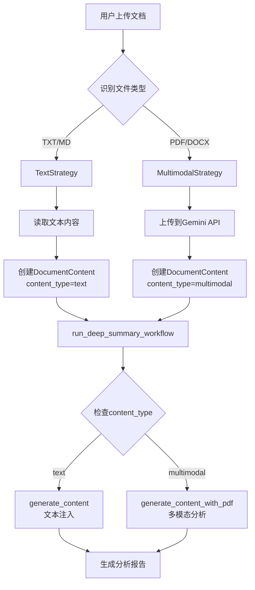

# Design Document

## Overview

本设计文档描述了如何以最小修改方案扩展现有PDF工作流以支持多种文档格式（TXT、MD、WORD等）。设计遵循以下核心原则：

1. **复用现有架构**：最大化利用现有的PDFContent、workflow和summarizer组件
2. **策略模式**：根据文档类型选择不同的处理策略（文本注入 vs 多模态分析）
3. **零侵入**：不修改现有的模型参数、Prompt模板和核心工作流逻辑
4. **扩展性**：通过配置和工厂模式轻松添加新格式支持

## Architecture

### 高层架构

```
┌─────────────────┐
│   API Layer     │  接收文档上传请求
│  (api.py)       │
└────────┬────────┘
         │
         ▼
┌─────────────────┐
│ Document        │  统一文档处理入口
│ Processor       │  - 格式识别
│ (new)           │  - 策略选择
└────────┬────────┘
         │
    ┌────┴────┐
    │         │
    ▼         ▼
┌────────┐ ┌──────────┐
│ Text   │ │Multimodal│  处理策略
│Strategy│ │ Strategy │
└───┬────┘ └────┬─────┘
    │           │
    └─────┬─────┘
          ▼
┌─────────────────┐
│ DocumentContent │  统一内容模型
│ (扩展PDFContent)│
└────────┬────────┘
         │
         ▼
┌─────────────────┐
│   Workflow      │  现有工作流（不修改）
│ (workflow.py)   │
└────────┬────────┘
         │
         ▼
┌─────────────────┐
│  Summarizer     │  内容生成（扩展）
│(summarizer.py)  │
└─────────────────┘
```

### 文档处理流程



## Components and Interfaces

### 1. DocumentProcessor（新增）

**职责**：统一的文档处理入口，负责格式识别和策略选择

**位置**：`src/reinvent_insight/document_processor.py`

```python
class DocumentProcessor:
    """统一文档处理器"""
    
    SUPPORTED_FORMATS = {
        'text': ['.txt', '.md'],
        'multimodal': ['.pdf', '.docx']
    }
    
    async def process_document(
        self, 
        file_path: str, 
        title: Optional[str] = None
    ) -> DocumentContent:
        """
        处理文档并返回统一的内容对象
        
        Args:
            file_path: 文档文件路径
            title: 可选的文档标题
            
        Returns:
            DocumentContent对象
        """
        pass
    
    def _get_document_type(self, file_path: str) -> str:
        """根据文件扩展名判断文档类型"""
        pass
    
    async def _process_text_document(
        self, 
        file_path: str, 
        title: Optional[str]
    ) -> DocumentContent:
        """处理文本类文档（TXT/MD）"""
        pass
    
    async def _process_multimodal_document(
        self, 
        file_path: str, 
        title: Optional[str]
    ) -> DocumentContent:
        """处理多模态文档（PDF/DOCX）"""
        pass
```

### 2. DocumentContent（扩展现有PDFContent）

**职责**：统一的文档内容数据模型

**位置**：`src/reinvent_insight/workflow.py`（扩展现有代码）

```python
@dataclass
class DocumentContent:
    """文档内容封装类（扩展自PDFContent）"""
    file_info: Dict[str, Any]  # 文件信息
    title: str  # 文档标题
    content_type: str  # 'text' 或 'multimodal'
    text_content: Optional[str] = None  # 文本内容（仅text类型）
    
    @property
    def file_id(self) -> str:
        """获取文件ID"""
        return self.file_info.get("name", "")
    
    @property
    def is_text(self) -> bool:
        """是否为文本类型"""
        return self.content_type == "text"
    
    @property
    def is_multimodal(self) -> bool:
        """是否为多模态类型"""
        return self.content_type == "multimodal"

# 保持向后兼容
PDFContent = DocumentContent  # 别名
```

### 3. Workflow修改（最小化）

**修改点**：在workflow.py中添加对text类型的支持

**原则**：通过条件判断而非重写逻辑

```python
class DeepSummaryWorkflow:
    def __init__(self, task_id: str, model_name: str, 
                 content: Union[str, DocumentContent], 
                 video_metadata: VideoMetadata):
        self.task_id = task_id
        self.model_name = model_name
        self.content = content
        
        # 判断内容类型
        if isinstance(content, str):
            # 向后兼容：字符串视为transcript
            self.content_type = "transcript"
            self.transcript = content
        elif isinstance(content, DocumentContent):
            self.content_type = content.content_type
            self.transcript = content.text_content or ""
        
        # ... 其他初始化代码保持不变
    
    async def _generate_outline(self) -> Optional[str]:
        """生成大纲（添加对text类型的支持）"""
        # 根据content_type选择处理方式
        if self.content_type == "text":
            # 文本注入方式
            outline = await self.summarizer.generate_content(prompt)
        elif self.content_type == "multimodal":
            # 多模态方式
            outline = await self.summarizer.generate_content_with_pdf(
                prompt, 
                self.content.file_info
            )
        else:
            # 向后兼容：transcript方式
            outline = await self.summarizer.generate_content(prompt)
        
        # ... 其他逻辑保持不变
```

### 4. Summarizer扩展（已存在）

**现状**：已有`generate_content`和`generate_content_with_pdf`两个方法

**无需修改**：现有接口已满足需求

- `generate_content(prompt)` - 用于文本注入
- `generate_content_with_pdf(prompt, file_info)` - 用于多模态分析

### 5. API端点（新增）

**位置**：`src/reinvent_insight/api.py`

```python
@app.post("/analyze-document")
async def analyze_document(
    file: UploadFile = File(...),
    title: Optional[str] = None
):
    """
    通用文档分析端点
    支持格式：TXT, MD, PDF, DOCX
    """
    # 1. 验证文件格式
    # 2. 保存临时文件
    # 3. 调用DocumentProcessor处理
    # 4. 启动workflow
    # 5. 返回任务ID
    pass
```

## Data Models

### DocumentContent数据结构

```python
{
    "file_info": {
        "name": "doc_identifier",
        "path": "/path/to/file",
        "mime_type": "text/plain",
        "size_bytes": 12345,
        "local_file": True
    },
    "title": "文档标题",
    "content_type": "text",  # 或 "multimodal"
    "text_content": "完整的文本内容..."  # 仅text类型有值
}
```

### 文档类型映射

```python
DOCUMENT_TYPE_MAP = {
    '.txt': {
        'type': 'text',
        'mime_type': 'text/plain',
        'strategy': 'text_injection'
    },
    '.md': {
        'type': 'text',
        'mime_type': 'text/markdown',
        'strategy': 'text_injection'
    },
    '.pdf': {
        'type': 'multimodal',
        'mime_type': 'application/pdf',
        'strategy': 'multimodal_analysis'
    },
    '.docx': {
        'type': 'multimodal',
        'mime_type': 'application/vnd.openxmlformats-officedocument.wordprocessingml.document',
        'strategy': 'multimodal_analysis'
    }
}
```

## Error Handling

### 错误类型和处理策略

1. **不支持的文件格式**
   - 检查点：API层文件上传时
   - 处理：返回400错误，提示支持的格式列表

2. **文件读取失败**
   - 检查点：DocumentProcessor读取文件时
   - 处理：记录错误日志，返回500错误，清理临时文件

3. **文件大小超限**
   - 检查点：API层文件上传时
   - 处理：返回413错误，提示最大文件大小

4. **编码错误**
   - 检查点：读取文本文件时
   - 处理：尝试多种编码（UTF-8, GBK），失败则返回错误

5. **API调用失败**
   - 检查点：Gemini API调用时
   - 处理：重试机制（已存在），失败后通知用户

### 错误处理流程

```python
try:
    # 1. 验证文件
    validate_file(file)
    
    # 2. 处理文档
    content = await processor.process_document(file_path, title)
    
    # 3. 启动工作流
    await run_deep_summary_workflow(task_id, model_name, content, metadata)
    
except UnsupportedFormatError as e:
    logger.error(f"不支持的文件格式: {e}")
    return {"error": "不支持的文件格式", "supported": SUPPORTED_FORMATS}
    
except FileReadError as e:
    logger.error(f"文件读取失败: {e}")
    cleanup_temp_file(file_path)
    return {"error": "文件读取失败，请检查文件是否损坏"}
    
except Exception as e:
    logger.error(f"处理文档时发生错误: {e}", exc_info=True)
    cleanup_temp_file(file_path)
    return {"error": "处理失败，请稍后重试"}
```

## Testing Strategy

### 单元测试

1. **DocumentProcessor测试**
   - 测试格式识别逻辑
   - 测试文本文档读取
   - 测试多模态文档处理
   - 测试错误处理

2. **DocumentContent测试**
   - 测试数据模型创建
   - 测试属性访问
   - 测试向后兼容性

3. **Workflow测试**
   - 测试text类型处理
   - 测试multimodal类型处理
   - 测试向后兼容性（transcript）

### 集成测试

1. **端到端测试**
   - 上传TXT文件 → 生成报告
   - 上传MD文件 → 生成报告
   - 上传DOCX文件 → 生成报告
   - 上传PDF文件 → 验证现有功能不受影响

2. **错误场景测试**
   - 上传不支持格式
   - 上传损坏文件
   - 上传超大文件
   - 上传空文件

### 测试数据

准备测试文档：
- `test_sample.txt` - 简单文本文档
- `test_sample.md` - 包含Markdown格式的文档
- `test_sample.docx` - 包含图表的Word文档
- `test_sample.pdf` - 现有PDF测试文件

## Implementation Notes

### 代码修改清单

**新增文件**：
1. `src/reinvent_insight/document_processor.py` - 文档处理器

**修改文件**：
1. `src/reinvent_insight/workflow.py` - 扩展DocumentContent，添加content_type判断
2. `src/reinvent_insight/api.py` - 添加新的API端点
3. `src/reinvent_insight/utils.py` - 添加文档标识符生成函数

**不修改文件**：
1. `src/reinvent_insight/summarizer.py` - 无需修改
2. `src/reinvent_insight/prompts.py` - 无需修改
3. `src/reinvent_insight/config.py` - 无需修改（可选添加配置）

### 向后兼容性保证

1. **PDFContent别名**：保持PDFContent作为DocumentContent的别名
2. **字符串参数**：workflow继续支持字符串类型的transcript参数
3. **现有API**：保持现有的PDF分析API不变
4. **文件结构**：生成的报告格式和存储位置保持不变

### 配置项（可选）

```python
# config.py
MAX_TEXT_FILE_SIZE = 10 * 1024 * 1024  # 10MB
MAX_BINARY_FILE_SIZE = 50 * 1024 * 1024  # 50MB
SUPPORTED_TEXT_FORMATS = ['.txt', '.md']
SUPPORTED_BINARY_FORMATS = ['.pdf', '.docx']
```

## Performance Considerations

1. **文件大小限制**
   - 文本文件：10MB（可配置）
   - 二进制文件：50MB（可配置）

2. **内存使用**
   - 文本文件：直接读入内存
   - 大文件：考虑流式读取（未来优化）

3. **API调用**
   - 复用现有的速率限制机制
   - 无额外API调用开销

4. **缓存策略**
   - 复用现有的hash映射机制
   - 文档标识符生成保持一致

## Security Considerations

1. **文件验证**
   - 验证文件扩展名
   - 验证MIME类型
   - 验证文件大小

2. **路径安全**
   - 使用临时目录
   - 清理临时文件
   - 防止路径遍历攻击

3. **内容安全**
   - 文本内容长度限制
   - 特殊字符过滤（如需要）

## Future Enhancements

1. **更多格式支持**
   - RTF格式
   - HTML格式
   - EPUB格式

2. **批量处理**
   - 支持一次上传多个文档
   - 批量分析和报告生成

3. **格式转换**
   - 自动将DOCX转换为PDF进行处理
   - 统一的格式标准化

4. **增强的文本处理**
   - Markdown渲染预览
   - 代码块语法高亮识别
