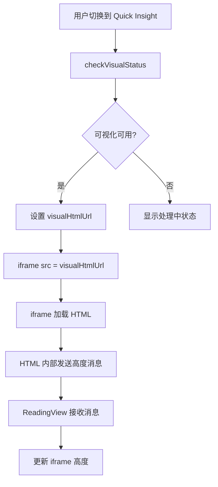

# Design Document

## Overview

本设计文档描述了如何将 ReadingView 组件中的 Quick Insight 可视化展示从直接 HTML 注入（`v-html`）改为使用 iframe 实现样式隔离。设计的核心目标是：

1. **完全的样式隔离**：通过 iframe 的独立浏览上下文，确保可视化 HTML 的样式不会与主应用样式冲突
2. **保持布局一致性**：iframe 的位置、尺寸和布局与当前实现保持一致
3. **自动高度适配**：通过 postMessage 通信机制，实现 iframe 高度自动适配内容
4. **性能优化**：避免不必要的 HTML 内容预加载，直接使用 iframe 的 src 属性加载

## Architecture

### 组件结构

```
ReadingView
├── Quick Insight 模式
│   ├── visual-header (模式切换器)
│   └── visual-iframe-container
│       └── iframe (加载可视化 HTML)
└── Deep Insight 模式
    ├── toc-sidebar (目录)
    └── article-content (文章内容)
```

### 数据流



### 通信机制

使用 `postMessage` API 实现父窗口与 iframe 之间的通信：

1. **iframe → 父窗口**：发送内容高度信息
2. **父窗口 → iframe**：接收高度信息并更新 iframe 样式

## Components and Interfaces

### 1. ReadingView 组件修改

#### 模板变更

**当前实现（v-html 方式）：**
```html
<div v-else-if="displayMode === 'quick' && visualAvailable"
     class="reading-view__visual-container">
  <div class="reading-view__visual-header">
    <mode-toggle ... />
  </div>
  <div v-html="visualHtmlContent" 
       class="reading-view__visual-content">
  </div>
</div>
```

**新实现（iframe 方式）：**
```html
<div v-else-if="displayMode === 'quick' && visualAvailable"
     class="reading-view__visual-container">
  <div class="reading-view__visual-header">
    <mode-toggle ... />
  </div>
  <div class="reading-view__visual-iframe-container">
    <iframe
      ref="visualIframe"
      :src="visualHtmlUrl"
      class="reading-view__visual-iframe"
      :style="{ height: iframeHeight + 'px' }"
      frameborder="0"
      scrolling="no"
      @load="handleIframeLoad">
    </iframe>
  </div>
</div>
```

#### 响应式状态变更

**移除的状态：**
- `visualHtmlContent` - 不再需要预加载 HTML 内容

**新增的状态：**
- `iframeHeight` - iframe 的动态高度（初始值：800px）
- `visualIframe` - iframe 元素的引用

**保留的状态：**
- `visualHtmlUrl` - 可视化 HTML 的 URL
- `visualAvailable` - 可视化是否可用
- `visualStatus` - 可视化状态

#### 方法变更

**移除的方法：**
- `loadVisualHtml()` - 不再需要预加载 HTML 内容

**新增的方法：**
- `handleIframeLoad()` - 处理 iframe 加载完成事件
- `handleIframeMessage(event)` - 处理来自 iframe 的 postMessage 消息
- `setupIframeMessageListener()` - 设置消息监听器
- `cleanupIframeMessageListener()` - 清理消息监听器

**修改的方法：**
- `checkVisualStatus()` - 移除 `loadVisualHtml()` 调用
- `handleVersionChangeWithVisual()` - 移除 `loadVisualHtml()` 调用

### 2. iframe 内容脚本注入

为了实现高度自适应，需要在可视化 HTML 中注入一个脚本，用于向父窗口发送高度信息。

#### 方案 A：后端注入（推荐）

在后端生成可视化 HTML 时，在 `</body>` 标签前注入以下脚本：

```html
<script>
(function() {
  function sendHeight() {
    const height = Math.max(
      document.body.scrollHeight,
      document.body.offsetHeight,
      document.documentElement.clientHeight,
      document.documentElement.scrollHeight,
      document.documentElement.offsetHeight
    );
    
    window.parent.postMessage({
      type: 'iframe-height',
      height: height
    }, '*');
  }
  
  // 初始发送
  if (document.readyState === 'loading') {
    document.addEventListener('DOMContentLoaded', sendHeight);
  } else {
    sendHeight();
  }
  
  // 监听内容变化
  window.addEventListener('load', sendHeight);
  window.addEventListener('resize', sendHeight);
  
  // 使用 MutationObserver 监听 DOM 变化
  const observer = new MutationObserver(sendHeight);
  observer.observe(document.body, {
    childList: true,
    subtree: true,
    attributes: true,
    characterData: true
  });
})();
</script>
```

#### 方案 B：前端注入（备选）

如果后端无法修改，可以在 iframe 加载完成后，通过 `contentWindow` 注入脚本：

```javascript
handleIframeLoad() {
  const iframe = this.$refs.visualIframe;
  if (!iframe || !iframe.contentWindow) return;
  
  try {
    const script = iframe.contentDocument.createElement('script');
    script.textContent = `
      // 同上脚本内容
    `;
    iframe.contentDocument.body.appendChild(script);
  } catch (error) {
    console.error('无法注入脚本到 iframe:', error);
    // 回退到固定高度
    this.iframeHeight = 800;
  }
}
```

**注意**：方案 B 可能受到同源策略限制，如果可视化 HTML 与主应用不同源，则无法注入脚本。

### 3. 消息监听器实现

```javascript
// 设置消息监听器
setupIframeMessageListener() {
  this.iframeMessageHandler = (event) => {
    // 安全检查：验证消息来源
    // 注意：在生产环境中应该验证 event.origin
    if (event.data && event.data.type === 'iframe-height') {
      const newHeight = event.data.height;
      
      // 添加一些额外的空间，避免内容被裁剪
      this.iframeHeight = newHeight + 20;
      
      console.log('📏 [DEBUG] 更新 iframe 高度:', this.iframeHeight);
    }
  };
  
  window.addEventListener('message', this.iframeMessageHandler);
}

// 清理消息监听器
cleanupIframeMessageListener() {
  if (this.iframeMessageHandler) {
    window.removeEventListener('message', this.iframeMessageHandler);
    this.iframeMessageHandler = null;
  }
}
```

## Data Models

### 响应式状态

```javascript
// 新增状态
const iframeHeight = ref(800); // 初始高度 800px
const visualIframe = ref(null); // iframe 元素引用
let iframeMessageHandler = null; // 消息处理器引用

// 保留状态
const visualHtmlUrl = ref(null);
const visualAvailable = ref(false);
const visualStatus = ref('pending');
const currentVersion = ref(0);

// 移除状态
// const visualHtmlContent = ref(''); // 不再需要
```

### postMessage 消息格式

```typescript
interface IframeHeightMessage {
  type: 'iframe-height';
  height: number; // 内容高度（像素）
}
```

## Error Handling

### 1. iframe 加载失败

```javascript
handleIframeLoad() {
  const iframe = this.$refs.visualIframe;
  
  // 检查 iframe 是否成功加载
  try {
    if (!iframe || !iframe.contentWindow) {
      throw new Error('iframe 加载失败');
    }
    
    // 检查内容是否为错误页面
    const doc = iframe.contentDocument || iframe.contentWindow.document;
    if (doc.title.includes('Error') || doc.body.textContent.includes('404')) {
      throw new Error('可视化内容不存在');
    }
    
    console.log('✅ iframe 加载成功');
  } catch (error) {
    console.error('❌ iframe 加载错误:', error);
    
    // 显示错误提示
    this.visualStatus = 'failed';
    this.visualAvailable = false;
    
    // 可选：自动切换回 Deep Insight 模式
    this.displayMode = 'deep';
  }
}
```

### 2. 跨域限制

如果可视化 HTML 与主应用不同源，可能无法访问 iframe 内容。解决方案：

1. **推荐**：确保可视化 HTML 与主应用同源
2. **备选**：使用后端代理，将可视化 HTML 代理到同源路径
3. **回退**：如果无法同源，使用固定高度或用户手动调整高度

### 3. 消息安全验证

```javascript
handleIframeMessage(event) {
  // 验证消息来源（生产环境必须）
  const allowedOrigins = [
    window.location.origin,
    // 添加其他允许的源
  ];
  
  if (!allowedOrigins.includes(event.origin)) {
    console.warn('⚠️ 拒绝来自未知源的消息:', event.origin);
    return;
  }
  
  // 验证消息格式
  if (!event.data || typeof event.data !== 'object') {
    return;
  }
  
  if (event.data.type === 'iframe-height') {
    const height = parseInt(event.data.height, 10);
    
    if (isNaN(height) || height <= 0 || height > 50000) {
      console.warn('⚠️ 无效的高度值:', event.data.height);
      return;
    }
    
    this.iframeHeight = height + 20;
  }
}
```

## Testing Strategy

### 单元测试

1. **状态管理测试**
   - 测试 `iframeHeight` 初始值为 800
   - 测试 `visualIframe` ref 正确绑定

2. **方法测试**
   - 测试 `handleIframeLoad` 正确处理加载事件
   - 测试 `handleIframeMessage` 正确解析消息
   - 测试消息监听器的设置和清理

3. **错误处理测试**
   - 测试 iframe 加载失败时的错误处理
   - 测试无效消息的过滤
   - 测试跨域消息的拒绝

### 集成测试

1. **模式切换测试**
   - 测试从 Deep Insight 切换到 Quick Insight
   - 测试从 Quick Insight 切换到 Deep Insight
   - 测试切换过程中的动画和过渡

2. **高度适配测试**
   - 测试 iframe 高度自动适配内容
   - 测试窗口大小改变时的高度更新
   - 测试内容动态变化时的高度更新

3. **版本切换测试**
   - 测试版本切换时 iframe 重新加载
   - 测试版本切换时 URL 正确更新

### 端到端测试

1. **用户流程测试**
   - 用户打开文章 → 切换到 Quick Insight → 查看可视化内容
   - 用户在 Quick Insight 模式下切换版本
   - 用户在移动设备上查看 Quick Insight

2. **性能测试**
   - 测试 iframe 加载时间
   - 测试高度计算的性能影响
   - 测试大型可视化内容的渲染性能

3. **兼容性测试**
   - 测试不同浏览器（Chrome, Firefox, Safari, Edge）
   - 测试不同设备（桌面、平板、手机）
   - 测试不同屏幕尺寸

## CSS 样式设计

### 1. iframe 容器样式

```css
/* iframe 容器 - 替代原来的 visual-content */
.reading-view__visual-iframe-container {
  flex: 1;
  width: 100%;
  background: #121212;
  overflow-x: hidden;
  overflow-y: auto; /* 外部容器处理滚动 */
  position: relative;
}

/* iframe 元素 */
.reading-view__visual-iframe {
  width: 100%;
  min-height: 100vh; /* 最小高度为视口高度 */
  border: none;
  display: block;
  background: #121212;
  /* 高度通过内联样式动态设置 */
}
```

### 2. 加载状态样式

```css
/* iframe 加载中状态 */
.reading-view__visual-iframe-container--loading {
  display: flex;
  align-items: center;
  justify-content: center;
  min-height: 100vh;
}

.reading-view__visual-iframe-container--loading::before {
  content: '加载可视化内容中...';
  color: #9ca3af;
  font-size: 1rem;
}
```

### 3. 移动端适配

```css
@media (max-width: 768px) {
  .reading-view__visual-iframe-container {
    /* 移动端优化 */
    -webkit-overflow-scrolling: touch;
  }
  
  .reading-view__visual-iframe {
    min-height: 100vh;
  }
}
```

## 性能优化

### 1. 延迟加载

只有在用户切换到 Quick Insight 模式时才加载 iframe：

```javascript
watch(displayMode, (newMode) => {
  if (newMode === 'quick' && visualAvailable.value) {
    // iframe 会自动加载，无需额外操作
    console.log('🔄 切换到 Quick Insight，iframe 开始加载');
  }
});
```

### 2. 防抖高度更新

如果 iframe 内容频繁变化，使用防抖避免过多的高度更新：

```javascript
let heightUpdateTimer = null;

handleIframeMessage(event) {
  if (event.data && event.data.type === 'iframe-height') {
    // 清除之前的定时器
    if (heightUpdateTimer) {
      clearTimeout(heightUpdateTimer);
    }
    
    // 延迟更新高度
    heightUpdateTimer = setTimeout(() => {
      this.iframeHeight = event.data.height + 20;
    }, 100); // 100ms 防抖
  }
}
```

### 3. 内存清理

在组件卸载或模式切换时，清理 iframe 相关资源：

```javascript
watch(displayMode, (newMode, oldMode) => {
  if (oldMode === 'quick' && newMode !== 'quick') {
    // 清理 iframe
    const iframe = this.$refs.visualIframe;
    if (iframe) {
      iframe.src = 'about:blank'; // 释放内存
    }
  }
});
```

## 迁移计划

### 阶段 1：实现 iframe 基础功能
- 修改模板，使用 iframe 替代 v-html
- 实现基本的 iframe 加载逻辑
- 移除 `loadVisualHtml` 和 `visualHtmlContent`

### 阶段 2：实现高度自适应
- 添加 postMessage 消息监听
- 实现高度动态更新逻辑
- 后端注入高度通信脚本

### 阶段 3：优化和测试
- 添加错误处理
- 性能优化（防抖、内存清理）
- 编写测试用例

### 阶段 4：移动端适配
- 测试移动端表现
- 优化移动端样式
- 测试不同设备和浏览器

## 向后兼容性

- 保持所有现有的 props 和 emits 不变
- 保持版本切换逻辑不变
- 保持模式切换逻辑不变
- 保持 API 接口不变（`/api/article/{hash}/visual`）

## 安全考虑

1. **消息来源验证**：验证 postMessage 的来源，防止恶意消息
2. **内容安全策略**：确保 iframe 内容符合 CSP 策略
3. **XSS 防护**：虽然 iframe 提供隔离，但仍需确保可视化 HTML 内容安全
4. **同源策略**：优先使用同源的可视化 HTML，避免跨域问题

## 回退方案

如果 iframe 方案遇到无法解决的问题，可以回退到当前的 v-html 方案：

1. 保留当前代码的备份
2. 使用 feature flag 控制是否启用 iframe 方案
3. 提供配置选项让用户选择使用哪种方案
