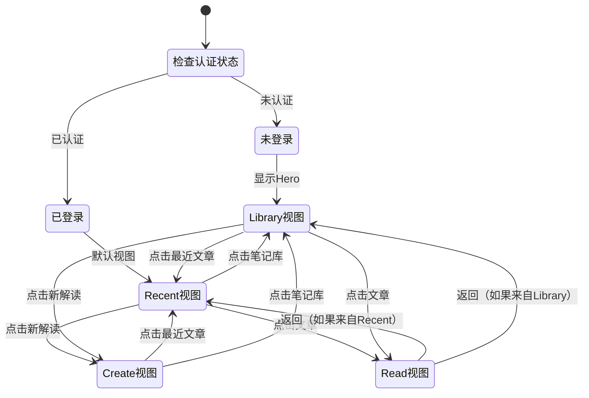
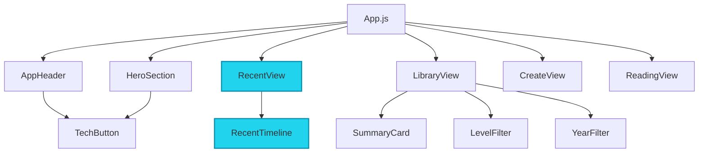
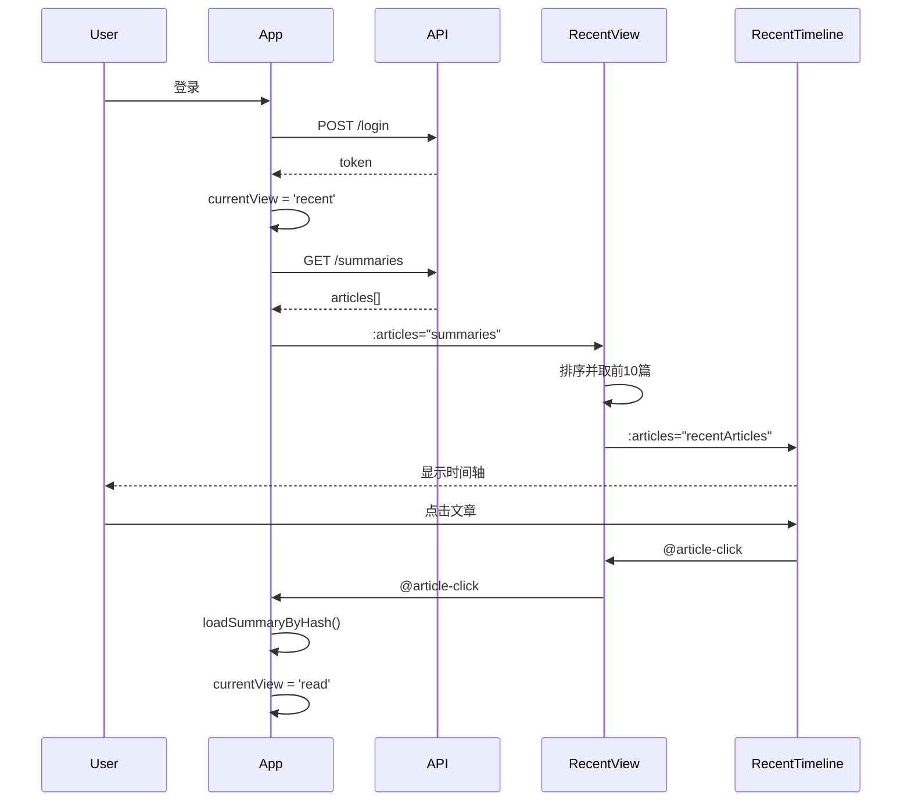

# Design Document

## Overview

本设计文档描述了如何将"最近文章时间轴"功能从 Hero Section 中分离出来，创建一个独立的 Recent View 页面。该重构将改善应用的信息架构，使登录后的用户能够快速访问最新更新的内容，同时恢复 Hero Section 的原始简洁设计。

## Architecture

### 组件层次结构

```
App (app.js)
├── AppHeader
│   ├── 导航按钮: 新解读 | 最近文章 | 笔记库
│   └── 用户操作: 登录/退出
├── HeroSection (仅未登录时显示)
│   ├── 欢迎标题
│   ├── 副标题
│   └── 登录按钮
├── RecentView (新增)
│   ├── 页面标题
│   ├── 副标题说明
│   └── RecentTimeline
│       └── 文章卡片列表
├── LibraryView
│   └── 分类文章列表
├── CreateView
│   └── 创建分析表单
└── ReadingView
    └── 文章阅读界面
```

### 视图路由系统

```
视图状态机:
- 'recent': 最近文章页面（登录后默认）
- 'library': 笔记库页面
- 'create': 创建分析页面
- 'read': 阅读页面
```

### 数据流

```
┌─────────────┐
│   app.js    │
│             │
│ summaries[] │ ← 从 /summaries API 加载
│             │
└──────┬──────┘
       │
       ├─────────────────┐
       │                 │
       ▼                 ▼
┌─────────────┐   ┌─────────────┐
│ RecentView  │   │ LibraryView │
│             │   │             │
│ 显示最近10篇 │    │ 显示全部分类  │
└─────────────┘   └─────────────┘
       │
       ▼
┌─────────────┐
│RecentTimeline│
│             │
│ 时间轴展示   │
└─────────────┘
```

## Components and Interfaces

### 1. RecentView 组件（新增）

**文件位置:**
- `web/components/views/RecentView/RecentView.js`
- `web/components/views/RecentView/RecentView.html`
- `web/components/views/RecentView/RecentView.css`

**Props:**
```javascript
{
  // 文章列表数据
  articles: {
    type: Array,
    default: () => []
  },
  
  // 加载状态
  loading: {
    type: Boolean,
    default: false
  },
  
  // 是否为访客模式
  isGuest: {
    type: Boolean,
    default: false
  }
}
```

**Emits:**
```javascript
[
  'article-click'  // 文章点击事件，传递文章对象
]
```

**依赖组件:**
```javascript
dependencies: [
  ['recent-timeline', '/components/common/RecentTimeline', 'RecentTimeline']
]
```

**计算属性:**
```javascript
{
  // 最近文章列表（按修改时间排序，取前10篇）
  recentArticles: computed(() => {
    return props.articles
      .filter(article => article && article.hash)
      .sort((a, b) => b.modified_at - a.modified_at)
      .slice(0, 10);
  })
}
```

### 2. HeroSection 组件（修改）

**移除的 Props:**
- `recentArticles`
- `recentLoading`

**移除的 Emits:**
- `article-click`

**移除的依赖:**
- `recent-timeline` 组件

**修改后的显示逻辑:**
```javascript
// 仅在未登录时显示
v-if="!isAuthenticated"
```

### 3. AppHeader 组件（修改）

**新增导航按钮:**

在普通模式下用户添加"最近文章"导航按钮：

```html
<div class="apheader__nav">
  <tech-button 
    variant="secondary" 
    :class="{ 'active': currentView === 'create' }"
    @click="handleViewChange('create')">
    新解读
  </tech-button>
  
  <!-- 新增 -->
  <tech-button 
    variant="secondary" 
    :class="{ 'active': currentView === 'recent' }"
    @click="handleViewChange('recent')">
    最近文章
  </tech-button>
  
  <tech-button 
    variant="secondary" 
    :class="{ 'active': currentView === 'library' }"
    @click="handleViewChange('library')">
    笔记库
  </tech-button>
</div>
```

移动端导航同样添加：

```html
<div class="app-header__mobile-nav">
  <tech-button variant="secondary" full-width
    :class="{ 'active': currentView === 'create' }"
    @click="handleViewChange('create')">
    新解读
  </tech-button>
  
  <!-- 新增 -->
  <tech-button variant="secondary" full-width
    :class="{ 'active': currentView === 'recent' }"
    @click="handleViewChange('recent')">
    最近文章
  </tech-button>
  
  <tech-button variant="secondary" full-width
    :class="{ 'active': currentView === 'library' }"
    @click="handleViewChange('library')">
    笔记库
  </tech-button>
</div>
```

### 4. App.js 主应用（修改）

**移除的状态变量:**
```javascript
// 删除这些
const recentArticles = ref([]);
const recentLoading = ref(false);
```

**移除的方法:**
```javascript
// 删除这个方法
const loadRecentArticles = async () => { ... }
```

**修改的计算属性:**
```javascript
// 修改 showHeroSection
const showHeroSection = computed(() => {
  // 仅在未登录且在 library 视图时显示
  return currentView.value === 'library' && !isAuthenticated.value && !isShareView.value;
});
```

**修改的方法:**

1. `getInitialView()` - 修改默认视图逻辑：
```javascript
const getInitialView = () => {
  const path = window.location.pathname;
  const hashMatch = path.match(/^\/d\/([a-zA-Z0-9]+)$/);
  const docMatch = path.match(/\/documents\/(.+)/);
  
  if (hashMatch || docMatch) {
    return 'read';
  }
  
  // 如果已登录，默认显示最近文章页面
  if (isAuthenticated.value) {
    return 'recent';
  }
  
  return 'library';
};
```

2. `login()` - 修改登录后的默认视图：
```javascript
const login = async (formData) => {
  try {
    // ... 登录逻辑 ...
    
    // 登录成功后跳转到最近文章页面
    currentView.value = 'recent';
    await nextTick();
    await loadSummaries();
  } catch (error) {
    // ... 错误处理 ...
  }
};
```

3. `goHome()` - 修改首页跳转逻辑：
```javascript
const goHome = () => {
  history.pushState(null, '', '/');
  
  // 根据登录状态决定默认视图
  currentView.value = isAuthenticated.value ? 'recent' : 'library';
  
  clearReadingState();
  closeVideoPlayer();
};
```

4. `onMounted()` - 移除 loadRecentArticles 调用：
```javascript
onMounted(async () => {
  checkAuth();
  handleRouting();
  window.addEventListener('popstate', handleRouting);
  await restoreTask();
  
  if (currentView.value === 'library' || currentView.value === 'recent') {
    await loadSummaries();
  }
  
  // 移除这行：
  // if (isAuthenticated.value) {
  //   await loadRecentArticles();
  // }
  
  // ... 其他初始化代码 ...
});
```

**新增的组件注册:**
```javascript
const components = [
  ['app-header', '/components/common/AppHeader', 'AppHeader'],
  ['hero-section', '/components/views/HeroSection', 'HeroSection'],
  ['create-view', '/components/views/CreateView', 'CreateView'],
  ['recent-view', '/components/views/RecentView', 'RecentView'],  // 新增
  ['library-view', '/components/views/LibraryView', 'LibraryView'],
  ['reading-view', '/components/views/ReadingView', 'ReadingView'],
  // ... 其他组件 ...
];
```

### 5. Index.html（修改）

**修改 Hero Section 的显示条件:**
```html
<!-- 首页展示区域 - 仅未登录时显示 -->
<hero-section 
  v-if="!isAuthenticated && currentView === 'library'" 
  :is-authenticated="isAuthenticated" 
  @login-click="handleLoginShow">
</hero-section>
```

**新增 Recent View:**
```html
<!-- 最近文章视图 -->
<div v-if="currentView === 'recent' && !isShareView" class="max-w-3xl mx-auto p-6 fade-in">
  <recent-view 
    :articles="summaries" 
    :loading="libraryLoading"
    :is-guest="!isAuthenticated"
    @article-click="handleSummaryClick">
  </recent-view>
</div>
```

## Data Models

### Article 数据模型

```typescript
interface Article {
  hash: string;              // 文章唯一标识
  title_cn?: string;         // 中文标题
  title_en?: string;         // 英文标题
  filename: string;          // 文件名
  modified_at: number;       // 修改时间戳（秒）
  word_count?: number;       // 字数
  size?: number;             // 文件大小
  level?: string;            // 级别（re:Invent）
  upload_date?: string;      // 上传日期
  content_type?: string;     // 内容类型
  is_pdf?: boolean;          // 是否为PDF
  video_url?: string;        // 视频URL
}
```

### View State 视图状态

```typescript
type ViewState = 'recent' | 'library' | 'create' | 'read';

interface AppState {
  currentView: ViewState;
  isAuthenticated: boolean;
  summaries: Article[];
  libraryLoading: boolean;
  // ... 其他状态
}
```

## Error Handling

### 1. 数据加载错误

**场景:** API 请求失败或返回无效数据

**处理策略:**
- 显示友好的错误提示
- 提供重试按钮
- 降级到空状态显示

```javascript
try {
  const res = await axios.get('/summaries');
  summaries.value = Array.isArray(res.data) ? res.data : (res.data.summaries || []);
} catch (error) {
  console.error('加载文章列表失败:', error);
  showToast('加载文章列表失败', 'danger');
  summaries.value = [];
}
```

### 2. 文章点击错误

**场景:** 点击文章时缺少必要的 hash 或数据

**处理策略:**
- 验证数据完整性
- 记录错误日志
- 显示错误提示

```javascript
const handleArticleClick = (article) => {
  if (!article || !article.hash) {
    console.error('无效的文章数据:', article);
    showToast('文章数据无效', 'danger');
    return;
  }
  emit('article-click', article);
};
```

### 3. 视图切换错误

**场景:** 视图状态不一致或路由错误

**处理策略:**
- 验证视图状态
- 提供回退机制
- 记录状态变化

```javascript
const handleViewChange = (view) => {
  const validViews = ['recent', 'library', 'create', 'read'];
  if (!validViews.includes(view)) {
    console.error('无效的视图:', view);
    return;
  }
  currentView.value = view;
};
```

## Testing Strategy

### 1. 组件单元测试

**RecentView 组件测试:**
- ✓ 正确渲染文章列表
- ✓ 加载状态显示
- ✓ 空状态显示
- ✓ 文章点击事件触发
- ✓ 文章排序正确（按修改时间降序）
- ✓ 最多显示10篇文章

**HeroSection 组件测试:**
- ✓ 未登录时显示欢迎信息
- ✓ 已登录时不显示
- ✓ 不再包含时间轴组件
- ✓ 登录按钮点击事件

**AppHeader 组件测试:**
- ✓ 导航按钮正确显示
- ✓ 当前视图高亮显示
- ✓ 视图切换事件触发
- ✓ 移动端导航正确显示

### 2. 集成测试

**视图路由测试:**
- ✓ 登录后默认显示最近文章页面
- ✓ 点击导航按钮切换视图
- ✓ 浏览器前进后退正确工作
- ✓ URL 路径正确更新

**数据流测试:**
- ✓ summaries 数据正确传递到 RecentView
- ✓ 文章点击正确跳转到阅读视图
- ✓ 加载状态正确同步

### 3. 用户体验测试

**登录流程测试:**
- ✓ 登录成功后自动跳转到最近文章页面
- ✓ 最近文章页面正确显示数据
- ✓ 可以通过导航切换到其他页面

**导航测试:**
- ✓ 导航按钮响应迅速
- ✓ 视图切换动画流畅
- ✓ 移动端导航体验良好

**性能测试:**
- ✓ 页面加载时间 < 1秒
- ✓ 视图切换延迟 < 200ms
- ✓ 文章列表渲染流畅

## Design Decisions and Rationales

### 1. 为什么创建独立的 RecentView 而不是复用 LibraryView？

**决策:** 创建新的 RecentView 组件

**理由:**
- 职责分离：RecentView 专注于时间轴展示，LibraryView 专注于分类展示
- 样式差异：两者的布局和交互模式不同
- 可维护性：独立组件更容易维护和扩展
- 性能优化：可以针对不同场景优化渲染策略

### 2. 为什么移除 recentArticles 状态而直接使用 summaries？

**决策:** 移除独立的 recentArticles 状态

**理由:**
- 减少状态冗余：避免维护两份相同的数据
- 简化数据流：单一数据源更容易管理
- 减少 API 调用：不需要额外的数据加载
- 降低复杂度：减少状态同步的复杂性

### 3. 为什么登录后默认显示最近文章而不是笔记库？

**决策:** 登录后默认显示最近文章页面

**理由:**
- 用户需求：用户更关心最新更新的内容
- 信息优先级：最近文章是最有价值的信息
- 用户习惯：符合社交媒体和新闻应用的习惯
- 快速访问：减少用户查找最新内容的步骤

### 4. 为什么在导航栏中添加独立的"最近文章"按钮？

**决策:** 添加独立的导航按钮

**理由:**
- 信息架构：明确区分不同的内容视图
- 用户控制：让用户自由选择浏览方式
- 可发现性：提高最近文章功能的可见性
- 一致性：与其他导航按钮保持一致的交互模式

### 5. 为什么 Hero Section 仅在未登录时显示？

**决策:** 已登录用户不显示 Hero Section

**理由:**
- 空间利用：为内容留出更多空间
- 用户体验：已登录用户不需要看到欢迎信息
- 性能优化：减少不必要的组件渲染
- 视觉简洁：避免页面过于拥挤

## UI/UX Specifications

### RecentView 页面布局

```
┌─────────────────────────────────────────┐
│  最近文章                                │
│  快速浏览最近更新的深度分析笔记           │
├─────────────────────────────────────────┤
│                                         │
│  ┌─────────────────────────────────┐   │
│  │ 2024-11-04                      │   │
│  │ ● AWS re:Invent 2024 Keynote   │   │
│  │   深度解读云计算未来趋势         │   │
│  └─────────────────────────────────┘   │
│                                         │
│  ┌─────────────────────────────────┐   │
│  │ 2024-11-03                      │   │
│  │ ● 网络创新的力量                 │   │
│  │   NET201-INT 技术分析           │   │
│  └─────────────────────────────────┘   │
│                                         │
│  ... 更多文章 ...                       │
│                                         │
└─────────────────────────────────────────┘
```

### 样式规范

**页面标题:**
- 字体: Outfit, Inter
- 大小: 1.875rem (30px)
- 颜色: 渐变色（cyan → blue → purple）
- 字重: 700

**副标题:**
- 字体: Inter
- 大小: 1rem (16px)
- 颜色: #9ca3af
- 字重: 500

**时间轴样式:**
- 复用现有的 RecentTimeline 组件样式
- 保持与其他视图一致的视觉风格

### 响应式设计

**桌面端 (≥768px):**
- 最大宽度: 48rem (768px)
- 内边距: 1.5rem
- 时间轴项间距: 1rem

**移动端 (<768px):**
- 最大宽度: 100%
- 内边距: 1rem
- 时间轴项间距: 0.75rem
- 导航按钮全宽显示

## Mermaid Diagrams

### 视图切换流程



### 组件依赖关系



### 数据流图


