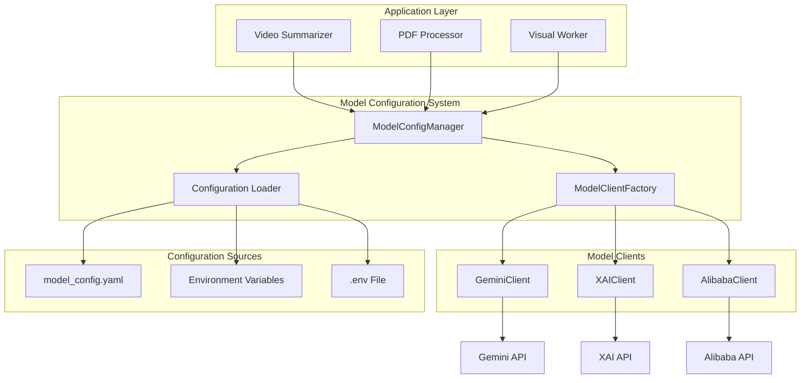

# Design Document

## Overview

本设计文档描述了统一模型配置系统的架构和实现方案。该系统将替代当前分散的、硬编码的模型调用逻辑，提供一个集中式、可配置的模型管理方案。

核心设计理念：
- **配置驱动**：所有模型配置通过 YAML 文件和环境变量管理
- **任务导向**：按任务类型（video_summary、pdf_processing、visual_generation、document_analysis）组织配置
- **统一接口**：所有模型客户端实现相同的接口，便于切换和扩展
- **彻底重构**：移除所有硬编码逻辑，统一到新的配置系统

## Architecture

### 系统架构图



### 配置层次结构

```
model_config.yaml (默认配置)
    ↓ (覆盖)
Environment Variables (环境特定配置)
    ↓ (覆盖)
Runtime Parameters (运行时参数)
```

## Components and Interfaces

### 1. ModelConfig (数据类)

配置数据结构，表示单个任务类型的模型配置。

```python
@dataclass
class ModelConfig:
    """模型配置数据类"""
    task_type: str                    # 任务类型标识
    provider: str                     # 模型提供商 (gemini/xai/alibaba)
    model_name: str                   # 具体模型名称
    api_key: str                      # API密钥
    
    # 生成参数
    temperature: float = 0.7
    top_p: float = 0.9
    top_k: int = 40
    max_output_tokens: int = 8000
    
    # 速率限制
    rate_limit_interval: float = 0.5  # API调用间隔（秒）
    max_retries: int = 3              # 最大重试次数
    retry_backoff_base: float = 2.0   # 重试退避基数
```

### 2. ModelConfigManager (配置管理器)

负责加载、管理和提供模型配置。

```python
class ModelConfigManager:
    """模型配置管理器"""
    
    def __init__(self, config_path: Optional[Path] = None):
        """初始化配置管理器"""
        
    def load_config(self) -> None:
        """从配置文件和环境变量加载配置"""
        
    def get_config(self, task_type: str) -> ModelConfig:
        """获取指定任务类型的配置"""
        
    def get_default_config(self) -> ModelConfig:
        """获取默认配置"""
        
    def reload_config(self) -> None:
        """重新加载配置（用于热更新）"""
```

### 3. BaseModelClient (抽象基类)

所有模型客户端的基类，定义统一接口。

```python
class BaseModelClient(ABC):
    """模型客户端抽象基类"""
    
    def __init__(self, config: ModelConfig):
        """初始化模型客户端"""
        self.config = config
        self._rate_limiter = RateLimiter(config.rate_limit_interval)
        
    @abstractmethod
    async def generate_content(
        self, 
        prompt: str, 
        is_json: bool = False
    ) -> str:
        """生成文本内容"""
        
    @abstractmethod
    async def generate_content_with_file(
        self,
        prompt: str,
        file_info: Dict[str, Any],
        is_json: bool = False
    ) -> str:
        """使用文件生成内容（多模态）"""
        
    async def _apply_rate_limit(self) -> None:
        """应用速率限制"""
        
    async def _retry_with_backoff(
        self,
        func: Callable,
        *args,
        **kwargs
    ) -> Any:
        """带指数退避的重试机制"""
```

### 4. GeminiClient (Gemini实现)

Gemini API 的具体实现。

```python
class GeminiClient(BaseModelClient):
    """Gemini模型客户端"""
    
    def __init__(self, config: ModelConfig):
        super().__init__(config)
        genai.configure(api_key=config.api_key)
        self.model = genai.GenerativeModel(config.model_name)
        
    async def generate_content(
        self, 
        prompt: str, 
        is_json: bool = False
    ) -> str:
        """实现Gemini文本生成"""
        
    async def generate_content_with_file(
        self,
        prompt: str,
        file_info: Dict[str, Any],
        is_json: bool = False
    ) -> str:
        """实现Gemini多模态生成"""
```

### 5. ModelClientFactory (工厂类)

根据配置创建相应的模型客户端实例。

```python
class ModelClientFactory:
    """模型客户端工厂"""
    
    _client_registry: Dict[str, Type[BaseModelClient]] = {
        "gemini": GeminiClient,
        "xai": XAIClient,
        "alibaba": AlibabaClient,
    }
    
    @classmethod
    def create_client(cls, config: ModelConfig) -> BaseModelClient:
        """根据配置创建模型客户端"""
        
    @classmethod
    def register_client(
        cls, 
        provider: str, 
        client_class: Type[BaseModelClient]
    ) -> None:
        """注册新的模型客户端类型"""
```

### 6. RateLimiter (速率限制器)

全局速率限制器，控制 API 调用频率。

```python
class RateLimiter:
    """全局速率限制器"""
    
    _lock = asyncio.Lock()
    _last_call_time: Dict[str, float] = {}
    
    def __init__(self, interval: float):
        self.interval = interval
        
    async def acquire(self, key: str = "default") -> None:
        """获取调用许可，必要时等待"""
```

## Data Models

### Configuration File Structure (YAML)

```yaml
# model_config.yaml

# 默认配置（所有任务的后备配置）
default:
  provider: gemini
  model_name: gemini-2.0-flash-exp
  api_key_env: GEMINI_API_KEY
  generation:
    temperature: 0.7
    top_p: 0.9
    top_k: 40
    max_output_tokens: 8000
  rate_limit:
    interval: 0.5
    max_retries: 3
    retry_backoff_base: 2.0

# 任务特定配置
tasks:
  # 视频摘要任务
  video_summary:
    provider: gemini
    model_name: gemini-2.5-pro
    api_key_env: GEMINI_API_KEY
    generation:
      temperature: 0.7
      top_p: 0.9
      top_k: 40
      max_output_tokens: 128000
    rate_limit:
      interval: 0.5
      max_retries: 3

  # PDF处理任务
  pdf_processing:
    provider: gemini
    model_name: gemini-2.0-flash-exp
    api_key_env: GEMINI_API_KEY
    generation:
      temperature: 0.8
      top_p: 0.9
      top_k: 40
      max_output_tokens: 8000
    rate_limit:
      interval: 0.5
      max_retries: 3

  # 可视化生成任务
  visual_generation:
    provider: gemini
    model_name: gemini-2.5-pro
    api_key_env: GEMINI_API_KEY
    generation:
      temperature: 0.8
      top_p: 0.9
      top_k: 40
      max_output_tokens: 128000
    rate_limit:
      interval: 0.5
      max_retries: 3

  # 文档分析任务
  document_analysis:
    provider: gemini
    model_name: gemini-2.5-pro
    api_key_env: GEMINI_API_KEY
    generation:
      temperature: 0.7
      top_p: 0.9
      top_k: 40
      max_output_tokens: 128000
    rate_limit:
      interval: 0.5
      max_retries: 3
```

### Environment Variable Override

环境变量命名规范：`MODEL_{TASK_TYPE}_{PARAMETER}`

示例：
```bash
# 覆盖 PDF 处理任务的模型名称
MODEL_PDF_PROCESSING_MODEL_NAME=gemini-2.5-pro

# 覆盖视频摘要任务的 temperature
MODEL_VIDEO_SUMMARY_TEMPERATURE=0.8

# 覆盖默认的 API Key
MODEL_DEFAULT_API_KEY=your-api-key-here
```

## Error Handling

### 错误类型和处理策略

1. **配置错误**
   - 配置文件不存在：使用默认配置 + 警告日志
   - 配置格式错误：使用默认配置 + 错误日志
   - API Key 缺失：抛出 `ConfigurationError` 异常

2. **API 调用错误**
   - 网络错误：自动重试（最多3次）
   - 速率限制：等待后重试
   - 认证错误：记录错误并抛出异常
   - 内容过滤：记录警告并返回 None

3. **模型客户端错误**
   - 不支持的提供商：抛出 `UnsupportedProviderError`
   - 客户端初始化失败：记录错误并使用默认客户端

### 异常类定义

```python
class ModelConfigError(Exception):
    """模型配置相关错误的基类"""
    pass

class ConfigurationError(ModelConfigError):
    """配置错误"""
    pass

class UnsupportedProviderError(ModelConfigError):
    """不支持的模型提供商"""
    pass

class APIError(ModelConfigError):
    """API调用错误"""
    pass
```

## Testing Strategy

### 单元测试

1. **ModelConfigManager 测试**
   - 测试配置文件加载
   - 测试环境变量覆盖
   - 测试默认配置回退
   - 测试配置验证

2. **ModelClientFactory 测试**
   - 测试客户端创建
   - 测试提供商注册
   - 测试错误处理

3. **BaseModelClient 测试**
   - 测试速率限制
   - 测试重试机制
   - 测试错误处理

4. **GeminiClient 测试**
   - 测试文本生成（使用 mock）
   - 测试多模态生成（使用 mock）
   - 测试配置应用

### 集成测试

1. **端到端配置测试**
   - 从配置文件到客户端创建的完整流程
   - 环境变量覆盖验证
   - 多任务类型配置隔离

2. **API 集成测试**
   - 真实 API 调用测试（使用测试 API Key）
   - 速率限制验证
   - 重试机制验证

### 迁移测试

1. **向后兼容性测试**
   - 验证现有代码无需修改即可工作
   - 验证 API 接口保持一致
   - 验证配置迁移路径

2. **性能测试**
   - 配置加载性能
   - 并发 API 调用性能
   - 速率限制器性能

## Migration Strategy

### 迁移步骤

1. **Phase 1: 创建新系统**
   - 实现 ModelConfig、ModelConfigManager
   - 实现 BaseModelClient 和 GeminiClient
   - 实现 ModelClientFactory 和 RateLimiter
   - 创建默认配置文件 `config/model_config.yaml`

2. **Phase 2: 重构现有模块**
   - **删除** `summarizer.py` 中的旧实现（GeminiSummarizer、get_summarizer 等）
   - **重构** `pdf_processor.py`，移除硬编码的模型配置，改用 ModelClient
   - **重构** `visual_worker.py`，使用任务类型获取模型客户端
   - **重构** `workflow.py`，统一使用新的模型客户端接口
   - **重构** `document_worker.py`，使用任务类型配置

3. **Phase 3: 清理和验证**
   - 移除所有旧的模型相关代码
   - 统一日志记录格式
   - 添加配置验证和错误处理
   - 运行集成测试验证功能
   - 更新文档和配置示例

### 需要修改的文件清单

1. **新增文件**
   - `src/reinvent_insight/model_config.py` - 配置管理和模型客户端
   - `config/model_config.yaml` - 模型配置文件

2. **需要重构的文件**
   - `src/reinvent_insight/visual_worker.py` - 第45行，改用 `get_model_client("visual_generation")`
   - `src/reinvent_insight/pdf_processor.py` - 整个类重构，使用 ModelClient
   - `src/reinvent_insight/workflow.py` - 所有模型调用改用新接口
   - `src/reinvent_insight/document_worker.py` - 使用任务类型配置

3. **需要删除的代码**
   - `src/reinvent_insight/summarizer.py` - 整个文件将被新系统替代

## Configuration Management

### 配置文件位置

- 默认位置：`config/model_config.yaml`
- 环境变量：`MODEL_CONFIG_PATH` 可指定自定义路径
- 项目根目录：`PROJECT_ROOT / "config" / "model_config.yaml"`

### 配置优先级

1. 运行时参数（最高优先级）
2. 环境变量
3. 配置文件
4. 默认值（最低优先级）

### 配置热更新

支持通过 `ModelConfigManager.reload_config()` 重新加载配置，无需重启应用。

## Security Considerations

1. **API Key 管理**
   - API Key 仅通过环境变量传递
   - 配置文件中仅存储环境变量名称
   - 日志中不记录完整 API Key

2. **配置文件权限**
   - 建议配置文件权限设置为 600 或 644
   - 敏感信息使用环境变量

3. **错误信息**
   - 错误日志不包含敏感信息
   - API 错误信息经过过滤

## Performance Considerations

1. **配置缓存**
   - 配置在首次加载后缓存
   - 避免重复解析 YAML 文件

2. **速率限制**
   - 使用全局锁避免竞态条件
   - 最小化锁持有时间

3. **异步操作**
   - 所有 API 调用使用异步接口
   - 支持并发请求（受速率限制约束）

## Extensibility

### 添加新的模型提供商

1. 创建新的客户端类继承 `BaseModelClient`
2. 实现必需的抽象方法
3. 注册到 `ModelClientFactory`
4. 在配置文件中添加配置示例

示例：
```python
class NewProviderClient(BaseModelClient):
    async def generate_content(self, prompt: str, is_json: bool = False) -> str:
        # 实现逻辑
        pass
        
    async def generate_content_with_file(self, prompt: str, file_info: Dict, is_json: bool = False) -> str:
        # 实现逻辑
        pass

# 注册
ModelClientFactory.register_client("new_provider", NewProviderClient)
```

### 添加新的任务类型

在配置文件中添加新的任务配置：

```yaml
tasks:
  new_task_type:
    provider: gemini
    model_name: gemini-2.5-pro
    # ... 其他配置
```

代码中使用：
```python
from .model_config import get_model_client

# 获取指定任务类型的客户端
client = get_model_client("new_task_type")

# 使用客户端
result = await client.generate_content(prompt)
```

### 统一的使用方式

所有模块都应该使用相同的方式获取模型客户端：

```python
from .model_config import get_model_client

class SomeWorker:
    def __init__(self, task_id: str):
        self.task_id = task_id
        # 根据任务类型获取客户端
        self.client = get_model_client("visual_generation")
    
    async def process(self):
        # 文本生成
        result = await self.client.generate_content(prompt)
        
        # 多模态生成
        result = await self.client.generate_content_with_file(
            prompt, 
            file_info
        )
```
