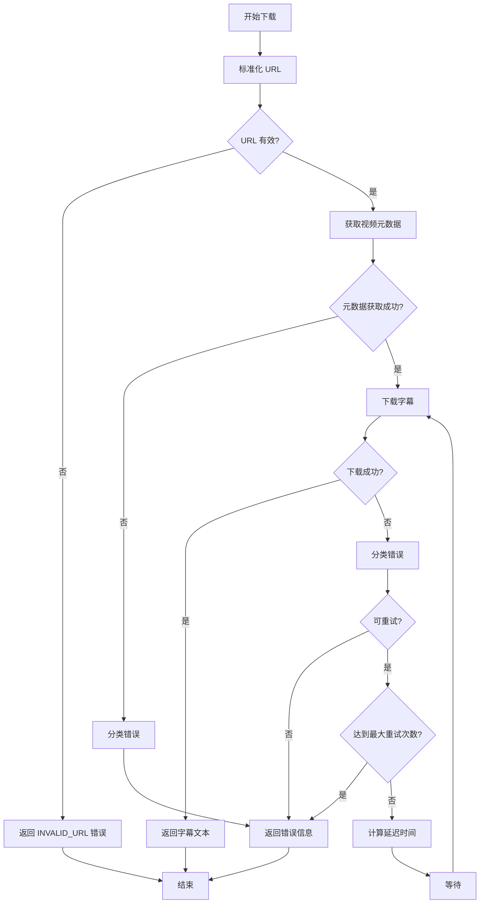

# 设计文档

## 概述

本设计文档描述了如何增强 YouTube 字幕下载系统的健壮性，使其能够处理各种 URL 格式，并在前端清晰地展示错误信息。设计遵循以下原则：

1. **全面的 URL 解析** - 支持所有常见的 YouTube URL 格式
2. **结构化错误处理** - 使用错误类型和上下文信息
3. **智能重试策略** - 根据错误类型采用不同的重试策略
4. **用户友好的错误展示** - 在前端清晰展示错误原因和建议操作

## 架构

### 系统组件

```
┌─────────────────┐
│   Frontend      │
│   (Vue.js)      │
└────────┬────────┘
         │ WebSocket/SSE
         ↓
┌─────────────────┐
│   API Layer     │
│   (FastAPI)     │
└────────┬────────┘
         │
         ↓
┌─────────────────┐
│  Task Manager   │
│  (Async Queue)  │
└────────┬────────┘
         │
         ↓
┌─────────────────┐
│  Worker Layer   │
│  (Async Tasks)  │
└────────┬────────┘
         │
         ↓
┌─────────────────┐
│   Downloader    │
│   (yt-dlp)      │
└─────────────────┘
```

### 数据流

1. 用户在前端提交 YouTube URL
2. API 层验证并创建任务
3. Worker 调用 Downloader 下载字幕
4. Downloader 标准化 URL 并执行下载
5. 错误信息通过 WebSocket/SSE 实时推送到前端
6. 前端解析并展示结构化的错误信息

## 组件和接口

### 1. URL 标准化模块

#### 位置
`src/reinvent_insight/downloader.py`

#### 接口

```python
def normalize_youtube_url(url: str) -> tuple[str, dict]:
    """
    标准化 YouTube URL 并提取元数据
    
    Args:
        url: 原始 YouTube URL
        
    Returns:
        tuple: (标准化的URL, 元数据字典)
        元数据包含: video_id, timestamp, playlist_id, share_id 等
        
    Raises:
        ValueError: 如果 URL 格式无效
    """
    pass
```

#### 支持的 URL 格式

| 格式 | 示例 | 说明 |
|------|------|------|
| 标准格式 | `https://www.youtube.com/watch?v=VIDEO_ID` | 基本格式 |
| 带时间戳 | `https://www.youtube.com/watch?v=VIDEO_ID&t=2209s` | 包含时间戳参数 |
| 带播放列表 | `https://www.youtube.com/watch?v=VIDEO_ID&list=...` | 包含播放列表 |
| 短链接 | `https://youtu.be/VIDEO_ID` | 短链接格式 |
| 短链接+分享 | `https://youtu.be/VIDEO_ID?si=SHARE_ID` | 带分享参数 |
| 嵌入式 | `https://www.youtube.com/embed/VIDEO_ID` | 嵌入式播放器 |
| 移动端 | `https://m.youtube.com/watch?v=VIDEO_ID` | 移动端链接 |

#### 实现策略

使用多个正则表达式模式按优先级匹配：

1. 嵌入式格式：`/embed/([a-zA-Z0-9_-]{11})`
2. 短链接格式：`youtu\.be/([a-zA-Z0-9_-]{11})`
3. 标准格式：`[?&]v=([a-zA-Z0-9_-]{11})`

提取 video_id 后，构建标准 URL：`https://www.youtube.com/watch?v={video_id}`

### 2. 错误处理模块

#### 错误类型定义

```python
from enum import Enum
from dataclasses import dataclass
from typing import Optional, List

class DownloadErrorType(Enum):
    """下载错误类型枚举"""
    NETWORK_TIMEOUT = "network_timeout"
    ACCESS_FORBIDDEN = "access_forbidden"
    NO_SUBTITLES = "no_subtitles"
    TOOL_MISSING = "tool_missing"
    INVALID_URL = "invalid_url"
    VIDEO_NOT_FOUND = "video_not_found"
    RATE_LIMITED = "rate_limited"
    UNKNOWN = "unknown"

@dataclass
class DownloadError:
    """结构化的下载错误信息"""
    error_type: DownloadErrorType
    message: str
    technical_details: Optional[str] = None
    suggestions: Optional[List[str]] = None
    retry_after: Optional[int] = None  # 秒数
    
    def to_dict(self) -> dict:
        """转换为字典格式，用于 JSON 序列化"""
        return {
            "error_type": self.error_type.value,
            "message": self.message,
            "technical_details": self.technical_details,
            "suggestions": self.suggestions,
            "retry_after": self.retry_after
        }
```

#### 错误分类逻辑

```python
def classify_download_error(
    stderr: str,
    returncode: int,
    exception: Optional[Exception] = None
) -> DownloadError:
    """
    根据 yt-dlp 的输出分类错误
    
    Args:
        stderr: yt-dlp 的错误输出
        returncode: 进程返回码
        exception: Python 异常对象（如果有）
        
    Returns:
        DownloadError: 结构化的错误信息
    """
    pass
```

错误分类规则：

| 错误特征 | 错误类型 | 建议操作 |
|---------|---------|---------|
| "403" 或 "Forbidden" | ACCESS_FORBIDDEN | 更新 Cookie 文件 |
| "timeout" 或 "timed out" | NETWORK_TIMEOUT | 检查网络连接，稍后重试 |
| "no subtitles" | NO_SUBTITLES | 该视频没有字幕 |
| "not found" 或 "404" | VIDEO_NOT_FOUND | 检查 URL 是否正确 |
| "429" 或 "rate limit" | RATE_LIMITED | 等待后重试 |
| "yt-dlp: command not found" | TOOL_MISSING | 安装 yt-dlp 工具 |

### 3. 重试策略模块

#### 接口

```python
@dataclass
class RetryConfig:
    """重试配置"""
    max_attempts: int = 3
    base_delay: float = 5.0  # 秒
    max_delay: float = 30.0  # 秒
    exponential_base: float = 2.0
    
class RetryStrategy:
    """重试策略管理器"""
    
    def should_retry(self, error: DownloadError, attempt: int) -> bool:
        """判断是否应该重试"""
        pass
    
    def get_delay(self, error: DownloadError, attempt: int) -> float:
        """计算重试延迟时间"""
        pass
```

#### 重试规则

| 错误类型 | 是否重试 | 重试策略 | 最大次数 |
|---------|---------|---------|---------|
| NETWORK_TIMEOUT | 是 | 指数退避 | 3 |
| ACCESS_FORBIDDEN | 是 | 递增延迟 (5s, 10s, 15s) | 3 |
| RATE_LIMITED | 是 | 固定延迟 30s | 2 |
| NO_SUBTITLES | 否 | - | 0 |
| VIDEO_NOT_FOUND | 否 | - | 0 |
| TOOL_MISSING | 否 | - | 0 |
| INVALID_URL | 否 | - | 0 |

### 4. 前端错误展示组件

#### 组件结构

```javascript
// ErrorDisplay.vue (概念性设计)
{
  props: {
    error: {
      type: Object,
      required: true,
      // 格式: { error_type, message, technical_details, suggestions }
    }
  },
  
  computed: {
    errorIcon() {
      // 根据 error_type 返回对应的图标
    },
    errorColor() {
      // 根据 error_type 返回对应的颜色
    }
  }
}
```

#### 错误展示样式

```
┌─────────────────────────────────────────┐
│ ⚠️ 访问被拒绝                            │
├─────────────────────────────────────────┤
│ YouTube 服务器拒绝了访问请求。           │
│                                         │
│ 建议操作：                               │
│ • 更新 Cookie 文件                       │
│ • 检查网络连接                           │
│ • 稍后重试                               │
│                                         │
│ [展开技术详情 ▼]                         │
└─────────────────────────────────────────┘
```

#### 错误类型映射

| 错误类型 | 图标 | 颜色 | 标题 |
|---------|------|------|------|
| NETWORK_TIMEOUT | ⏱️ | 橙色 | 网络超时 |
| ACCESS_FORBIDDEN | 🚫 | 红色 | 访问被拒绝 |
| NO_SUBTITLES | 📝 | 蓝色 | 字幕不可用 |
| TOOL_MISSING | 🔧 | 红色 | 工具缺失 |
| INVALID_URL | ❌ | 红色 | 无效的 URL |
| VIDEO_NOT_FOUND | 🔍 | 橙色 | 视频未找到 |
| RATE_LIMITED | ⏸️ | 黄色 | 请求过于频繁 |

### 5. WebSocket 消息协议

#### 错误消息格式

```json
{
  "type": "error",
  "error_type": "access_forbidden",
  "message": "YouTube 服务器拒绝了访问请求",
  "technical_details": "HTTP Error 403: Forbidden\nyt-dlp stderr: ...",
  "suggestions": [
    "更新 Cookie 文件",
    "检查网络连接",
    "稍后重试"
  ],
  "retry_after": null,
  "timestamp": "2024-11-14T10:30:00Z"
}
```

#### 重试消息格式

```json
{
  "type": "log",
  "message": "下载失败，5秒后重试 (第 1/3 次)",
  "level": "warning",
  "timestamp": "2024-11-14T10:30:00Z"
}
```

## 数据模型

### SubtitleDownloader 类增强

```python
class SubtitleDownloader:
    def __init__(self, url: str):
        self.original_url = url
        self.normalized_url, self.url_metadata = normalize_youtube_url(url)
        self.metadata: Optional[VideoMetadata] = None
        self.retry_strategy = RetryStrategy()
        self.error_history: List[DownloadError] = []
    
    def download(self) -> tuple[str | None, VideoMetadata | None, DownloadError | None]:
        """
        下载字幕
        
        Returns:
            tuple: (字幕文本, 视频元数据, 错误信息)
            如果成功，错误信息为 None
            如果失败，字幕文本和元数据为 None
        """
        pass
    
    def _download_with_retry(self) -> tuple[str | None, DownloadError | None]:
        """带重试的下载逻辑"""
        pass
    
    def _execute_download(self) -> tuple[str | None, DownloadError | None]:
        """执行单次下载尝试"""
        pass
```

## 错误处理流程

### 下载流程图



### 错误传播流程

```
Downloader (捕获异常)
    ↓
Worker (接收错误对象)
    ↓
TaskManager (序列化错误)
    ↓
WebSocket/SSE (发送 JSON)
    ↓
Frontend (解析并展示)
```

## 测试策略

### 单元测试

1. **URL 标准化测试**
   - 测试所有支持的 URL 格式
   - 测试无效 URL 的处理
   - 测试边界情况（特殊字符、超长 URL 等）

2. **错误分类测试**
   - 模拟各种 yt-dlp 错误输出
   - 验证错误类型分类的准确性
   - 测试建议操作的生成

3. **重试策略测试**
   - 测试不同错误类型的重试行为
   - 验证延迟时间计算
   - 测试最大重试次数限制

### 集成测试

1. **端到端下载测试**
   - 使用真实的 YouTube URL
   - 测试成功和失败场景
   - 验证错误信息的完整传播

2. **WebSocket 通信测试**
   - 测试错误消息的序列化和反序列化
   - 验证前端能正确接收和解析错误

### 手动测试场景

1. 提交带时间戳的 URL，验证能正确下载
2. 提交无字幕的视频 URL，验证错误提示
3. 断开网络后提交 URL，验证超时处理
4. 使用过期的 Cookie，验证 403 错误处理

## 日志和监控

### 日志级别

- **DEBUG**: URL 标准化详情、重试计算过程
- **INFO**: 下载开始、成功、重试信息
- **WARNING**: 可恢复的错误、重试尝试
- **ERROR**: 不可恢复的错误、最终失败

### 日志格式

```python
logger.info(
    "下载字幕",
    extra={
        "task_id": task_id,
        "original_url": original_url,
        "normalized_url": normalized_url,
        "video_id": video_id,
        "attempt": attempt,
        "duration_ms": duration_ms
    }
)
```

### 监控指标

1. **成功率**: 下载成功次数 / 总下载次数
2. **错误分布**: 各种错误类型的出现频率
3. **重试率**: 需要重试的下载次数 / 总下载次数
4. **平均重试次数**: 总重试次数 / 需要重试的下载次数
5. **平均下载时间**: 包含重试的总时间

## 性能考虑

1. **URL 标准化**: 使用编译后的正则表达式，避免重复编译
2. **错误分类**: 使用字典查找而非多个 if-else
3. **重试延迟**: 使用异步 sleep，不阻塞其他任务
4. **日志记录**: 使用结构化日志，避免字符串拼接

## 安全考虑

1. **URL 验证**: 严格验证 URL 格式，防止注入攻击
2. **错误信息**: 不在前端暴露敏感的系统信息
3. **重试限制**: 限制最大重试次数，防止资源耗尽
4. **Cookie 保护**: 不在日志中记录完整的 Cookie 内容

## 向后兼容性

1. 保持现有的 `download()` 方法签名兼容
2. 新增的错误信息作为可选的第三个返回值
3. 前端优雅降级：如果收到旧格式的错误消息，仍能正常显示

## 未来扩展

1. **错误统计仪表板**: 可视化展示错误分布和趋势
2. **自动 Cookie 刷新**: 检测到 403 错误时自动刷新 Cookie
3. **智能重试**: 基于历史数据动态调整重试策略
4. **多语言支持**: 错误消息和建议的国际化
