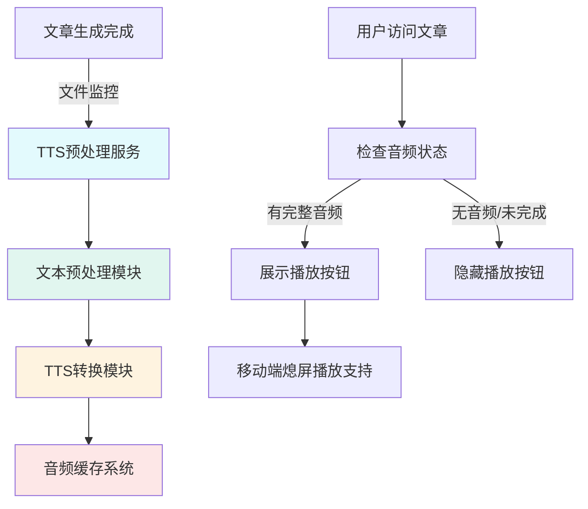
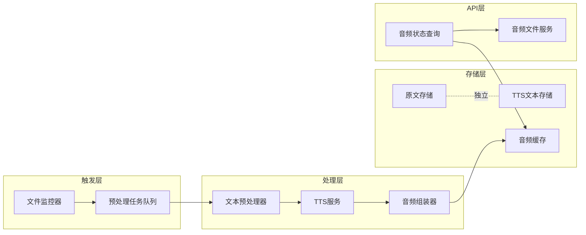
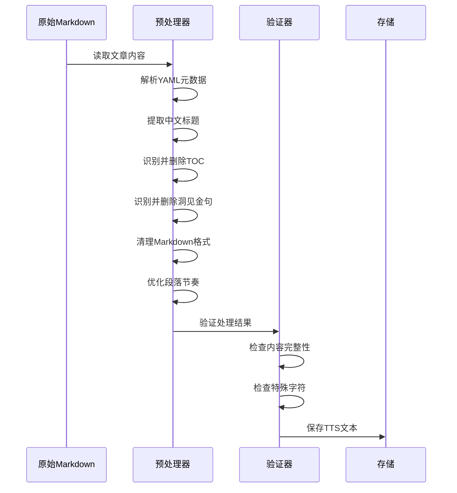
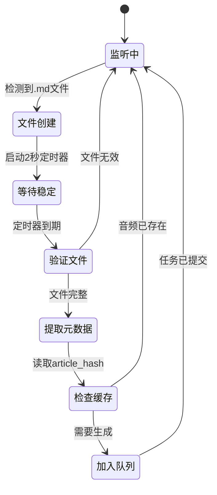
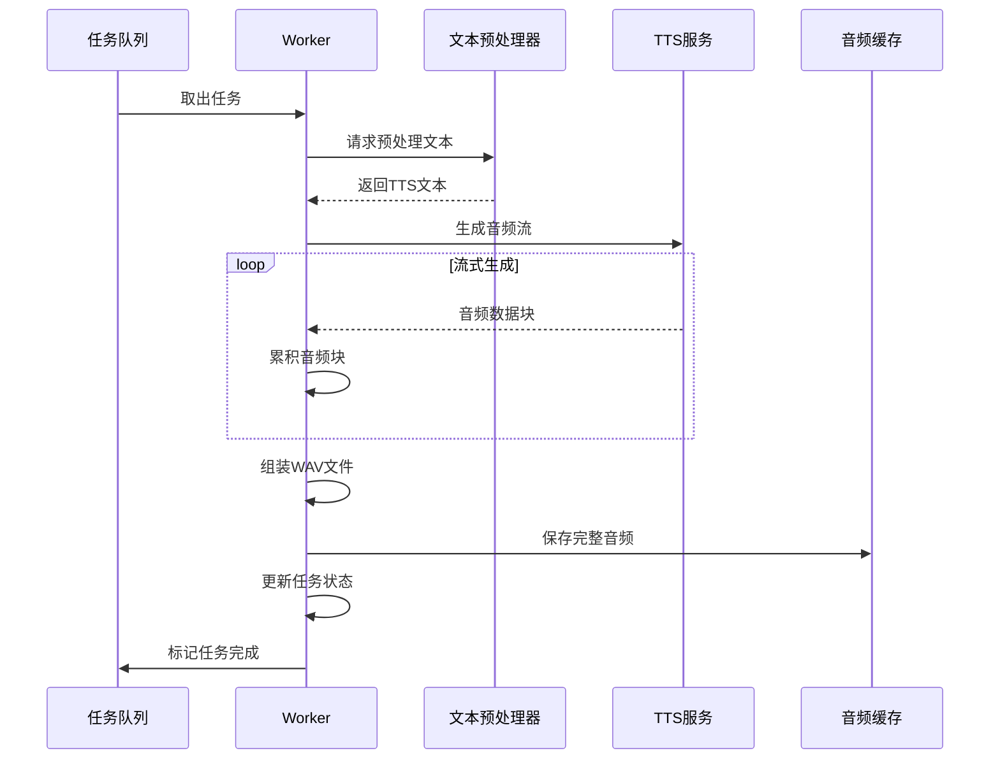
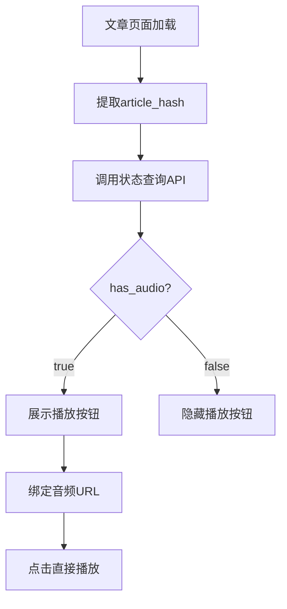
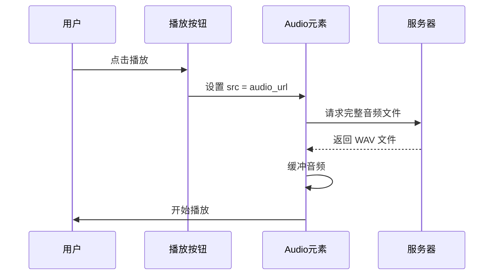
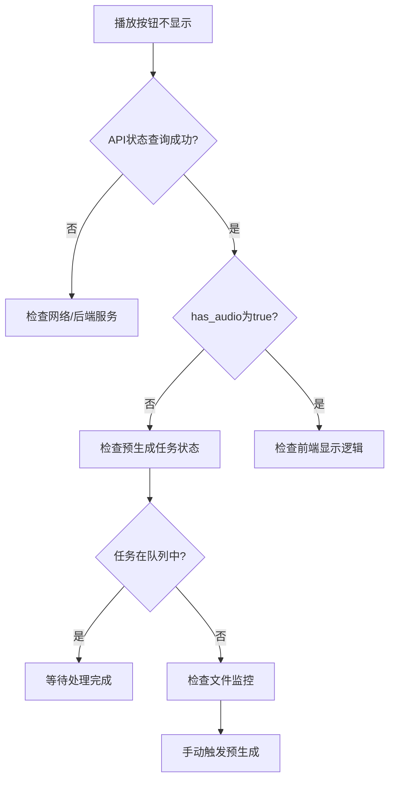

# 文章语音预处理与主动生成系统设计

## 需求概述

对已解读完成的文章进行专用于 TTS 播放的文本预处理，并实现系统主动预转换音频的机制，替代现有的用户触发流式缓冲模式。

### 核心需求

1. **文本预处理**：生成适合 TTS 朗读的文本版本
   - 去除英文标题，保留中文标题
   - 去除文章内的目录（TOC）
   - 去除结尾的洞见与金句
   - 调整段落与标点，优化朗读节奏和抑扬顿挫
   
2. **系统主动生成**：新文章完成时自动触发音频预生成
   - 监听文章生成完成事件
   - 后台自动执行 TTS 转换
   - 去除现有的用户主动点击流式缓冲逻辑
   
3. **播放控制优化**：
   - 仅展示已有完整音频的播放按钮
   - 未完成音频不展示播放按钮
   - 支持移动端熄屏播放

4. **隔离原则**：
   - 所有改动不影响原始阅读文章
   - 预处理结果与原文独立存储


## 系统架构设计

### 整体流程图



### 分层架构




## 详细设计

### 一、文本预处理模块

#### 职责
将原始 Markdown 文章转换为适合 TTS 朗读的纯文本。

#### 预处理规则表

| 处理项 | 规则 | 示例 |
|--------|------|------|
| 标题处理 | 保留中文标题，去除英文标题 | `# Title 标题` → `标题` |
| 目录去除 | 删除 `### 目录` 至下一个三级标题之间的所有内容 | 完全移除 TOC 章节 |
| 洞见金句 | 删除 `### 核心洞见` 和 `### 金句` 及其内容 | 从文末删除这两个章节 |
| 元数据清理 | 去除 YAML front matter | 删除 `---` 包裹的头部元数据 |
| Markdown格式 | 去除 Markdown 语法符号 | `**粗体**` → `粗体` |
| 代码块 | 跳过所有代码块 | 不朗读代码内容 |
| 段落调整 | 在标题后添加停顿标记 | 标题后加 `。` 增加停顿感 |
| 列表优化 | 将列表标记转换为序号词 | `- 项目` → `第一，项目` |
| 链接处理 | 仅保留链接文本 | `[文本](url)` → `文本` |
| 特殊符号 | 替换不适合朗读的符号 | `→` → `到` |

#### 文本节奏优化策略

**停顿控制**：
- 一级标题后添加长停顿（句号 + 换行）
- 二三级标题后添加中等停顿（句号）
- 段落间保留自然停顿（段落分隔符）
- 列表项之间添加短停顿（逗号）

**语气调整**：
- 问句保留问号，便于升调
- 感叹句保留感叹号，便于强调
- 引用内容前后添加停顿标记

#### 处理流程




### 二、文件监控与触发机制

#### 监控目标

监控 `downloads/summaries/` 目录下的 Markdown 文件创建事件。

#### 触发条件

| 事件类型 | 触发条件 | 延迟策略 |
|---------|---------|---------|
| 文件创建 | 检测到新 `.md` 文件 | 延迟 2 秒确保文件写入完成 |
| 文件修改 | 文件内容发生变化 | 不触发（避免频繁处理） |
| 文件完整性 | 文件大小 > 1KB 且包含 YAML 元数据 | 验证后触发 |

#### 事件处理流程



#### 任务去重策略

使用文章的唯一标识（`article_hash`）防止重复生成：
- 从 YAML 元数据中提取 `video_url` 或 `title`
- 计算内容哈希值
- 查询音频缓存系统
- 已存在完整音频则跳过


### 三、TTS 预生成服务

#### 服务架构

**任务队列设计**：

| 组件 | 技术选型 | 说明 |
|------|---------|------|
| 队列类型 | asyncio.Queue | 异步内存队列 |
| 并发控制 | 单 worker 模式 | 避免 API 频率限制 |
| 任务持久化 | JSON 文件 | 记录待处理和处理中的任务 |
| 失败重试 | 指数退避 | 3 次重试，间隔 2^n 秒 |

#### 生成流程



#### 任务状态管理

| 状态 | 说明 | 操作 |
|------|------|------|
| pending | 等待处理 | 新任务进入队列 |
| processing | 处理中 | Worker 正在生成 |
| completed | 已完成 | 音频已缓存 |
| failed | 失败 | 超过重试次数 |
| skipped | 跳过 | 音频已存在 |

#### 资源控制策略

**API 调用限制**：
- 单任务串行处理
- 任务间隔 1 秒
- 监控 API 配额使用情况

**内存管理**：
- 流式处理音频块
- 单次任务完成后释放内存
- 设置队列最大长度（100个任务）

**磁盘空间**：
- 监控缓存目录大小
- 超过上限（500MB）时触发 LRU 清理


### 四、存储与缓存设计

#### 目录结构

```
downloads/
├── summaries/                    # 原始文章（不修改）
│   └── article-name.md
├── tts_texts/                    # TTS专用文本（新增）
│   └── {article_hash}.txt
└── tts_cache/                    # 音频缓存（现有）
    ├── metadata.json
    └── {audio_hash}.wav
```

#### 文件命名规则

| 文件类型 | 命名格式 | 示例 |
|---------|---------|------|
| TTS文本 | `{article_hash}.txt` | `a1b2c3d4e5f6.txt` |
| 音频文件 | `{audio_hash}.wav` | `f6e5d4c3b2a1.wav` |
| 元数据 | `metadata.json` | 固定名称 |

#### 哈希计算方式

**Article Hash**（文章标识）：
```
SHA256(video_url + title + upload_date)[:16]
```

**Audio Hash**（音频标识）：
```
SHA256(tts_text + voice + language)[:16]
```

#### 元数据扩展

在现有 `metadata.json` 基础上增加字段：

| 字段 | 类型 | 说明 |
|------|------|------|
| article_hash | string | 关联的文章标识 |
| source_file | string | 原始文章文件名 |
| preprocessing_version | string | 预处理规则版本号 |
| generated_at | string | 生成时间（ISO 8601） |
| is_pregenerated | boolean | 是否为预生成（true） |


### 五、API 接口设计

#### 新增接口

**1. 查询音频状态**

| 属性 | 值 |
|------|-----|
| 路径 | `GET /api/tts/status/{article_hash}` |
| 参数 | `article_hash`: 文章唯一标识 |
| 响应 | JSON 对象 |

响应格式：
```
{
  "has_audio": boolean,          // 是否有完整音频
  "audio_url": string | null,    // 音频URL
  "duration": number | null,     // 音频时长（秒）
  "status": "ready" | "processing" | "none",
  "voice": string,               // 使用的音色
  "generated_at": string         // 生成时间
}
```

**2. 获取 TTS 文本**

| 属性 | 值 |
|------|-----|
| 路径 | `GET /api/tts/text/{article_hash}` |
| 参数 | `article_hash`: 文章唯一标识 |
| 响应 | 纯文本 |

**3. 手动触发预生成**（管理功能）

| 属性 | 值 |
|------|-----|
| 路径 | `POST /api/tts/pregenerate` |
| 请求体 | `{"filename": "article.md"}` |
| 响应 | `{"task_id": "...", "status": "queued"}` |

#### 现有接口调整

**流式接口移除**：

移除 `POST /api/tts/stream` 接口，因为改为预生成模式。

**生成接口保留**：

保留 `POST /api/tts/generate` 接口用于：
- 管理员手动生成
- 预生成失败后的降级方案
- 开发调试


### 六、前端集成设计

#### 播放按钮显示逻辑



#### 组件状态管理

**SimpleAudioButton 组件调整**：

| 属性 | 类型 | 说明 |
|------|------|------|
| articleHash | string | 必需，文章标识 |
| autoCheck | boolean | 自动检查音频状态（默认 true） |
| showIfReady | boolean | 仅在音频就绪时显示（默认 true） |
| audioUrl | string | 音频 URL（状态查询后自动设置） |

**数据流**：
```
mounted() → checkAudioStatus() → updateButtonState() → show/hide
```

#### 移动端熄屏播放支持

**技术方案**：Media Session API

实现要点：

| 功能点 | 实现方式 |
|-------|---------|
| 后台播放 | 使用 `<audio>` 元素而非 Web Audio API |
| 锁屏控制 | 注册 MediaSession 元数据和控制器 |
| 通知栏显示 | 设置标题、作者、封面图 |
| 控制按钮 | 播放/暂停、快进/快退、停止 |

元数据设置：
```
navigator.mediaSession.metadata = {
  title: 文章标题,
  artist: "ReInvent Insight",
  album: "深度解读",
  artwork: [封面图URL]
}
```

控制器绑定：
```
navigator.mediaSession.setActionHandler('play', handler)
navigator.mediaSession.setActionHandler('pause', handler)
navigator.mediaSession.setActionHandler('seekbackward', handler)
navigator.mediaSession.setActionHandler('seekforward', handler)
```


### 七、移除流式缓冲逻辑

#### 现有机制分析

当前实现：
- 用户点击播放 → 调用 `/api/tts/stream`
- SSE 流式返回音频块
- StreamBuffer 累积音频
- 达到缓冲阈值后开始播放

#### 移除范围

**后端**：
- 删除或废弃 `POST /api/tts/stream` 端点
- 移除 SSE 事件生成逻辑
- 清理流式相关的辅助函数

**前端**：
- SimpleAudioButton: 移除 `loadFromStream()` 调用
- 移除 StreamBuffer 流式追加逻辑
- 改为直接加载完整音频 URL

#### 新播放流程



#### 降级方案

如果音频文件较大，可保留基本的 HTTP Range 请求支持：
- 服务器返回 `Accept-Ranges: bytes` 头
- 浏览器自动分段下载
- 无需额外代码实现


### 八、错误处理与监控

#### 异常场景

| 场景 | 处理策略 | 用户体验 |
|------|---------|---------|
| 文本预处理失败 | 记录日志，任务标记为失败 | 不展示播放按钮 |
| TTS API 调用失败 | 指数退避重试 3 次 | 任务队列中延迟重试 |
| 音频组装失败 | 记录错误，清理临时文件 | 任务标记失败 |
| 存储空间不足 | 触发缓存清理，重试任务 | 清理后自动恢复 |
| 预生成超时 | 超过 10 分钟任务终止 | 标记失败，允许手动重试 |

#### 日志记录

**关键日志点**：
- 文件监控触发
- 文本预处理开始/完成
- TTS 任务加入队列
- 音频生成开始/进度/完成
- 缓存写入成功
- 错误详情（含堆栈）

**日志级别**：
- INFO: 正常流程节点
- WARNING: 重试、跳过
- ERROR: 失败、异常

#### 监控指标

建议收集的指标：

| 指标 | 说明 | 用途 |
|------|------|------|
| 任务队列长度 | 待处理任务数 | 负载监控 |
| 平均处理时长 | 单任务耗时 | 性能优化 |
| 成功率 | 完成/总数 | 质量监控 |
| 缓存命中率 | 已缓存/查询次数 | 效率评估 |
| 存储使用率 | 已用/总容量 | 资源管理 |


## 实施计划

### 阶段一：基础设施（1-2天）

**任务列表**：
1. 创建 `tts_texts/` 目录
2. 实现文本预处理器核心逻辑
3. 编写单元测试验证预处理规则
4. 扩展音频缓存元数据结构

**验收标准**：
- 预处理器能正确处理各类 Markdown 格式
- 生成的文本适合 TTS 朗读
- 测试覆盖率 > 80%

### 阶段二：预生成服务（2-3天）

**任务列表**：
1. 实现任务队列系统
2. 集成文件监控触发机制
3. 实现 Worker 处理逻辑
4. 添加任务状态持久化
5. 实现重试与错误处理

**验收标准**：
- 新文章自动触发预生成
- 任务可靠执行，失败能重试
- 任务状态可查询

### 阶段三：API 开发（1天）

**任务列表**：
1. 实现音频状态查询接口
2. 实现 TTS 文本获取接口
3. 实现手动触发接口
4. 更新 API 文档

**验收标准**：
- 接口返回正确的状态信息
- 响应时间 < 100ms
- 错误处理完善

### 阶段四：前端集成（2天）

**任务列表**：
1. 调整 SimpleAudioButton 组件
2. 移除流式播放逻辑
3. 实现移动端 MediaSession 支持
4. 添加加载状态提示
5. 适配移动端样式

**验收标准**：
- 仅在有音频时展示按钮
- 点击直接播放，无延迟
- 移动端锁屏可控制播放
- 通知栏显示正确信息

### 阶段五：测试与优化（1-2天）

**任务列表**：
1. 端到端测试完整流程
2. 性能测试（生成速度、并发）
3. 移动端浏览器兼容性测试
4. 负载测试（大量文章场景）
5. 错误恢复测试

**验收标准**：
- 完整流程无阻塞
- 单篇文章预生成 < 5 分钟
- 移动端主流浏览器支持
- 系统重启后任务可恢复


## 技术风险与应对

### 风险评估

| 风险 | 影响 | 可能性 | 应对措施 |
|------|------|--------|---------|
| TTS API 配额不足 | 高 | 中 | 实现优先级队列，重要文章优先 |
| 预生成速度过慢 | 中 | 高 | 设置并发数可配置，增加 API 并发 |
| 存储空间增长快 | 中 | 中 | 严格执行 LRU 策略，设置合理上限 |
| 移动端兼容性 | 中 | 低 | MediaSession API 降级方案 |
| 文本预处理误判 | 低 | 中 | 提供预览功能，支持手动修正 |

### 降级方案

**场景：预生成服务不可用**

回退策略：
1. 保留生成接口作为备用
2. 用户点击时按需生成
3. 前端显示"正在生成"提示
4. 生成完成后自动播放

**场景：移动端不支持 MediaSession**

兼容方案：
1. 检测 API 可用性
2. 不可用时仍显示播放按钮
3. 使用基础 `<audio>` 元素
4. 提示用户保持浏览器前台


## 性能优化建议

### 预生成优化

1. **智能预测**：优先为高访问量文章生成
2. **分时处理**：低峰期批量处理历史文章
3. **增量生成**：仅处理新增和修改的文章

### 缓存优化

1. **多级缓存**：内存缓存热点音频元数据
2. **CDN 分发**：音频文件可上传到 CDN
3. **压缩传输**：启用 gzip 压缩音频响应

### 移动端优化

1. **预加载策略**：文章页面加载时预加载音频元数据
2. **懒加载音频**：滚动到播放器时才加载音频文件
3. **网络自适应**：检测网络状态，弱网环境降低音质


## 配置参数设计

### 环境变量

| 变量名 | 默认值 | 说明 |
|--------|--------|------|
| TTS_PREGENERATE_ENABLED | true | 是否启用预生成 |
| TTS_QUEUE_MAX_SIZE | 100 | 任务队列最大长度 |
| TTS_WORKER_DELAY | 1.0 | 任务间隔（秒） |
| TTS_MAX_RETRIES | 3 | 最大重试次数 |
| TTS_TASK_TIMEOUT | 600 | 单任务超时（秒） |
| TTS_TEXT_DIR | downloads/tts_texts | TTS文本目录 |

### 配置文件扩展

在 `model_config.yaml` 中增加 TTS 预生成配置段：

```
text_to_speech:
  pregeneration:
    enabled: true
    priority_mode: "fifo"  # fifo | recent | popular
    auto_cleanup: true
    cleanup_threshold_mb: 450
    parallel_workers: 1
```


## 兼容性说明

### 浏览器支持

| 功能 | Chrome | Safari | Firefox | Edge |
|------|--------|--------|---------|------|
| 基础播放 | ✓ | ✓ | ✓ | ✓ |
| MediaSession | ✓ 73+ | ✓ 15+ | ✓ 82+ | ✓ 79+ |
| 锁屏控制 | ✓ | ✓ iOS 13+ | ✓ | ✓ |

### 移动系统要求

- **iOS**: 13.0 及以上
- **Android**: 8.0 及以上
- **浏览器**: Chrome Mobile 73+, Safari Mobile 15+

### 向后兼容

**已有音频缓存**：
- 现有缓存继续有效
- 自动识别预生成音频
- 元数据自动迁移

**前端兼容**：
- 旧版组件继续工作
- 新功能渐进增强
- 不破坏现有交互


## 监控与运维

### 运维检查清单

**每日检查**：
- [ ] 任务队列是否积压
- [ ] 预生成成功率
- [ ] 存储空间使用率
- [ ] API 调用配额剩余

**每周检查**：
- [ ] 清理失败任务日志
- [ ] 审查异常频率
- [ ] 优化预处理规则
- [ ] 更新监控报表

### 故障排查流程




## 总结

本设计方案通过引入专用的文本预处理和系统主动预生成机制，实现了以下目标：

1. **用户体验优化**：从流式缓冲改为预生成，点击即播，无等待
2. **内容质量提升**：专门优化的 TTS 文本，朗读效果更自然
3. **系统架构改进**：解耦生成与播放，提高系统可维护性
4. **移动端支持**：原生支持锁屏播放，提升移动端体验
5. **资源利用优化**：后台智能预生成，合理利用系统资源

设计遵循以下原则：
- **隔离性**：不修改原始文章，预处理结果独立存储
- **可靠性**：完善的错误处理和重试机制
- **可扩展性**：模块化设计，便于未来功能扩展
- **兼容性**：渐进增强，不破坏现有功能
