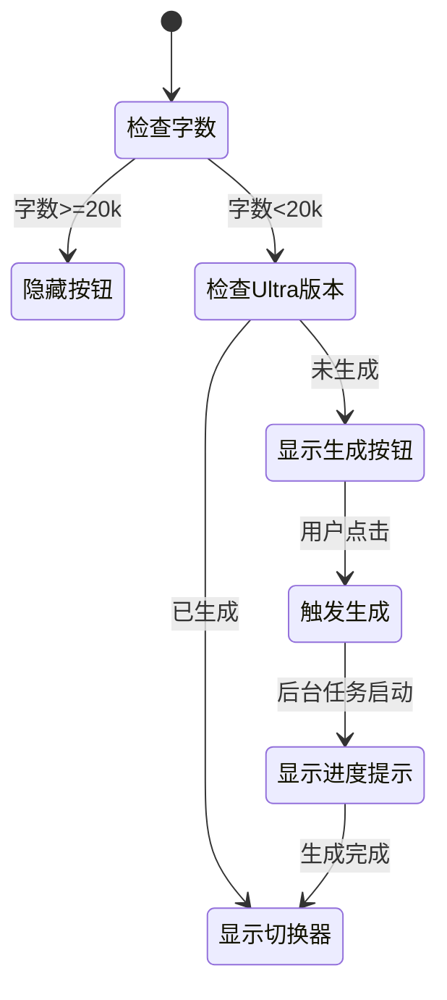
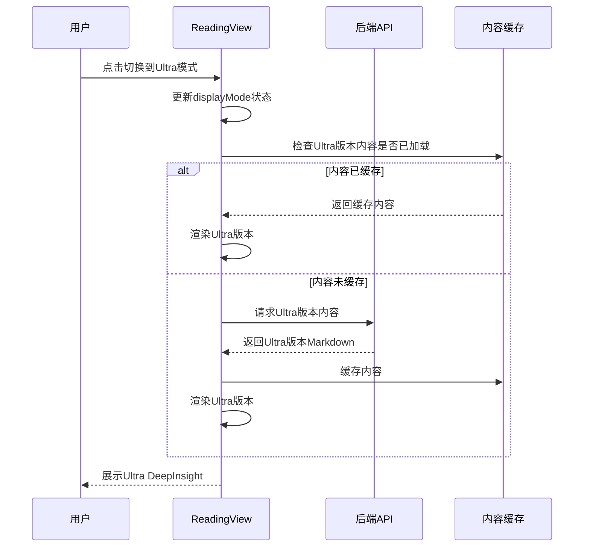
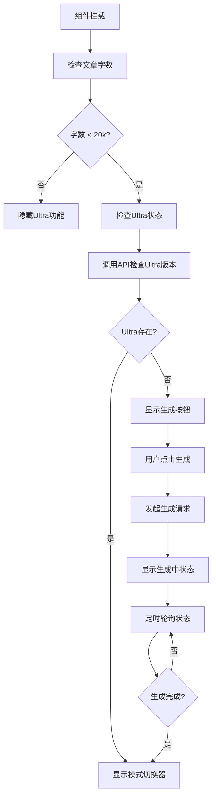
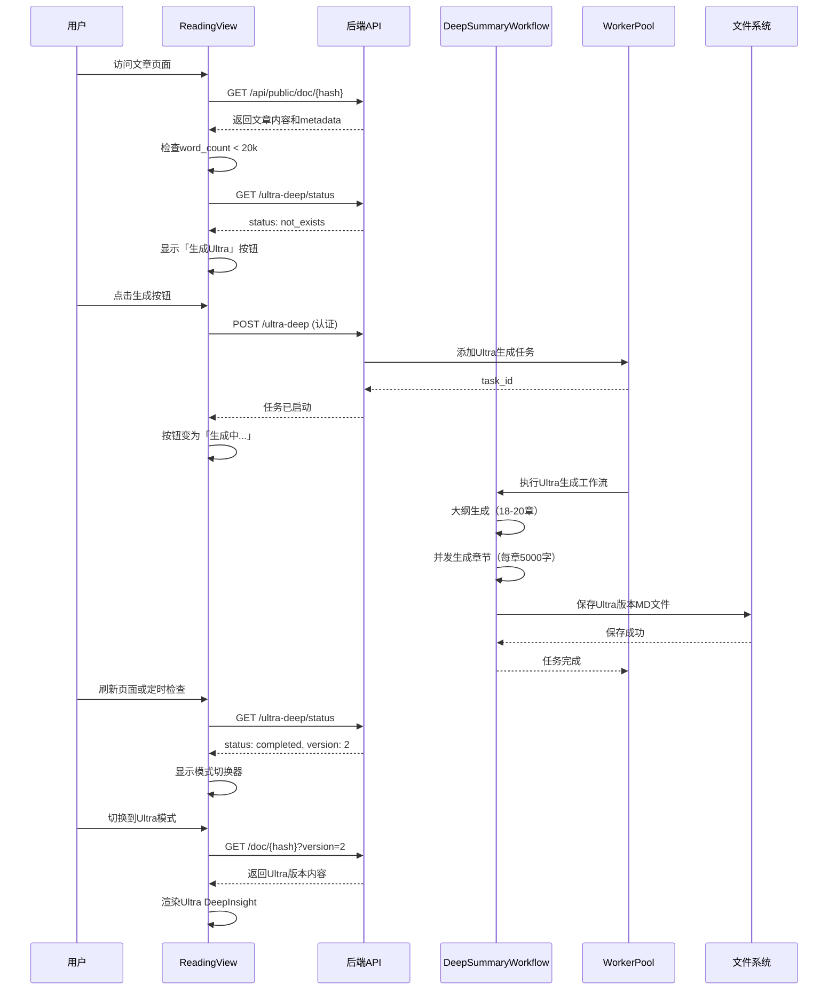

# Ultra DeepInsight 深度解读功能设计文档

## 需求概述

为现有视频分析系统新增Ultra DeepInsight深度解读模式，为用户提供更深入、更详尽的内容分析。该功能在现有解读基础上，通过增加章节数量和单章节字数，生成更全面的深度解读版本。

### 核心目标

- 为用户提供可选的超深度解读模式
- 在ReadingView文章界面提供模式切换能力
- 保持现有分析流程的稳定性，Ultra DeepInsight作为独立的增强选项

### 功能边界

- **启用条件**：仅当原始文章字数少于20000字时提供Ultra DeepInsight按钮
- **生成策略**：强制生成18-20个章节，每章节约5000字
- **异步执行**：深度解读在后台异步完成，不阻塞用户操作
- **版本管理**：Ultra DeepInsight作为独立版本存储和管理

## 功能设计

### 1. 触发入口设计

#### 1.1 按钮展示逻辑

在ReadingView文章阅读界面，根据文章字数判断是否展示Ultra DeepInsight按钮：

**展示位置**：
- 文章标题下方或工具栏区域
- 与现有的版本选择器（VersionSelector）并列或临近放置
- 移动端和桌面端均需考虑布局适配

**展示条件判断**：

| 条件 | 展示状态 | 说明 |
|------|---------|------|
| 文章字数 < 20000 | 显示按钮 | 适合进行深度扩展 |
| 文章字数 >= 20000 | 隐藏按钮 | 已足够详尽，无需Ultra模式 |
| Ultra版本已生成 | 不显示按钮，显示切换器 | 允许在标准版和Ultra版之间切换 |

**按钮状态**：



#### 1.2 按钮交互设计

**初始状态（未生成Ultra版本）**：
- 按钮文案：「Ultra DeepInsight」或「生成超深度解读」
- 图标建议：✨ 或 🔬
- 按钮样式：醒目但不干扰主内容阅读

**点击后行为**：
- 发起后台异步任务
- 按钮状态变更为「生成中...」（禁用状态）
- 显示预估完成时间或进度提示
- 页面保持可用，用户可继续阅读或离开

**生成完成后**：
- 按钮替换为模式切换器（ModeSelector）
- 支持在「标准解读」和「Ultra DeepInsight」之间切换

### 2. 模式切换设计

#### 2.1 复用ModeSelector组件

利用现有的ModeSelector组件实现版本切换，新增Ultra模式：

**模式定义**：

| 模式ID | 显示标签 | 图标 | 简写标签 | 说明 |
|--------|---------|------|---------|------|
| full-analysis | 完整解读 | 📖 | 全文 | 标准深度解读版本 |
| ultra-deep | Ultra DeepInsight | ✨ | Ultra | 超深度解读版本 |

**注意事项**：
- 保持与现有模式（core-summary、simplified-text）的一致性
- 切换逻辑应平滑，避免页面闪烁
- 切换时更新URL参数，支持直接分享特定模式的链接

#### 2.2 切换行为定义

**切换流程**：



**URL参数设计**：
- 标准模式：`/article/{doc_hash}?mode=full-analysis`
- Ultra模式：`/article/{doc_hash}?mode=ultra-deep`
- 支持模式参数持久化，刷新页面保持当前模式

### 3. 后端生成流程设计

#### 3.1 API端点设计

**新增API端点**：

##### 触发Ultra DeepInsight生成

**端点**：`POST /api/article/{doc_hash}/ultra-deep`

**请求参数**：

| 参数 | 类型 | 必填 | 说明 |
|------|------|------|------|
| doc_hash | string (路径参数) | 是 | 文档哈希值 |

**请求头**：
- `Authorization: Bearer {token}` - 需要认证

**响应示例**：

成功触发：
```json
{
  "success": true,
  "task_id": "uuid-string",
  "message": "Ultra DeepInsight生成任务已启动",
  "estimated_time": "15-20分钟"
}
```

已存在Ultra版本：
```json
{
  "success": false,
  "error": "ultra_version_exists",
  "message": "该文章已存在Ultra DeepInsight版本"
}
```

文章不符合条件：
```json
{
  "success": false,
  "error": "article_too_long",
  "message": "该文章已超过20000字，不适合生成Ultra DeepInsight",
  "word_count": 25000
}
```

##### 检查Ultra DeepInsight状态

**端点**：`GET /api/article/{doc_hash}/ultra-deep/status`

**响应示例**：

```json
{
  "exists": true,
  "status": "completed",
  "version": 2,
  "filename": "article_hash_v2.md",
  "word_count": 95000,
  "generated_at": "2025-01-15T10:30:00Z"
}
```

**状态值说明**：

| 状态值 | 含义 |
|--------|------|
| not_exists | Ultra版本不存在 |
| generating | 正在生成中 |
| completed | 生成完成 |
| failed | 生成失败 |

#### 3.2 生成参数配置

Ultra DeepInsight模式的核心参数配置：

**大纲生成阶段**：

| 配置项 | 标准模式 | Ultra模式 | 说明 |
|--------|---------|----------|------|
| 章节数量范围 | 10-20章（自适应） | 固定18-20章 | 强制生成更多章节 |
| 章节划分策略 | 基于内容密度自适应 | 细粒度拆分主题 | 更细致的内容划分 |
| 忽略稀疏内容检测 | 否 | 是 | 即使内容稀疏也要独立成章 |

**章节生成阶段**：

| 配置项 | 标准模式 | Ultra模式 | 说明 |
|--------|---------|----------|------|
| 单章节目标字数 | 1500-4000字（自适应） | 固定5000字左右 | 显著增加单章深度 |
| 深度建议覆盖 | 否 | 是 | 忽略outline阶段的深度建议 |
| 内容扩展策略 | 基于原文密度 | 强制深度扩展 | 即使原文稀疏也要详细展开 |

**风格保持不变**：
- 语言风格：保持现有的专业中文表达
- 质量控制规则：继承标准模式的所有质量要求
- 格式规范：Markdown格式、标题层级、引用规范等

#### 3.3 工作流适配

基于现有的`DeepSummaryWorkflow`，为Ultra模式新增配置分支：

**流程适配点**：

##### 大纲生成阶段（_generate_outline）

需要修改的行为：

1. **章节数量控制**
   - 标准模式：调用`OutlineGenerator`的自适应章节划分
   - Ultra模式：在提示词中强制要求18-20章，忽略内容统计建议

2. **提示词增强**
   - 在`adaptive_instructions`中注入Ultra模式指令：
     - 明确要求章节数量：18-20章
     - 要求细粒度主题拆分
     - 允许为次要主题独立成章

**Ultra模式大纲提示词增强示例**：

```
## Ultra DeepInsight 模式特殊要求

本次生成为Ultra DeepInsight模式，需要更详尽的分析：

1. **章节数量**：必须生成18-20个章节，不可少于18章
2. **细粒度拆分**：将主要主题拆分为多个独立章节，确保每个章节聚焦单一维度
3. **完整覆盖**：即使某些主题在原文中讨论较少，也应独立成章，后续生成时会充分扩展
4. **深度标注**：所有章节的generation_depth统一标注为'detailed'
```

##### 章节生成阶段（_generate_single_chapter）

需要修改的行为：

1. **字数要求覆盖**
   - 标准模式：根据`depth_recommendation`的建议生成（800-4000字）
   - Ultra模式：统一要求5000字左右，忽略原深度建议

2. **提示词调整**
   - 在`CHAPTER_DEPTH_CONSTRAINT_TEMPLATE`中注入Ultra特定要求：
     - 明确单章目标字数：5000字
     - 要求深度扩展：即使原文内容少，也要结合背景知识充分展开
     - 保持事实准确：扩展内容必须基于原文逻辑推演，不得臆造

**Ultra模式章节生成提示词增强示例**：

```
## Ultra DeepInsight 章节生成要求

本章节为Ultra DeepInsight模式，需要超深度解读：

**字数要求**：
- 目标字数：约5000字
- 最低字数：不少于4500字
- 充分展开每个论点，提供详细的背景、案例和分析

**扩展策略**：
1. 如果原文该部分内容丰富，进行全面深入的解读
2. 如果原文该部分较简略，基于上下文和领域知识合理扩展：
   - 补充技术背景和行业上下文
   - 提供相关案例类比
   - 分析潜在影响和延伸思考
3. 所有扩展必须符合原文逻辑，不得偏离主题

**注意事项**：
- 保持高质量的专业表达
- 避免为凑字数而重复或空洞
- 确保内容对读者有实质价值
```

##### 版本管理适配

**文件命名规范**：

Ultra DeepInsight版本应作为独立版本存储：

- 标准版本：`article_hash.md`（version=0）或 `article_hash_v1.md`（version=1）
- Ultra版本：`article_hash_v{N}.md`（N为下一个版本号）

**元数据标注**：

在Markdown文件的YAML front matter中新增Ultra标识：

```yaml
---
title_cn: "文章标题"
title_en: "Article Title"
video_url: "https://youtube.com/watch?v=xxx"
version: 2
is_ultra_deep: true
base_version: 1
created_at: "2025-01-15T10:30:00Z"
word_count: 95000
chapter_count: 19
---
```

**字段说明**：

| 字段 | 类型 | 说明 |
|------|------|------|
| is_ultra_deep | boolean | 标识为Ultra DeepInsight版本 |
| base_version | integer | 基于哪个标准版本生成的Ultra版本 |
| word_count | integer | 总字数（用于前端显示） |
| chapter_count | integer | 章节数量 |

#### 3.4 任务队列集成

Ultra DeepInsight生成任务应集成到现有的WorkerPool任务队列系统：

**任务类型定义**：

新增任务类型：`ultra_deep_insight`

**优先级设置**：

| 任务类型 | 默认优先级 | 说明 |
|---------|-----------|------|
| youtube（标准分析） | NORMAL | 用户主动触发的新分析 |
| ultra_deep_insight | LOW | 增强功能，优先级低于标准分析 |
| document（文档分析） | NORMAL | 文档上传分析 |

**任务参数**：

```python
{
    "task_id": "uuid-string",
    "task_type": "ultra_deep_insight",
    "doc_hash": "article_hash",
    "base_version": 1,
    "priority": TaskPriority.LOW
}
```

**并发控制**：

- Ultra任务共享全局并发池（MAX_CONCURRENT_ANALYSIS_TASKS）
- 不单独设置Ultra任务的并发限制
- 如果队列已满，返回503错误，提示用户稍后重试

### 4. 前端交互流程设计

#### 4.1 ReadingView组件适配

**新增状态管理**：

```javascript
// 新增Ultra相关状态
const ultraAvailable = ref(false);      // Ultra版本是否可用
const ultraStatus = ref('not_exists');  // Ultra生成状态
const isGeneratingUltra = ref(false);   // 是否正在生成Ultra
const ultraVersion = ref(null);         // Ultra版本号
```

**组件生命周期**：



**状态检查逻辑**：

组件加载时需执行的检查流程：

1. 从文章metadata中提取word_count
2. 判断是否 < 20000字
3. 如果符合条件，调用`GET /api/article/{doc_hash}/ultra-deep/status`
4. 根据响应状态渲染对应UI组件

#### 4.2 生成进度反馈

**进度提示策略**：

由于Ultra生成耗时较长（预估15-20分钟），需要良好的进度反馈：

**方案一：轻量提示**（推荐）

- 点击生成按钮后，按钮变为禁用状态
- 显示文字提示：「Ultra DeepInsight生成中，预计需要15-20分钟」
- 用户可继续阅读或离开页面
- 生成完成后，刷新页面时自动显示切换器

**方案二：实时进度（可选）**

如需实现实时进度更新，可采用以下方案：

- WebSocket连接任务进度推送
- 显示当前生成阶段：「大纲生成中」「章节1/19生成中」
- 显示预估剩余时间

**推荐实现**：采用方案一，简单且不增加系统复杂度

#### 4.3 模式切换UI实现

**ModeSelector组件扩展**：

复用现有ModeSelector，新增Ultra模式配置：

**模式配置**：

```javascript
const modes = [
  { 
    id: 'full-analysis', 
    label: '标准解读', 
    icon: '📖', 
    shortLabel: '标准',
    description: '10-20章，深度解读'
  },
  { 
    id: 'ultra-deep', 
    label: 'Ultra DeepInsight', 
    icon: '✨', 
    shortLabel: 'Ultra',
    description: '18-20章，每章5000字，超深度分析'
  }
];
```

**切换交互**：

1. 用户点击Ultra模式
2. 触发`handleDisplayModeChange('ultra-deep')`
3. 更新URL参数：`?mode=ultra-deep`
4. 调用API获取Ultra版本内容
5. 重新渲染文章内容和目录

**内容加载**：

- 标准模式：加载`/api/public/doc/{doc_hash}?version={base_version}`
- Ultra模式：加载`/api/public/doc/{doc_hash}?version={ultra_version}`

**UI细节**：

- 切换时显示加载动画
- 内容切换采用淡入淡出效果，避免突兀
- 目录自动刷新（Ultra版本章节数更多）

### 5. 数据流设计

#### 5.1 完整交互流程



#### 5.2 错误处理

**生成失败场景**：

| 失败原因 | 错误码 | 处理策略 |
|---------|--------|---------|
| 文章字数超限 | 400 | 前端不显示生成按钮 |
| 用户未认证 | 401 | 提示登录 |
| 队列已满 | 503 | 提示稍后重试 |
| 生成超时 | 500 | 记录失败状态，允许重新生成 |
| LLM调用失败 | 500 | 重试机制，超过最大重试次数则失败 |

**失败状态存储**：

在任务管理系统中记录失败原因：

```python
{
    "task_id": "uuid",
    "status": "failed",
    "error": "LLM generation timeout",
    "failed_at": "2025-01-15T11:00:00Z",
    "retry_count": 3
}
```

**用户界面反馈**：

- 生成失败后，按钮恢复为「生成Ultra」
- 显示错误提示：「生成失败，请稍后重试」
- 提供重试按钮

### 6. 性能与资源考量

#### 6.1 生成耗时估算

基于现有系统的性能数据，估算Ultra模式的耗时：

| 阶段 | 标准模式 | Ultra模式 | 增幅 |
|------|---------|----------|------|
| 大纲生成 | 30-60秒 | 40-80秒 | +33% |
| 单章节生成 | 20-40秒 | 60-90秒 | +150% |
| 总章节数 | 10-20章 | 18-20章 | +80% |
| 总耗时估算 | 5-15分钟 | 18-30分钟 | +200% |

**优化策略**：

- 复用现有的并发章节生成机制
- 保持并发数不变（由MAX_CONCURRENT_ANALYSIS_TASKS控制）
- Ultra任务优先级设为LOW，避免阻塞标准分析任务

#### 6.2 存储空间影响

**单篇Ultra版本存储估算**：

- Markdown文件：约200-300KB（95000字，含格式）
- PDF文件（如生成）：约1-2MB
- 可视化HTML（如生成）：约150-250KB

**系统容量规划**：

假设有1000篇文章，其中30%生成Ultra版本：

- 额外Markdown存储：300 * 250KB ≈ 75MB
- 额外PDF存储：300 * 1.5MB ≈ 450MB
- 总增量：约525MB

对现有系统影响较小，无需特殊容量规划。

#### 6.3 并发控制

**共享并发池策略**：

Ultra任务与标准分析任务共享全局并发池，无需单独配置：

- 全局最大并发：`MAX_CONCURRENT_ANALYSIS_TASKS`（默认2）
- 队列容量：`ANALYSIS_QUEUE_MAX_SIZE`（默认10）

**优先级调度**：

任务优先级排序（高到低）：

1. URGENT - 紧急任务（保留）
2. HIGH - 高优先级任务（保留）
3. NORMAL - 标准分析任务
4. LOW - Ultra DeepInsight任务

这确保Ultra任务不会阻塞用户的标准分析需求。

## 实现建议

### 阶段一：后端API与生成逻辑

1. 在`api.py`中新增Ultra相关API端点
2. 在`workflow.py`中扩展Ultra模式配置分支
3. 在`prompts.py`中新增Ultra模式提示词增强
4. 集成到WorkerPool任务队列

### 阶段二：前端UI与交互

1. ReadingView组件新增Ultra状态管理
2. 新增Ultra生成按钮组件
3. 扩展ModeSelector支持Ultra模式
4. 实现模式切换与内容加载

### 阶段三：测试与优化

1. 功能测试：生成流程、模式切换、错误处理
2. 性能测试：生成耗时、并发影响
3. 用户体验优化：加载反馈、交互流畅度

## 技术依赖

### 后端

- 复用现有DeepSummaryWorkflow
- 复用现有OutlineGenerator和提示词系统
- 复用现有WorkerPool任务队列
- 无需引入新的外部依赖

### 前端

- 复用现有ReadingView组件架构
- 复用现有ModeSelector组件
- Vue 3 Composition API
- 现有的API客户端

## 风险与缓解

### 风险一：生成质量控制

**风险描述**：强制5000字可能导致内容稀疏章节质量下降

**缓解措施**：
- 在提示词中强调高质量扩展，避免空洞重复
- 基于原文逻辑合理扩展，禁止臆造
- 保持现有质量控制规则（QUALITY_CONTROL_RULES）

### 风险二：生成耗时过长

**风险描述**：18-20章每章5000字，总耗时可能超过30分钟

**缓解措施**：
- 采用异步任务，不阻塞用户
- 提供明确的预估时间提示
- 优先级设为LOW，避免影响标准任务

### 风险三：存储版本管理复杂度

**风险描述**：Ultra版本作为独立版本，可能增加版本管理复杂度

**缓解措施**：
- 在metadata中明确标注is_ultra_deep
- 复用现有版本发现机制（discover_versions）
- UI上清晰区分标准版和Ultra版

## 验收标准

### 功能验收

- [ ] 文章字数<20k时显示Ultra生成按钮
- [ ] 文章字数>=20k时不显示Ultra按钮
- [ ] 点击生成按钮成功触发后台任务
- [ ] 生成完成后显示模式切换器
- [ ] 可在标准版和Ultra版之间流畅切换
- [ ] Ultra版本包含18-20个章节
- [ ] Ultra版本总字数显著增加（接近或超过9万字）

### 性能验收

- [ ] Ultra任务不阻塞标准分析任务
- [ ] 生成耗时在可接受范围内（不超过30分钟）
- [ ] 模式切换响应时间<2秒

### 用户体验验收

- [ ] 生成按钮位置明显且不干扰阅读
- [ ] 生成中状态提示清晰
- [ ] 模式切换动画流畅
- [ ] 错误提示友好且可操作

## 后续扩展可能

### 可选增强功能

1. **实时进度推送**：通过WebSocket推送Ultra生成进度
2. **自定义参数**：允许用户自定义章节数和单章字数
3. **对比视图**：并排展示标准版和Ultra版，便于对比阅读
4. **智能推荐**：基于文章主题推荐是否适合生成Ultra版本

### 潜在优化方向

1. **生成速度优化**：探索更高效的并发策略
2. **质量评估**：引入自动质量评分，筛选高质量Ultra版本
3. **成本控制**：根据LLM调用成本设置Ultra生成限额
