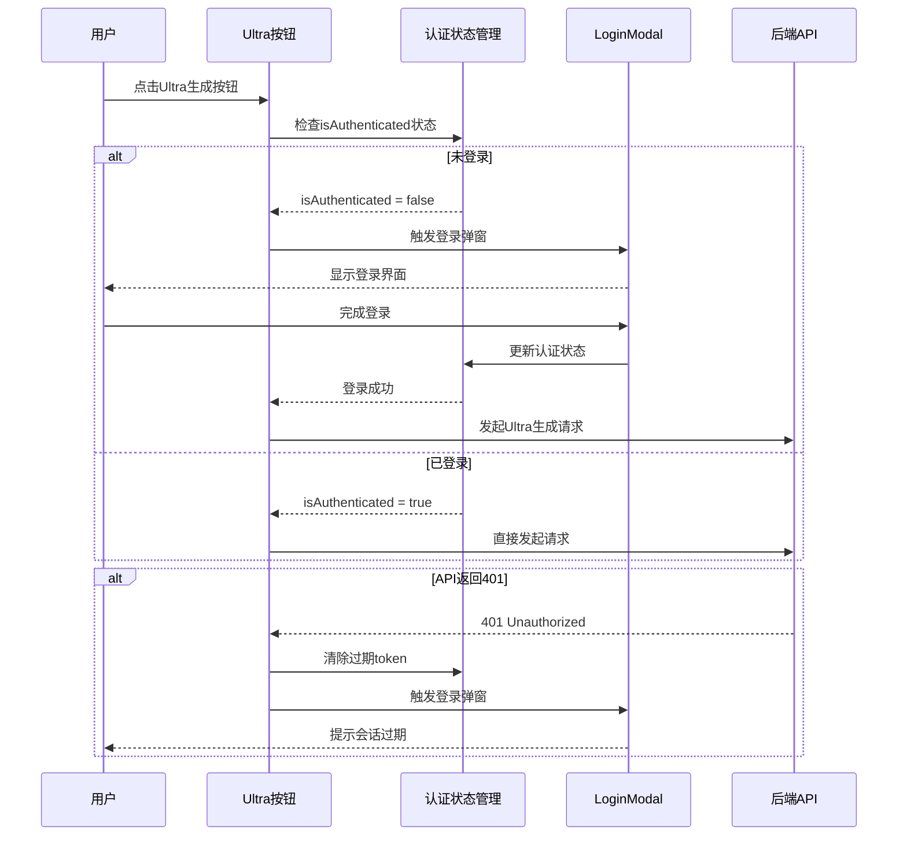
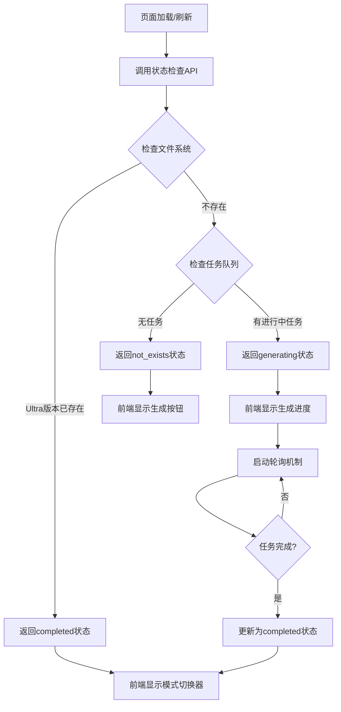
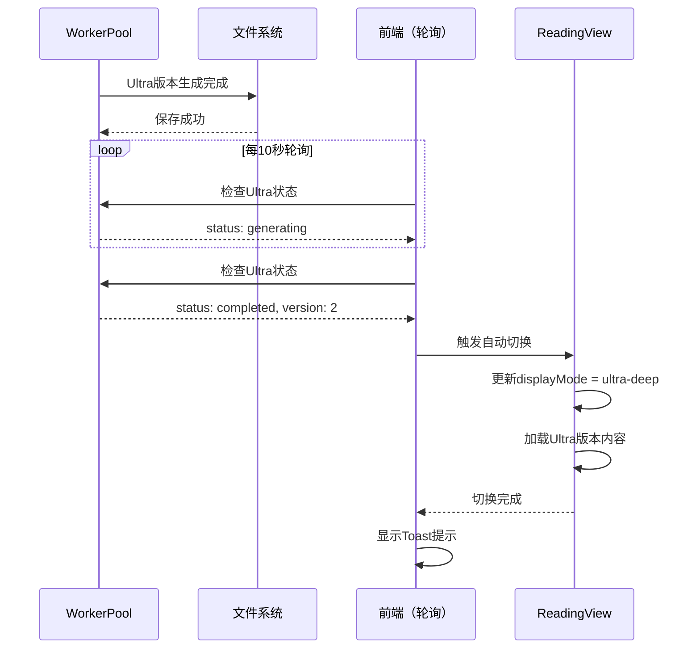
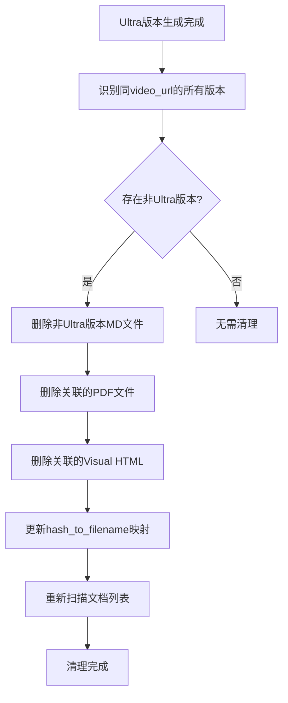
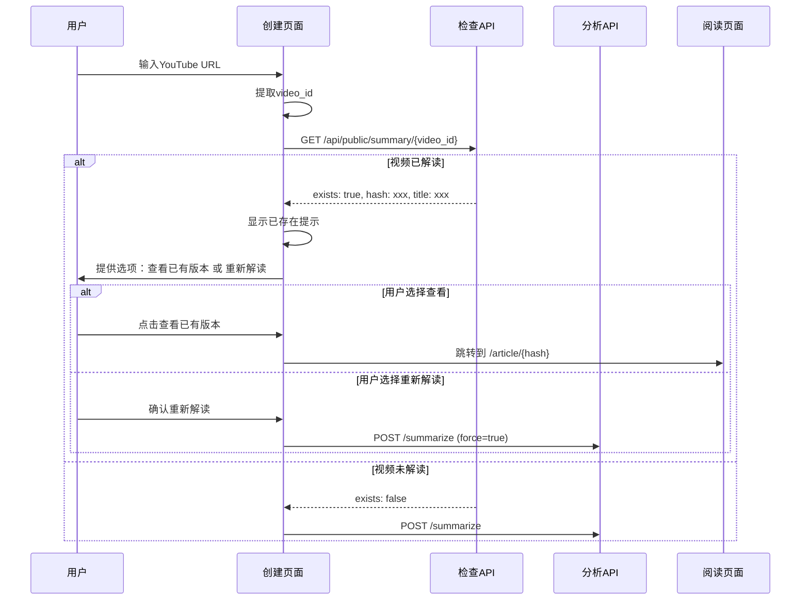

# 视频分析系统优化设计文档

## 需求概述

针对现有Ultra DeepInsight功能和视频分析流程中发现的5个核心问题进行系统性优化，提升用户体验和系统稳定性。

### 优化目标

- 完善Ultra DeepInsight功能的认证逻辑和状态管理
- 优化版本管理策略，避免冗余版本累积
- 增强视频重复解读检测，避免资源浪费
- 提供灵活的配置选项，满足不同场景需求

## 问题分析与设计方案

### 问题1：Ultra DeepInsight未登录时无弹窗提示

#### 问题描述

当前实现中，未登录用户点击Ultra DeepInsight按钮后，请求在前端默默失败（401错误），未触发登录模态框，用户无感知且无法继续操作。

#### 根本原因分析

1. **前端缺少认证状态检查**：ReadingView组件中的`triggerUltraGeneration`方法仅检查localStorage中的token，未与全局认证状态同步
2. **错误处理不完整**：捕获到401错误后未调用全局登录弹窗机制
3. **事件总线未复用**：系统已有LoginModal组件和eventBus机制，但Ultra功能未集成

#### 设计方案

**方案架构**：



**实现要点**：

| 组件 | 修改内容 | 目的 |
|------|---------|------|
| ReadingView.js | 新增props: `isAuthenticated` | 接收全局认证状态 |
| ReadingView.js | `triggerUltraGeneration`前置检查 | 未登录时直接触发登录弹窗 |
| ReadingView.js | 捕获401错误后的处理逻辑 | 自动触发登录弹窗 |
| app.js | 传递`isAuthenticated`给ReadingView | 实现状态同步 |
| app.js | Ultra生成成功后的回调 | 登录后自动重试Ultra生成 |

**触发登录弹窗的两种方式**：

**方式一：通过事件总线触发（推荐）**

利用现有的eventBus机制：

```javascript
// 在triggerUltraGeneration中
if (!isAuthenticated.value) {
  // 触发全局登录弹窗
  if (window.eventBus && window.eventBus.emit) {
    window.eventBus.emit('require-login', {
      reason: 'Ultra DeepInsight功能需要登录',
      callback: () => {
        // 登录成功后自动重试
        triggerUltraGeneration();
      }
    });
  }
  return;
}
```

**方式二：直接更新全局状态（备选）**

如果app.js暴露了`showLogin`状态的setter：

```javascript
// 在triggerUltraGeneration中
if (!isAuthenticated.value) {
  emit('require-login', {
    callback: triggerUltraGeneration
  });
  return;
}
```

**错误处理增强**：

```javascript
try {
  const response = await fetch(url, {
    method: 'POST',
    headers: {
      'Authorization': `Bearer ${token}`,
      'Content-Type': 'application/json'
    }
  });
  
  if (response.status === 401) {
    // 会话过期，清除token并触发登录
    localStorage.removeItem('authToken');
    if (window.eventBus) {
      window.eventBus.emit('session-expired');
    }
    return;
  }
  
  // ... 其他处理逻辑
} catch (error) {
  // 错误处理
}
```

**用户体验增强**：

- 登录弹窗显示明确提示：「Ultra DeepInsight功能需要登录」
- 登录成功后自动重试Ultra生成，无需用户重新点击
- 会话过期时显示友好提示：「登录已过期，请重新登录」

---

### 问题2：Ultra DeepInsight任务状态未正确读取

#### 问题描述

用户点击启动Ultra DeepInsight后，再次进入页面时未能正确读取任务状态，导致：
- 无法看到生成进度
- 允许重复触发生成任务（资源浪费）
- 用户不清楚任务是否在进行中

#### 根本原因分析

1. **状态检查API未集成任务队列**：`/api/article/{doc_hash}/ultra-deep/status`仅检查文件是否存在，未查询WorkerPool中的任务状态
2. **前端未定期轮询**：页面加载后仅检查一次，不监听任务进度变化
3. **任务状态未持久化**：Ultra生成任务的中间状态未与doc_hash关联

#### 设计方案

**状态检查流程优化**：



**后端API增强**：

**端点**：`GET /api/article/{doc_hash}/ultra-deep/status`

**增强逻辑**：

1. **优先检查文件系统**：Ultra版本文件是否存在
2. **次要检查任务队列**：WorkerPool中是否有对应doc_hash的Ultra任务
3. **返回统一状态**：包含任务进度、预估时间等详细信息

**响应格式扩展**：

```json
{
  "status": "generating",
  "exists": false,
  "task_info": {
    "task_id": "uuid-string",
    "created_at": "2025-01-15T10:00:00Z",
    "progress": 45,
    "current_stage": "章节生成中 (8/19)",
    "estimated_remaining_minutes": 12
  },
  "version": null,
  "word_count": null
}
```

**状态值完整定义**：

| 状态值 | 含义 | task_info | 前端行为 |
|--------|------|-----------|----------|
| not_exists | 未生成 | null | 显示生成按钮 |
| generating | 生成中 | 包含进度信息 | 显示进度条，禁用生成按钮 |
| completed | 已完成 | null | 显示模式切换器 |
| failed | 生成失败 | 包含错误信息 | 显示重试按钮 |

**任务队列查询逻辑**：

在`api.py`中，状态检查需要遍历WorkerPool：

```python
# 检查任务队列中是否有对应的Ultra生成任务
from .worker_pool import worker_pool

# 查询排队任务
for queued_task in worker_pool.task_queue:
    if (queued_task.task_type == 'ultra_deep_insight' and 
        queued_task.metadata.get('doc_hash') == doc_hash):
        return {
            "status": "generating",
            "exists": False,
            "task_info": {
                "task_id": queued_task.task_id,
                "created_at": queued_task.created_at,
                "queue_position": queued_task.queue_position
            }
        }

# 查询进行中任务
for task_id, task_state in manager.tasks.items():
    if (task_state.task_type == 'ultra_deep_insight' and 
        task_state.doc_hash == doc_hash and
        task_state.status in ['processing', 'running']):
        return {
            "status": "generating",
            "exists": False,
            "task_info": {
                "task_id": task_id,
                "progress": task_state.progress or 0,
                "current_stage": task_state.current_stage
            }
        }
```

**前端轮询机制**：

当检测到generating状态时，启动定时轮询：

```javascript
const startPolling = () => {
  if (pollingTimer) return; // 避免重复轮询
  
  pollingTimer = setInterval(async () => {
    const status = await checkUltraStatus();
    
    if (status === 'completed') {
      // 生成完成，停止轮询
      clearInterval(pollingTimer);
      pollingTimer = null;
      
      // 自动切换到Ultra版本
      await switchToUltraMode();
    } else if (status === 'failed') {
      // 生成失败，停止轮询
      clearInterval(pollingTimer);
      pollingTimer = null;
    }
  }, 10000); // 每10秒检查一次
};

// 组件卸载时清理
onUnmounted(() => {
  if (pollingTimer) {
    clearInterval(pollingTimer);
  }
});
```

**防止重复生成**：

在`triggerUltraGeneration`方法中增加状态检查：

```javascript
const triggerUltraGeneration = async () => {
  // 先检查当前状态
  const currentStatus = await checkUltraStatus();
  
  if (currentStatus === 'generating') {
    // 已有任务在进行中，提示用户
    console.warn('Ultra生成任务已在进行中');
    // 可选：显示Toast提示
    return;
  }
  
  if (currentStatus === 'completed') {
    // 已存在Ultra版本，无需重复生成
    console.warn('Ultra版本已存在');
    return;
  }
  
  // 继续生成逻辑...
};
```

**进度展示优化**：

根据task_info中的进度信息，展示友好的进度条：

```javascript
const progressText = computed(() => {
  if (!ultraTaskInfo.value) return '';
  
  const { current_stage, estimated_remaining_minutes } = ultraTaskInfo.value;
  
  return `${current_stage} · 预计还需 ${estimated_remaining_minutes} 分钟`;
});
```

---

### 问题3：Ultra生成完成后自动切换与版本清理

#### 问题描述

当前Ultra DeepInsight生成完成后：
- 未自动切换到新Ultra版本，需要用户手动刷新和切换
- 保留了非Ultra版本，导致版本列表冗余
- 用户可能不清楚Ultra版本已生成完毕

#### 根本原因分析

1. **缺少生成完成通知**：前端未监听Ultra任务完成事件
2. **版本管理策略不明确**：Ultra版本与标准版本同时存在的必要性未定义
3. **文件删除逻辑缺失**：无自动清理旧版本的机制

#### 设计方案

**自动切换策略**：



**自动切换实现**：

在轮询检测到completed状态时：

```javascript
const handleUltraCompleted = async (ultraVersion) => {
  console.log('✅ Ultra生成完成，自动切换到Ultra版本');
  
  // 1. 更新状态
  ultraAvailable.value = true;
  ultraStatus.value = 'completed';
  ultraVersion.value = ultraVersion;
  
  // 2. 自动切换到Ultra模式
  await handleDisplayModeChange('ultra-deep');
  
  // 3. 加载Ultra版本内容
  await emit('version-change', ultraVersion);
  
  // 4. 显示完成提示
  if (window.eventBus) {
    window.eventBus.emit('show-toast', {
      message: 'Ultra DeepInsight 已生成完成！',
      type: 'success'
    });
  }
};
```

**版本清理策略**：

**策略选择**：Ultra生成完成后，自动删除非Ultra版本

**理由**：
- Ultra版本是标准版本的超集（更多章节、更深入分析）
- 保留两个版本会导致版本列表混乱
- 节省存储空间
- 简化用户选择（避免版本困惑）

**清理流程**：



**后端清理逻辑**：

在Ultra生成完成后（workflow.py或worker.py中）：

```python
def cleanup_non_ultra_versions(video_url: str, ultra_version: int):
    """
    清理同一视频的非Ultra版本
    
    Args:
        video_url: 视频URL
        ultra_version: Ultra版本号
    """
    deleted_files = []
    
    # 扫描所有MD文件
    for md_file in config.OUTPUT_DIR.glob("*.md"):
        try:
            content = md_file.read_text(encoding="utf-8")
            metadata = parse_metadata_from_md(content)
            
            # 检查是否是同一视频的非Ultra版本
            if (metadata.get('video_url') == video_url and 
                not metadata.get('is_ultra_deep', False)):
                
                # 删除MD文件
                md_file.unlink()
                deleted_files.append(md_file.name)
                
                # 删除关联的PDF文件（如果存在）
                pdf_file = md_file.with_suffix('.pdf')
                if pdf_file.exists():
                    pdf_file.unlink()
                
                # 删除关联的Visual HTML（如果存在）
                doc_hash = metadata.get('hash')
                if doc_hash:
                    visual_dir = config.OUTPUT_DIR / 'visual'
                    visual_file = visual_dir / f"{doc_hash}_visual.html"
                    if visual_file.exists():
                        visual_file.unlink()
        
        except Exception as e:
            logger.warning(f"清理文件 {md_file.name} 时出错: {e}")
    
    # 触发文档列表重新扫描
    from .api import load_hash_mapping
    load_hash_mapping()
    
    logger.info(f"已清理 {len(deleted_files)} 个非Ultra版本文件: {deleted_files}")
    return deleted_files
```

**调用时机**：

在Ultra生成工作流完成后立即调用：

```python
# 在workflow.py的Ultra生成完成处
await manager.send_message("Ultra DeepInsight 生成完成！", task_id)

# 清理非Ultra版本
cleanup_non_ultra_versions(
    video_url=metadata.video_url,
    ultra_version=next_version
)

await manager.set_task_completed(task_id, ultra_md_path)
```

**安全保护**：

- 仅删除明确标识为非Ultra的版本（`is_ultra_deep != true`）
- 删除前备份到trash目录（可选）
- 记录删除日志，便于追溯

**前端版本列表更新**：

Ultra生成完成后，前端需刷新版本列表：

```javascript
const refreshVersions = async () => {
  // 重新加载文档信息
  const response = await fetch(`/api/public/doc/${props.currentHash}`);
  const data = await response.json();
  
  // 更新版本列表（应该只剩Ultra版本）
  documentVersions.value = data.versions || [];
};
```

---

### 问题4：禁用DeepInsight的版本选择逻辑

#### 问题描述

当前系统允许用户在多个版本之间切换（如v0、v1、v2），但在某些场景下：
- 用户只关心最新版本，版本选择器造成干扰
- 历史版本已过时，保留它们增加维护成本
- 需要提供配置选项，让管理员控制是否启用版本切换

#### 根本原因分析

1. **缺少配置开关**：系统未提供禁用版本选择器的全局配置
2. **VersionSelector组件硬编码**：组件未考虑禁用场景
3. **版本过滤逻辑缺失**：未提供"仅显示最新版"的过滤选项

#### 设计方案

**配置开关设计**：

在系统配置文件中新增版本管理相关配置：

**配置文件位置**：`config/model_config.yaml`或`.env`

**配置项定义**：

```yaml
# 版本管理配置
version_control:
  # 是否启用版本选择器
  enable_version_selector: true
  
  # 版本显示策略：'all' | 'latest_only' | 'latest_per_type'
  display_strategy: 'latest_only'
  
  # 是否自动清理旧版本
  auto_cleanup_old_versions: false
  
  # 保留最近N个版本（当auto_cleanup=true时生效）
  max_versions_to_keep: 1
```

**配置项说明**：

| 配置项 | 类型 | 默认值 | 说明 |
|--------|------|--------|------|
| enable_version_selector | boolean | true | 是否显示版本选择器组件 |
| display_strategy | string | 'all' | 版本显示策略 |
| auto_cleanup_old_versions | boolean | false | 是否自动清理旧版本 |
| max_versions_to_keep | integer | 3 | 保留的最大版本数 |

**版本显示策略详解**：

| 策略值 | 行为 | 适用场景 |
|--------|------|----------|
| all | 显示所有版本 | 需要版本对比、历史回溯 |
| latest_only | 仅显示最新版本 | 简化用户选择，避免混乱 |
| latest_per_type | 每种类型保留最新版 | 同时保留标准版和Ultra版的最新版本 |

**后端API适配**：

在`/api/public/doc/{doc_hash}`和`/api/public/summaries`中应用过滤逻辑：

```python
def filter_versions_by_strategy(versions: List[Dict], strategy: str) -> List[Dict]:
    """
    根据配置策略过滤版本列表
    
    Args:
        versions: 原始版本列表
        strategy: 显示策略
    
    Returns:
        过滤后的版本列表
    """
    if strategy == 'all':
        return versions
    
    if strategy == 'latest_only':
        # 仅保留最新版本
        if not versions:
            return []
        return [max(versions, key=lambda v: v.get('version', 0))]
    
    if strategy == 'latest_per_type':
        # 分别保留标准版和Ultra版的最新版本
        ultra_versions = [v for v in versions if v.get('is_ultra_deep', False)]
        standard_versions = [v for v in versions if not v.get('is_ultra_deep', False)]
        
        result = []
        if ultra_versions:
            result.append(max(ultra_versions, key=lambda v: v.get('version', 0)))
        if standard_versions:
            result.append(max(standard_versions, key=lambda v: v.get('version', 0)))
        
        return sorted(result, key=lambda v: v.get('version', 0))
    
    return versions
```

**应用配置**：

在API端点中读取配置并过滤：

```python
@app.get("/api/public/doc/{doc_hash}")
async def get_summary(doc_hash: str, version: Optional[int] = None):
    # ... 获取版本列表逻辑 ...
    
    # 应用版本过滤策略
    from .config import config
    display_strategy = config.VERSION_DISPLAY_STRATEGY  # 从配置读取
    
    filtered_versions = filter_versions_by_strategy(all_versions, display_strategy)
    
    return {
        "content": content,
        "versions": filtered_versions,
        "metadata": metadata
    }
```

**前端VersionSelector适配**：

**隐藏版本选择器**：

当配置为`enable_version_selector: false`或版本数<=1时，不渲染组件：

```vue
<version-selector 
  v-if="shouldShowVersionSelector && hasMultipleVersions"
  :versions="versions" 
  :current-version="currentVersion"
  @change="handleVersionChange">
</version-selector>
```

```javascript
const shouldShowVersionSelector = computed(() => {
  // 从API响应的metadata中读取配置
  return metadata.value?.version_control?.enable_version_selector !== false;
});

const hasMultipleVersions = computed(() => {
  return versions.value && versions.value.length > 1;
});
```

**仅显示最新版本**：

当`display_strategy: 'latest_only'`时，版本列表仅包含一个版本，自动隐藏选择器。

**配置管理界面（可选）**：

为管理员提供可视化配置界面，动态修改版本管理策略：

```javascript
// 管理员配置面板
const versionSettings = {
  enableVersionSelector: true,
  displayStrategy: 'latest_only',
  autoCleanup: false,
  maxVersions: 1
};

const updateVersionSettings = async (settings) => {
  await fetch('/api/admin/config/version-control', {
    method: 'PUT',
    headers: { 'Authorization': `Bearer ${token}` },
    body: JSON.stringify(settings)
  });
};
```

**默认推荐配置**：

基于问题3的自动清理策略，推荐配置为：

```yaml
version_control:
  enable_version_selector: false  # 禁用版本选择器
  display_strategy: 'latest_only'  # 仅显示最新版
  auto_cleanup_old_versions: true  # 自动清理旧版本
  max_versions_to_keep: 1
```

---

### 问题5：禁止视频重复解读

#### 问题描述

当用户提交已解读过的YouTube视频URL时：
- 系统仍然启动新的分析任务，浪费计算资源和API调用额度
- 用户可能不清楚视频已有解读，导致困惑
- 无法快速访问已有版本

#### 根本原因分析

1. **缺少重复检测逻辑**：`POST /summarize`端点未检查video_id是否已存在
2. **前端未调用检查API**：创建任务前未调用`/api/public/summary/{video_id}`
3. **用户引导不足**：即使检测到重复，未提供直接跳转到已有版本的入口

#### 设计方案

**重复检测流程**：



**前端检测逻辑**：

在CreateView组件中，用户输入URL后实时检测：

```javascript
const checkVideoExists = async (url) => {
  try {
    // 提取video_id
    const videoId = extractVideoId(url);
    if (!videoId) {
      return { exists: false };
    }
    
    // 调用检查API
    const response = await fetch(`/api/public/summary/${videoId}`);
    const data = await response.json();
    
    if (data.exists) {
      // 视频已存在
      existingVideo.value = {
        hash: data.hash,
        title: data.title
      };
      
      showDuplicateWarning.value = true;
      return data;
    }
    
    return { exists: false };
  } catch (error) {
    console.error('检查视频失败:', error);
    return { exists: false };
  }
};

// 监听URL输入
watch(videoUrl, async (newUrl) => {
  if (newUrl && isYouTubeUrl(newUrl)) {
    await checkVideoExists(newUrl);
  }
});
```

**重复提示UI设计**：

当检测到重复时，显示明确的提示框：

```vue
<div v-if="showDuplicateWarning" class="duplicate-warning">
  <div class="duplicate-warning__icon">ℹ️</div>
  <div class="duplicate-warning__content">
    <h3>该视频已有解读</h3>
    <p class="duplicate-warning__title">{{ existingVideo.title }}</p>
    <div class="duplicate-warning__actions">
      <button 
        @click="viewExistingAnalysis" 
        class="tech-button tech-button--primary">
        查看已有版本
      </button>
      <button 
        @click="forceReanalyze" 
        class="tech-button tech-button--secondary">
        重新解读
      </button>
    </div>
  </div>
</div>
```

**用户操作选项**：

| 操作 | 行为 | 适用场景 |
|------|------|----------|
| 查看已有版本 | 跳转到ReadingView | 用户只想查看已有解读 |
| 重新解读 | 强制启动新分析任务 | 视频内容更新或用户需要新版本 |

**后端防重复逻辑**：

在`POST /summarize`端点中增加重复检测：

```python
@app.post("/summarize")
async def summarize_youtube(
    req: SummarizeRequest,
    priority: int = Query(default=1, ge=0, le=3),
    force: bool = Query(default=False),  # 新增：是否强制重新解读
    current_user=Depends(get_current_user)
):
    """YouTube视频分析端点"""
    
    # 1. 提取video_id
    video_id = extract_video_id(str(req.url))
    if not video_id:
        raise HTTPException(status_code=400, detail="无效的YouTube URL")
    
    # 2. 检查是否已存在（除非force=true）
    if not force:
        video_url = f"https://www.youtube.com/watch?v={video_id}"
        doc_hash = generate_doc_hash(video_url)
        
        # 检查文档是否存在
        filename = hash_to_filename.get(doc_hash)
        if filename:
            # 已存在，返回已有版本信息
            return {
                "exists": True,
                "doc_hash": doc_hash,
                "message": "该视频已有解读，请使用查看功能或添加force=true参数重新解读",
                "redirect_url": f"/article/{doc_hash}"
            }
    
    # 3. 继续正常分析流程
    task_id = str(uuid.uuid4())
    # ... 现有逻辑 ...
```

**强制重新解读逻辑**：

当用户选择重新解读时，前端传递`force=true`参数：

```javascript
const forceReanalyze = async () => {
  showDuplicateWarning.value = false;
  
  // 发起强制重新解读请求
  const response = await fetch('/summarize?force=true', {
    method: 'POST',
    headers: {
      'Authorization': `Bearer ${token}`,
      'Content-Type': 'application/json'
    },
    body: JSON.stringify({ url: videoUrl.value })
  });
  
  const data = await response.json();
  
  // 连接WebSocket监听进度
  connectToTask(data.task_id);
};
```

**重新解读的版本管理**：

强制重新解读时，新版本应该：
- 作为新版本存储（version+1）
- 继承相同的video_url
- 在metadata中标注为重新解读（re-analysis）

```yaml
---
video_url: "https://youtube.com/watch?v=xxx"
version: 2
is_reanalysis: true
original_version: 1
reanalysis_reason: "用户手动触发"
created_at: "2025-01-15T12:00:00Z"
---
```

**任务队列去重优化**：

检查任务队列中是否已有同一video_id的任务：

```python
# 在添加任务前检查队列
for queued_task in worker_pool.task_queue:
    if (queued_task.task_type == 'youtube' and 
        queued_task.metadata.get('video_id') == video_id):
        # 队列中已有相同视频的任务
        return {
            "exists": True,
            "in_queue": True,
            "task_id": queued_task.task_id,
            "message": "该视频的分析任务已在队列中，请稍候"
        }

# 检查进行中的任务
for task_id, task_state in manager.tasks.items():
    if (task_state.task_type == 'youtube' and
        task_state.metadata.get('video_id') == video_id and
        task_state.status in ['processing', 'running']):
        # 正在分析中
        return {
            "exists": True,
            "in_progress": True,
            "task_id": task_id,
            "message": "该视频正在分析中，请连接WebSocket查看进度"
        }
```

**用户体验优化**：

**实时检测**：用户输入URL后自动检测，无需提交

```javascript
// 防抖检测，避免频繁请求
const debouncedCheck = debounce(async (url) => {
  await checkVideoExists(url);
}, 500);

watch(videoUrl, (newUrl) => {
  if (isYouTubeUrl(newUrl)) {
    debouncedCheck(newUrl);
  }
});
```

**智能跳转**：点击"查看已有版本"时，直接跳转到阅读页面

```javascript
const viewExistingAnalysis = () => {
  // 跳转到已有版本
  router.push(`/article/${existingVideo.value.hash}`);
};
```

**批量URL检测**（可选）**：

如果用户批量提交多个URL，批量检测哪些已存在：

```javascript
const batchCheckVideos = async (urls) => {
  const videoIds = urls.map(extractVideoId).filter(Boolean);
  
  const response = await fetch('/api/public/summary/batch-check', {
    method: 'POST',
    headers: { 'Content-Type': 'application/json' },
    body: JSON.stringify({ video_ids: videoIds })
  });
  
  return await response.json();
};
```

---

## 实现优先级

### 第一优先级（核心功能）

1. **问题5：禁止视频重复解读**
   - 影响范围：资源浪费、用户体验
   - 实现难度：低
   - 预估时间：2-3小时

2. **问题2：任务状态正确读取**
   - 影响范围：Ultra功能可用性
   - 实现难度：中
   - 预估时间：4-5小时

### 第二优先级（用户体验）

3. **问题1：未登录时弹窗提示**
   - 影响范围：Ultra功能认证体验
   - 实现难度：低
   - 预估时间：1-2小时

4. **问题3：Ultra生成后自动切换**
   - 影响范围：Ultra功能完整性
   - 实现难度：中
   - 预估时间：3-4小时

### 第三优先级（配置优化）

5. **问题4：版本选择器配置开关**
   - 影响范围：系统灵活性
   - 实现难度：中
   - 预估时间：4-5小时

## 技术依赖

### 后端修改点

| 文件 | 修改内容 | 影响范围 |
|------|---------|----------|
| api.py | 新增/优化API端点 | Ultra状态检查、重复检测 |
| workflow.py | 版本清理逻辑 | Ultra生成完成后清理 |
| worker_pool.py | 任务队列查询 | 支持按doc_hash查询任务 |
| config.py | 新增配置项 | 版本管理策略配置 |

### 前端修改点

| 文件 | 修改内容 | 影响范围 |
|------|---------|----------|
| ReadingView.js | 认证检查、轮询、自动切换 | Ultra功能完整流程 |
| CreateView.js | 重复检测、用户提示 | 视频提交流程 |
| app.js | 全局状态同步 | 认证状态传递 |
| VersionSelector组件 | 配置开关支持 | 版本选择器显示控制 |

### 新增API端点

无新增，优化现有端点：
- `GET /api/article/{doc_hash}/ultra-deep/status` - 增强任务队列查询
- `POST /summarize` - 增加重复检测和force参数
- `GET /api/public/summary/{video_id}` - 已存在，无需修改

## 风险评估

### 风险一：版本清理误删除

**风险描述**：自动清理旧版本可能误删除用户需要的版本

**缓解措施**：
- 仅在Ultra生成成功后才清理
- 清理前记录详细日志
- 提供配置开关，允许禁用自动清理
- 可选：将删除的文件移到trash目录而非直接删除

### 风险二：重复检测误判

**风险描述**：video_id相同但内容不同的视频被误判为重复

**缓解措施**：
- 提供force参数允许强制重新解读
- 在UI中清晰说明已有版本的创建时间
- 视频更新后用户可选择重新解读

### 风险三：轮询性能影响

**风险描述**：大量用户同时轮询Ultra状态可能增加服务器负担

**缓解措施**：
- 轮询间隔设为10秒（而非1秒）
- 任务完成后立即停止轮询
- 使用HTTP缓存头减少重复请求
- 可选：改用WebSocket推送（更优方案）

## 验收标准

### 问题1验收

- [ ] 未登录时点击Ultra按钮自动弹出登录窗口
- [ ] 登录成功后自动重试Ultra生成
- [ ] 会话过期时自动提示重新登录

### 问题2验收

- [ ] 刷新页面后正确显示Ultra生成进度
- [ ] 生成中时禁止重复触发
- [ ] 任务队列中的Ultra任务被正确识别

### 问题3验收

- [ ] Ultra生成完成后自动切换到Ultra版本
- [ ] 非Ultra版本文件被自动删除
- [ ] 版本列表中仅显示Ultra版本

### 问题4验收

- [ ] 配置`enable_version_selector: false`时版本选择器不显示
- [ ] 配置`display_strategy: latest_only`时仅显示最新版本
- [ ] 配置可通过API动态修改

### 问题5验收

- [ ] 输入已解读视频URL时自动提示
- [ ] 提供查看已有版本和重新解读两个选项
- [ ] 点击查看时正确跳转到已有文章
- [ ] force参数可绕过重复检测

## 配置建议

### 推荐配置（生产环境）

```yaml
# .env 或 config/model_config.yaml
version_control:
  enable_version_selector: false
  display_strategy: 'latest_only'
  auto_cleanup_old_versions: true
  max_versions_to_keep: 1

ultra_deep_insight:
  auto_switch_on_complete: true
  enable_polling: true
  polling_interval_seconds: 10

video_analysis:
  check_duplicate_before_analyze: true
  allow_force_reanalyze: true
```

### 开发/测试环境配置

```yaml
version_control:
  enable_version_selector: true
  display_strategy: 'all'
  auto_cleanup_old_versions: false

ultra_deep_insight:
  auto_switch_on_complete: false  # 便于测试手动切换
  enable_polling: true

video_analysis:
  check_duplicate_before_analyze: false  # 允许重复提交测试
```