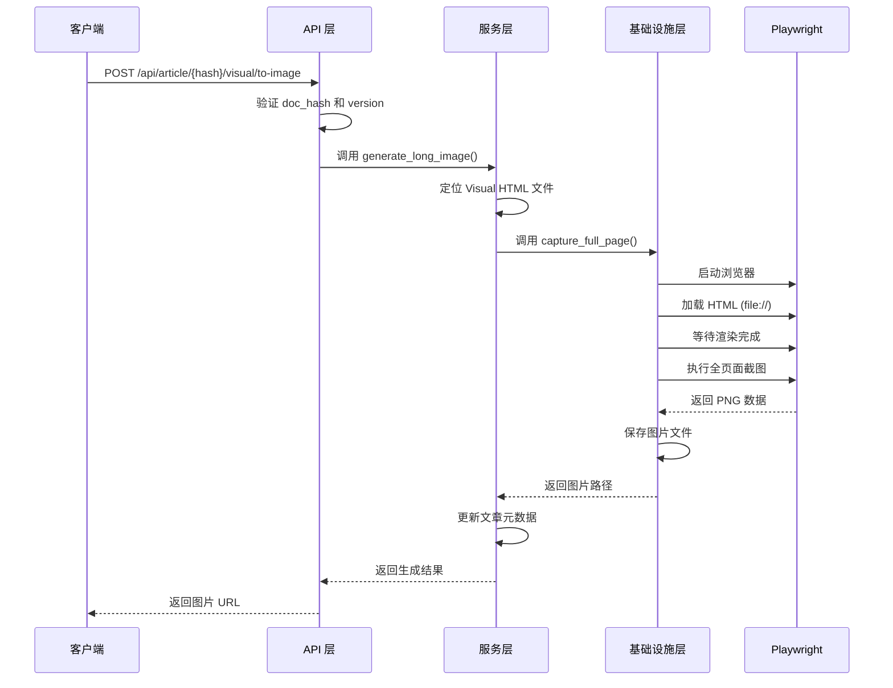

# Visual Insight 转长图功能设计

## 功能概述

将已生成的 Visual Insight HTML 可视化解读文档转换为长图（PNG/JPEG格式），便于用户分享和保存。功能支持全页面截图，保留完整的可视化效果，包括图表、卡片、动画效果的静态呈现。

## 需求分析

### 用户场景

- 用户完成 Visual Insight 可视化解读生成后，希望将其导出为图片格式
- 需要在社交媒体、报告、演示文稿中分享可视化内容
- 需要保存完整的可视化效果作为存档

### 功能边界

- 输入：已生成的 Visual Insight HTML 文件（存储在 `OUTPUT_DIR` 目录）
- 输出：完整的长图文件（PNG 格式，保存至 `OUTPUT_DIR/images/` 目录）
- 触发方式：API 端点调用
- 适用范围：仅处理已生成的 Visual Insight HTML，不支持其他 HTML 文档

## 系统架构设计

### 分层职责

按照项目架构规范，功能组件分布如下：

| 层级 | 组件 | 职责 |
|-----|------|------|
| **API 层** | `api/routes/visual.py` | 新增长图生成端点 |
| **服务层** | `services/visual_to_image_service.py` | 长图生成业务逻辑 |
| **基础设施层** | `infrastructure/media/screenshot_generator.py` | Playwright 截图实现 |
| **核心层** | `core/config.py` | 添加长图生成配置项 |

### 依赖关系

```
API 层 (visual.py)
    ↓ 调用
服务层 (visual_to_image_service.py)
    ↓ 调用
基础设施层 (screenshot_generator.py)
    ↓ 使用
Playwright + Chromium 浏览器
```

## 技术方案

### 技术选型

**采用 Playwright + Chromium**

理由：
- 项目已安装 Playwright（用于 Cookie 服务）
- 原生支持全页面截图（`page.screenshot(full_page=True)`）
- 异步 API 与项目 FastAPI 架构一致
- 支持等待动画完成后截图，确保图表正确渲染

**替代方案对比**

| 方案 | 优势 | 劣势 | 是否采用 |
|-----|------|------|---------|
| Playwright | 已安装、异步、功能完善 | 需要浏览器依赖 | ✅ 采用 |
| Selenium | 成熟稳定 | 同步 API、性能较低 | ❌ 不采用 |
| Puppeteer | 功能强大 | 需要 Node.js 环境 | ❌ 不采用 |
| WeasyPrint | 轻量、无浏览器依赖 | 不支持复杂 CSS/JS | ❌ 不适用 |

### 截图流程设计

**阶段一：准备阶段**

1. 接收文档哈希和版本号参数
2. 定位 Visual Insight HTML 文件路径
3. 验证文件存在性

**阶段二：浏览器渲染**

1. 启动 Playwright Chromium 浏览器（无头模式）
2. 设置视口宽度（固定 1920px，适合桌面查看）
3. 加载 HTML 文件（通过 `file://` 协议）
4. 等待页面完全加载（等待网络空闲）
5. 等待图表渲染完成（等待 Chart.js 初始化，延迟 2 秒）

**阶段三：截图生成**

1. 执行全页面截图（`full_page=True`）
2. 生成 PNG 格式图片
3. 保存至指定目录（`OUTPUT_DIR/images/{doc_hash}_visual.png`）

**阶段四：元数据更新**

1. 更新文章 YAML front matter，记录长图生成状态
2. 返回长图文件路径和元信息

### 流程图



## API 设计

### 生成长图端点

**端点定义**

```
POST /api/article/{doc_hash}/visual/to-image
```

**请求参数**

| 参数 | 类型 | 位置 | 必填 | 说明 |
|-----|------|------|------|------|
| doc_hash | string | path | 是 | 文档哈希标识 |
| version | int | query | 否 | 版本号（默认为最新版本） |
| viewport_width | int | query | 否 | 视口宽度（默认 1920px） |

**响应格式**

成功（200）：
```json
{
  "status": "success",
  "image_url": "/api/article/{doc_hash}/visual/image",
  "image_path": "images/{doc_hash}_visual_v1.png",
  "file_size": 2048576,
  "dimensions": {
    "width": 1920,
    "height": 8640
  },
  "generated_at": "2024-12-10T12:00:00"
}
```

失败（404/500）：
```json
{
  "status": "error",
  "detail": "Visual Insight 文件未找到"
}
```

### 获取长图端点

**端点定义**

```
GET /api/article/{doc_hash}/visual/image
```

**请求参数**

| 参数 | 类型 | 位置 | 必填 | 说明 |
|-----|------|------|------|------|
| doc_hash | string | path | 是 | 文档哈希标识 |
| version | int | query | 否 | 版本号（默认为最新版本） |

**响应格式**

- 成功：返回 `image/png` 二进制流
- 失败：返回 404 错误

## 数据模型设计

### 长图元数据结构

在文章 Markdown YAML front matter 中添加 `visual_long_image` 字段：

```yaml
---
title: "文章标题"
visual_interpretation:
  status: "completed"
  file: "article_visual.html"
  generated_at: "2024-12-10T10:00:00"
visual_long_image:
  status: "completed"
  file: "images/article_visual.png"
  generated_at: "2024-12-10T12:00:00"
  dimensions:
    width: 1920
    height: 8640
  file_size: 2048576
---
```

### 文件命名规范

| 类型 | 命名格式 | 示例 |
|-----|---------|------|
| 无版本长图 | `{base_name}_visual.png` | `article_visual.png` |
| 有版本长图 | `{base_name}_v{version}_visual.png` | `article_v2_visual.png` |

存储路径：`OUTPUT_DIR/images/`

## 配置设计

### 新增配置项

在 `core/config.py` 中添加：

```python
# --- Visual Long Image 配置 ---
# 是否启用长图生成功能
VISUAL_LONG_IMAGE_ENABLED = os.getenv("VISUAL_LONG_IMAGE_ENABLED", "true").lower() == "true"

# 长图存储目录
VISUAL_LONG_IMAGE_DIR = OUTPUT_DIR / "images"

# 截图视口宽度（像素）
VISUAL_SCREENSHOT_VIEWPORT_WIDTH = int(os.getenv("VISUAL_SCREENSHOT_VIEWPORT_WIDTH", "1920"))

# 截图等待时间（秒，用于等待图表渲染）
VISUAL_SCREENSHOT_WAIT_TIME = int(os.getenv("VISUAL_SCREENSHOT_WAIT_TIME", "2"))

# 浏览器启动超时（秒）
VISUAL_SCREENSHOT_BROWSER_TIMEOUT = int(os.getenv("VISUAL_SCREENSHOT_BROWSER_TIMEOUT", "30"))
```

### 环境变量

在 `.env.example` 中添加：

```bash
# Visual Long Image 配置
VISUAL_LONG_IMAGE_ENABLED=true
VISUAL_SCREENSHOT_VIEWPORT_WIDTH=1920
VISUAL_SCREENSHOT_WAIT_TIME=2
VISUAL_SCREENSHOT_BROWSER_TIMEOUT=30
```

## 组件设计

### 基础设施层：ScreenshotGenerator

**文件位置**：`infrastructure/media/screenshot_generator.py`

**核心职责**：
- 封装 Playwright 截图逻辑
- 管理浏览器生命周期
- 处理截图异常和重试

**关键方法**：

| 方法名 | 参数 | 返回值 | 说明 |
|-------|------|--------|------|
| `capture_full_page` | html_path, output_path, viewport_width | Path | 执行全页面截图 |
| `_wait_for_charts` | page | None | 等待 Chart.js 图表渲染完成 |
| `_get_page_dimensions` | page | Dict | 获取页面实际尺寸 |

**技术细节**：

- 使用异步 Playwright API（`async_playwright`）
- 浏览器配置：无头模式、禁用 GPU、忽略 HTTPS 错误
- 等待策略：`networkidle` + 固定延迟（2秒）
- 截图参数：`full_page=True`、`type='png'`

### 服务层：VisualToImageService

**文件位置**：`services/visual_to_image_service.py`

**核心职责**：
- 业务逻辑协调
- 文件路径定位和验证
- 元数据更新

**关键方法**：

| 方法名 | 参数 | 返回值 | 说明 |
|-------|------|--------|------|
| `generate_long_image` | doc_hash, version, viewport_width | Dict | 生成长图主流程 |
| `_locate_visual_html` | doc_hash, version | Path | 定位 Visual HTML 文件 |
| `_update_metadata` | article_path, image_info | None | 更新文章元数据 |
| `get_long_image_path` | doc_hash, version | Optional[Path] | 获取已生成长图路径 |

### API 层：新增路由

**文件位置**：`api/routes/visual.py`

**新增端点**：

1. **生成长图端点**：
   - 路由：`POST /{doc_hash}/visual/to-image`
   - 调用服务层 `generate_long_image()`
   - 返回生成结果 JSON

2. **获取长图端点**：
   - 路由：`GET /{doc_hash}/visual/image`
   - 返回图片二进制流
   - 设置响应头：`Content-Type: image/png`

## 错误处理设计

### 异常场景及处理策略

| 场景 | 异常类型 | HTTP 状态码 | 处理策略 |
|-----|---------|------------|---------|
| Visual HTML 不存在 | FileNotFoundError | 404 | 提示用户先生成 Visual Insight |
| 浏览器启动失败 | BrowserLaunchError | 500 | 记录日志，返回服务器错误 |
| 截图超时 | TimeoutError | 500 | 重试一次，失败后返回错误 |
| 磁盘空间不足 | OSError | 500 | 清理临时文件，返回错误 |
| 图片保存失败 | IOError | 500 | 记录错误路径，提示管理员检查权限 |

### 日志记录规范

- INFO 级别：记录生成开始、完成、文件路径
- WARNING 级别：记录重试操作、性能超时
- ERROR 级别：记录所有异常详情，包括堆栈信息

## 性能考量

### 资源消耗分析

**典型 Visual HTML**（高度约 8000-12000px）

- 浏览器内存占用：约 200-400 MB
- 截图生成时间：2-5 秒
- 生成图片大小：1-3 MB（PNG 格式）

### 优化策略

1. **浏览器复用**：
   - 不采用浏览器复用（每次请求独立浏览器实例）
   - 理由：避免状态污染，确保截图一致性

2. **并发控制**：
   - 限制同时进行的截图任务数量（最多 2 个）
   - 使用异步信号量（`asyncio.Semaphore`）控制并发

3. **图片压缩**：
   - 采用 PNG 格式（保证清晰度）
   - 后续可扩展：支持 JPEG 格式和质量参数

4. **缓存策略**：
   - 已生成的长图不重复生成（除非 HTML 更新）
   - 检查文件修改时间判断是否需要重新生成

## 测试策略

### 单元测试范围

**基础设施层测试**：
- 模拟 HTML 文件截图
- 验证浏览器启动和关闭
- 测试异常场景（文件不存在、超时）

**服务层测试**：
- 测试文件定位逻辑
- 测试元数据更新
- 测试版本号处理

**API 层测试**：
- 测试端点响应格式
- 测试参数验证
- 测试错误码返回

### 集成测试场景

1. 端到端流程：生成 Visual Insight → 转换长图 → 下载图片
2. 版本管理：生成多版本 Visual → 分别转换长图
3. 并发场景：同时请求多个长图生成

### 性能测试指标

- 单次截图时间：< 5 秒
- 内存占用峰值：< 500 MB
- 并发 2 个任务响应时间：< 10 秒

## 部署考虑

### 依赖项

**新增 Python 包**：
- 无（Playwright 已安装）

**系统依赖**：
- Chromium 浏览器（通过 `playwright install chromium` 安装）
- 字体库（中文字体，确保文字渲染正确）

### 部署检查清单

- [ ] 确认 Playwright 已安装
- [ ] 执行 `playwright install chromium` 安装浏览器
- [ ] 创建 `OUTPUT_DIR/images/` 目录
- [ ] 配置环境变量（`.env` 文件）
- [ ] 测试截图功能是否正常

### 环境兼容性

| 环境 | 支持情况 | 备注 |
|-----|---------|------|
| Linux | ✅ 支持 | 推荐部署环境 |
| macOS | ✅ 支持 | 开发环境可用 |
| Windows | ⚠️ 部分支持 | 字体路径可能需要调整 |
| Docker | ✅ 支持 | 需安装浏览器依赖 |

## 后续扩展方向

### 功能增强

1. **格式支持**：
   - 支持 JPEG 格式（更小文件体积）
   - 支持 WebP 格式（更高压缩率）
   - 支持自定义图片质量参数

2. **尺寸定制**：
   - 支持自定义视口宽度
   - 支持生成多种尺寸（移动端/桌面端）

3. **水印功能**：
   - 在长图底部添加品牌水印
   - 添加生成时间戳

4. **批量生成**：
   - 支持批量将多个 Visual Insight 转换为长图
   - 提供批量下载 ZIP 压缩包

### 性能优化

1. **浏览器池**：
   - 实现浏览器实例池，减少启动时间
   - 定期清理空闲浏览器

2. **分段截图**：
   - 对超长页面（>20000px）采用分段截图+拼接策略
   - 降低内存占用

3. **CDN 集成**：
   - 生成后自动上传至 CDN
   - 提升图片访问速度

## 风险评估

| 风险 | 影响 | 概率 | 缓解措施 |
|-----|------|------|---------|
| Playwright 依赖缺失 | 功能不可用 | 低 | 部署脚本检测并安装 |
| 浏览器崩溃 | 单次生成失败 | 中 | 实现重试机制 |
| 磁盘空间不足 | 保存失败 | 低 | 定期清理旧图片，添加空间检查 |
| 图表渲染不完整 | 截图缺失内容 | 中 | 增加等待时间，检测图表加载状态 |
| 中文字体缺失 | 文字显示异常 | 中 | 安装脚本自动安装中文字体 |

## 实现优先级

**P0（必须实现）**：
- 基础截图功能（全页面 PNG）
- API 端点（生成、获取）
- 元数据更新
- 错误处理

**P1（建议实现）**：
- 并发控制
- 缓存机制
- 日志完善

**P2（后续扩展）**：
- 格式支持（JPEG/WebP）
- 尺寸定制
- 水印功能

## 验收标准

### 功能验收

- [ ] 能够成功将 Visual Insight HTML 转换为 PNG 长图
- [ ] 生成的长图保留完整页面内容，无截断
- [ ] API 端点返回正确的响应格式
- [ ] 元数据正确更新至文章 YAML front matter
- [ ] 图片文件正确保存至 `images/` 目录

### 质量验收

- [ ] 图表清晰可见，无渲染异常
- [ ] 中文字体显示正常
- [ ] 颜色和样式与 HTML 版本一致
- [ ] 图片文件大小合理（< 5MB）

### 性能验收

- [ ] 单次生成时间 < 5 秒
- [ ] 并发 2 个请求不影响系统稳定性
- [ ] 内存占用峰值 < 500 MB

### 稳定性验收

- [ ] 连续生成 10 次无错误
- [ ] 异常场景（文件不存在、超时）正确处理
- [ ] 日志完整记录所有关键操作
