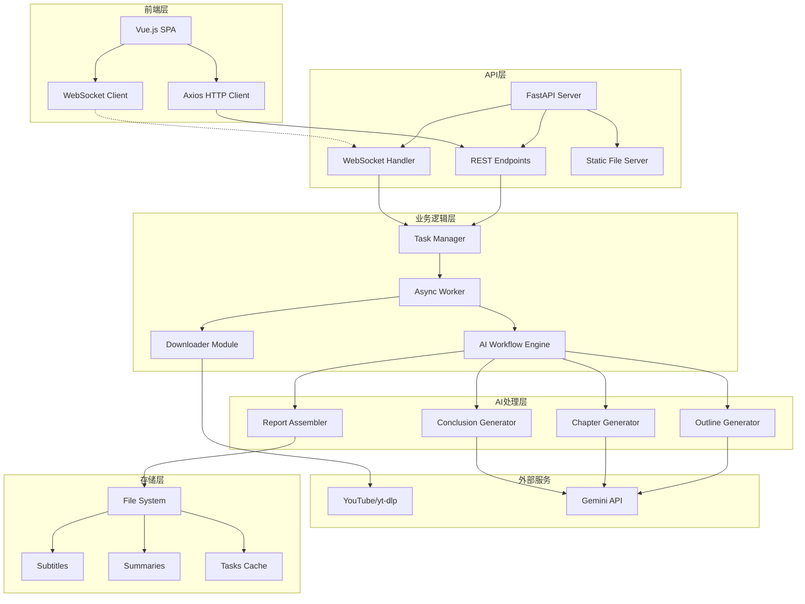
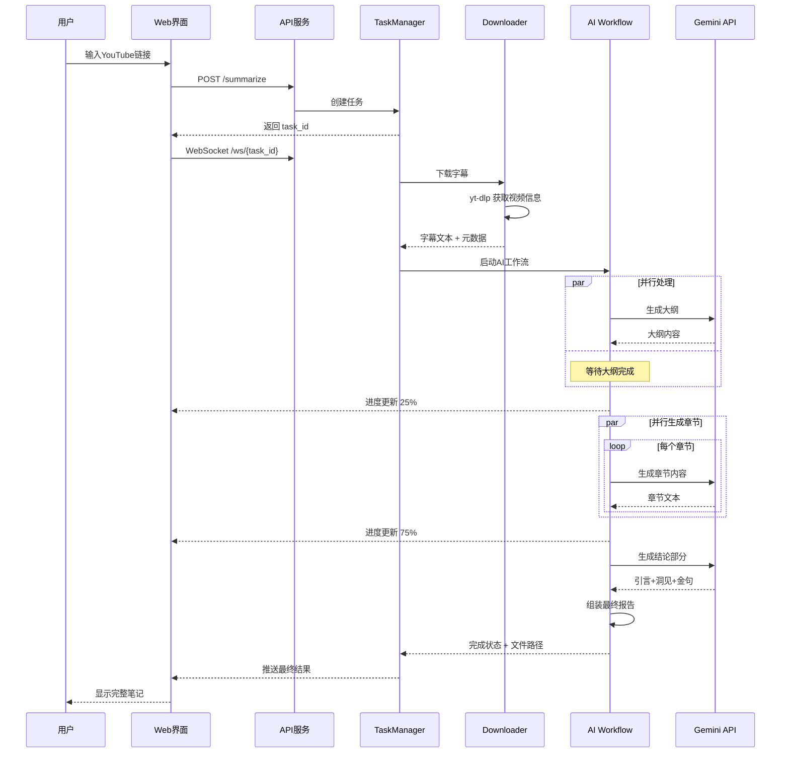

# Reinvent Insight - YouTube视频深度分析平台

<div align="center">

[](https://www.python.org/downloads/)
[](https://fastapi.tiangolo.com/)
[](https://vuejs.org/)
[](LICENSE)
[](https://github.com/benjamin1108/reinvent-insight)

**🚀 基于 AI 的 YouTube 视频深度分析平台**

将长篇技术演讲转化为结构化的深度笔记，让知识获取效率提升 10 倍

[功能特性](#-功能特性) • [快速开始](#-快速开始) • [架构设计](#-架构设计) • [API文档](#-api-文档) • [部署指南](#-部署指南)

</div>

---

## 📖 目录

- [项目简介](#项目简介)
- [核心特性](#-核心特性)
- [系统架构](#-系统架构)
- [技术栈](#-技术栈)
- [快速开始](#-快速开始)
- [使用指南](#-使用指南)
- [API文档](#-api-文档)
- [开发指南](#-开发指南)
- [部署说明](#-部署说明)
- [常见问题](#-常见问题)
- [贡献指南](#-贡献指南)

## 项目简介

**Reinvent Insight** 是一个创新的 AI 驱动平台，专门用于分析 YouTube 技术视频（特别是 AWS re:Invent 演讲）并生成可替代观看的深度笔记。通过先进的语言模型和精心设计的提示词工程，平台能够：

- 🎯 **智能提取**：自动下载字幕并清洗优化，减少 80%+ 冗余信息
- 🧠 **深度分析**：使用 Gemini 2.5 Pro 生成结构化的长文笔记
- 📊 **并行处理**：异步架构支持批量视频分析和实时进度反馈
- 🎨 **优雅展示**：科技感 UI 设计，支持 Markdown 渲染和 PDF 导出

## ✨ 核心特性

### 🎯 智能分析能力
- **多层次内容生成**：标题 → 大纲 → 章节内容 → 洞见总结 → 金句提炼
- **Token 优化算法**：智能清洗字幕，大幅降低 API 调用成本
- **并行章节生成**：10-20 个章节同时生成，效率提升 5-10 倍
- **版本管理系统**：同一视频支持多次分析，便于对比迭代

### 🚀 多端交互体验
- **CLI 工具**：支持交互式菜单、批量处理、命令行参数
- **Web 界面**：Vue.js 3 构建的现代化 SPA，响应式设计
- **API 服务**：RESTful API + WebSocket 实时通信
- **分享系统**：短链接生成，无需登录即可查看分享内容

### 🔧 企业级特性
- **异步任务架构**：基于 asyncio 的高性能任务处理
- **实时进度推送**：WebSocket 双向通信，毫秒级状态更新
- **错误恢复机制**：智能重试、断点续传、优雅降级
- **可扩展设计**：模块化架构，易于添加新的 AI 模型和功能

## 🏗 系统架构

### 整体架构图



### 核心工作流



## 🛠 技术栈

### 后端技术
| 技术 | 版本 | 用途 |
|------|------|------|
| Python | 3.9+ | 主要开发语言 |
| FastAPI | 0.111.0+ | 高性能 Web 框架 |
| asyncio | - | 异步并发处理 |
| WebSocket | - | 实时双向通信 |
| yt-dlp | latest | YouTube 字幕下载 |
| Google Generative AI | 0.5.4+ | Gemini API 客户端 |
| loguru | 0.7.2+ | 结构化日志 |
| rich | 13.7.1+ | 终端美化输出 |
| questionary | 2.0.1+ | CLI 交互界面 |

### 前端技术
| 技术 | 版本 | 用途 |
|------|------|------|
| Vue.js | 3.0+ | 前端框架 |
| Axios | latest | HTTP 客户端 |
| WebSocket | - | 实时通信 |
| Tailwind CSS | 3.0+ | 样式框架 |
| marked.js | latest | Markdown 渲染 |
| highlight.js | 11.9.0 | 代码高亮 |

### AI 模型
- **主模型**: Google Gemini 2.5 Pro (128K context)
- **备选模型**: XAI (预留接口), Alibaba (预留接口)

## 🚀 快速开始

### 1. 环境要求

- Python 3.9 或更高版本
- Git
- 稳定的网络连接（用于访问 YouTube 和 AI API）

### 2. 安装步骤

```bash
# 1. 克隆项目
git clone https://github.com/benjamin1108/reinvent-insight.git
cd reinvent-insight

# 2. 安装 uv 包管理器（推荐）
curl -LsSf https://astral.sh/uv/install.sh | sh   # macOS/Linux
# 或
pip install uv                                     # 使用 pip

# 3. 创建虚拟环境
uv venv                         # 创建 .venv
source .venv/bin/activate       # 激活虚拟环境 (Linux/macOS)
# .venv\Scripts\activate        # Windows

# 4. 安装依赖
uv pip install -e .             # 安装项目和所有依赖
```

### 3. 配置设置

```bash
# 1. 复制配置模板
cp .env.example .env

# 2. 编辑配置文件
nano .env                       # 或使用你喜欢的编辑器
```

**必需的配置项：**
```bash
# AI API密钥（至少配置一个）
GEMINI_API_KEY="your-gemini-api-key"         # Google Gemini (推荐)
XAI_API_KEY="your-xai-api-key"               # XAI (可选)
ALIBABA_API_KEY="your-alibaba-api-key"       # 阿里云 (可选)

# Web界面认证
ADMIN_USERNAME="admin"                        # 管理员用户名
ADMIN_PASSWORD="your-secure-password"         # 管理员密码

# 系统配置
LOG_LEVEL="INFO"                             # 日志级别
PREFERRED_MODEL="Gemini"                     # 默认AI模型
```

### 4. 快速体验

```bash
# 方式1：CLI 交互模式
youtube-summarizer

# 方式2：Web 界面（推荐）
python -m src.youtube_summarizer.main web

# 然后访问：http://localhost:8001
```

## 📘 使用指南

### CLI 使用方式

#### 1. 交互式模式
```bash
youtube-summarizer
```
- 通过友好的菜单选择操作
- 支持中文提示和彩色输出

#### 2. 命令行参数模式
```bash
# 分析单个视频
youtube-summarizer --url "https://www.youtube.com/watch?v=xxxxx"

# 批量处理
youtube-summarizer --file video_list.txt --concurrency 3

# 启动 Web 服务
youtube-summarizer web --host 0.0.0.0 --port 8001 --reload

# 重新组装报告
youtube-summarizer reassemble <task_id>
```

### Web 界面使用

1. **访问主页**: http://localhost:8001
2. **登录系统**: 使用配置的用户名密码
3. **创建分析**:
   - 点击"创建深度解读"
   - 粘贴 YouTube 链接
   - 点击"开始分析"
   - 实时查看处理进度
4. **浏览笔记**:
   - 点击"浏览笔记库"
   - 支持按级别、年份筛选
   - 点击卡片查看详情
5. **分享笔记**:
   - 在阅读界面点击分享按钮
   - 复制短链接发送给他人

### 批量处理指南

创建 `urls.txt` 文件：
```
https://www.youtube.com/watch?v=video1
https://www.youtube.com/watch?v=video2
https://www.youtube.com/watch?v=video3
```

执行批量处理：
```bash
youtube-summarizer --file urls.txt --concurrency 5
```

## 📚 API 文档

### 认证

所有需要认证的接口都需要在 Header 中携带 Bearer Token：
```
Authorization: Bearer <your-token>
```

### 核心接口

#### 1. 用户登录
```http
POST /login
Content-Type: application/json

{
  "username": "admin",
  "password": "your-password"
}

Response:
{
  "token": "your-bearer-token"
}
```

#### 2. 创建摘要任务
```http
POST /summarize
Authorization: Bearer <token>
Content-Type: application/json

{
  "url": "https://www.youtube.com/watch?v=xxxxx",
  "task_id": null  // 可选，用于重连
}

Response:
{
  "task_id": "uuid-string",
  "message": "任务已创建",
  "status": "created"
}
```

#### 3. WebSocket 连接
```javascript
const ws = new WebSocket(`ws://localhost:8001/ws/${taskId}`);

// 接收的消息类型
{
  "type": "log",      // 日志消息
  "message": "正在下载字幕..."
}

{
  "type": "progress", // 进度更新
  "progress": 50,
  "message": "正在生成章节内容..."
}

{
  "type": "result",   // 最终结果
  "title": "深度解析...",
  "summary": "# 完整的Markdown内容..."
}

{
  "type": "error",    // 错误信息
  "message": "处理失败：..."
}
```

#### 4. 获取摘要列表
```http
GET /api/public/summaries

Response:
{
  "summaries": [
    {
      "filename": "video_title.md",
      "title_cn": "中文标题",
      "title_en": "English Title",
      "size": 125000,
      "word_count": 15000,
      "created_at": 1234567890,
      "upload_date": "2024-01-01",
      "video_url": "https://...",
      "is_reinvent": true,
      "course_code": "NET402",
      "level": "400",
      "hash": "a1b2c3d4"
    }
  ]
}
```

#### 5. 获取摘要内容
```http
GET /api/public/summaries/{filename}
GET /api/public/doc/{hash}  // 短链接方式

Response:
{
  "filename": "video_title.md",
  "title_cn": "中文标题",
  "title_en": "English Title", 
  "content": "完整的Markdown内容",
  "video_url": "https://...",
  "versions": [...]  // 版本列表
}
```

#### 6. 下载 PDF
```http
GET /api/public/summaries/{filename}/pdf

Response: PDF文件流
```

## 🔧 开发指南

### 项目结构
```
reinvent-insight/
├── src/youtube_summarizer/      # 核心代码
│   ├── __init__.py             # 包初始化
│   ├── config.py               # 配置管理
│   ├── logger.py               # 日志系统
│   ├── main.py                 # CLI入口
│   ├── api.py                  # FastAPI服务
│   ├── downloader.py           # 字幕下载
│   ├── summarizer.py           # AI摘要器
│   ├── workflow.py             # 工作流引擎
│   ├── task_manager.py         # 任务管理
│   ├── worker.py               # 异步工作器
│   └── prompts.py              # 提示词模板
├── web/                        # 前端代码
│   ├── index.html              # 主页面
│   ├── css/                    # 样式文件
│   └── js/                     # JavaScript
├── prompt/                     # AI提示词
│   └── youtbe-deep-summary.txt # 基础提示词
├── tools/                      # 辅助工具
│   ├── generate_pdfs.py        # PDF生成
│   └── update_metadata.py      # 元数据更新
├── downloads/                  # 数据存储
│   ├── subtitles/              # 字幕文件
│   ├── summaries/              # 摘要文件
│   └── tasks/                  # 任务缓存
├── test/                       # 测试代码
├── pyproject.toml              # 项目配置
├── uv.lock                     # 依赖锁定
└── .env                        # 环境变量
```

### 添加新的 AI 模型

1. 在 `summarizer.py` 中创建新的摘要器类：
```python
class NewModelSummarizer(Summarizer):
    async def generate_content(self, prompt: str, is_json: bool = False) -> str | None:
        # 实现你的模型调用逻辑
        pass
```

2. 在 `MODEL_MAP` 中注册：
```python
MODEL_MAP = {
    "NewModel": (NewModelSummarizer, config.NEWMODEL_API_KEY),
}
```

3. 在 `config.py` 中添加配置：
```python
NEWMODEL_API_KEY = os.getenv("NEWMODEL_API_KEY")
```

### 自定义提示词

编辑 `prompt/youtbe-deep-summary.txt` 文件，可以调整：
- AI 角色设定
- 输出格式要求
- 内容结构定义
- 写作风格指导

### 调试技巧

1. **启用调试日志**:
```bash
LOG_LEVEL=DEBUG youtube-summarizer
```

2. **查看任务详情**:
```bash
ls -la downloads/tasks/<task_id>/
```

3. **手动测试 API**:
```bash
curl -X POST http://localhost:8001/login \
  -H "Content-Type: application/json" \
  -d '{"username":"admin","password":"password"}'
```

## 🚢 部署说明

### Docker 部署（推荐）

```dockerfile
# Dockerfile
FROM python:3.9-slim

WORKDIR /app

# 安装系统依赖
RUN apt-get update && apt-get install -y \
    ffmpeg \
    && rm -rf /var/lib/apt/lists/*

# 安装 Python 依赖
COPY pyproject.toml uv.lock ./
RUN pip install uv && uv pip install -r pyproject.toml

# 复制代码
COPY . .

# 暴露端口
EXPOSE 8001

# 启动命令
CMD ["python", "-m", "src.youtube_summarizer.main", "web", "--host", "0.0.0.0", "--port", "8001"]
```

### 生产环境配置

1. **使用环境变量**:
```bash
export GEMINI_API_KEY="your-production-key"
export ADMIN_PASSWORD="strong-password-here"
export LOG_LEVEL="WARNING"
```

2. **使用 Nginx 反向代理**:
```nginx
server {
    listen 80;
    server_name your-domain.com;

    location / {
        proxy_pass http://localhost:8001;
        proxy_http_version 1.1;
        proxy_set_header Upgrade $http_upgrade;
        proxy_set_header Connection "upgrade";
        proxy_set_header Host $host;
        proxy_set_header X-Real-IP $remote_addr;
    }
}
```

3. **使用 Supervisor 管理进程**:
```ini
[program:reinvent-insight]
command=/app/.venv/bin/python -m src.youtube_summarizer.main web
directory=/app
autostart=true
autorestart=true
stderr_logfile=/var/log/reinvent-insight.err.log
stdout_logfile=/var/log/reinvent-insight.out.log
```

### 性能优化建议

1. **API 并发限制**: 在 `config.py` 中调整 `CHAPTER_GENERATION_DELAY_SECONDS`
2. **缓存策略**: 已处理的视频直接返回现有结果
3. **CDN 加速**: 静态资源使用 CDN
4. **数据库升级**: 考虑使用 PostgreSQL 存储元数据

## ❓ 常见问题

### Q1: 如何获取 Gemini API Key？
访问 [Google AI Studio](https://makersuite.google.com/app/apikey) 创建免费的 API Key。

### Q2: 支持哪些视频？
- 必须有英文字幕（人工或自动生成）
- 建议时长在 10-90 分钟
- 技术类内容效果最佳

### Q3: 生成失败怎么办？
1. 检查网络连接
2. 确认 API Key 有效
3. 查看日志文件了解详情
4. 尝试使用 `reassemble` 命令重新生成

### Q4: 如何优化生成质量？
1. 调整 `temperature` 参数（在 `summarizer.py` 中）
2. 修改提示词模板
3. 增加重试次数

## 🤝 贡献指南

我们欢迎所有形式的贡献！

### 贡献方式
1. 🐛 提交 Bug 报告
2. 💡 提出新功能建议
3. 📝 改进文档
4. 🔧 提交代码改进

### 开发流程
1. Fork 项目
2. 创建特性分支 (`git checkout -b feature/AmazingFeature`)
3. 提交更改 (`git commit -m 'Add some AmazingFeature'`)
4. 推送到分支 (`git push origin feature/AmazingFeature`)
5. 开启 Pull Request

### 代码规范
- 使用 `ruff` 进行代码格式化
- 遵循 PEP 8 规范
- 添加适当的注释和文档
- 编写单元测试

## 📄 许可协议

本项目基于 MIT License 开源。详见 [LICENSE](LICENSE) 文件。

## 🙏 致谢

- [yt-dlp](https://github.com/yt-dlp/yt-dlp) - 强大的视频下载工具
- [Google Gemini](https://deepmind.google/technologies/gemini/) - 先进的语言模型
- [FastAPI](https://fastapi.tiangolo.com/) - 现代化的 Python Web 框架
- [Vue.js](https://vuejs.org/) - 渐进式 JavaScript 框架

---

<div align="center">

**⭐ 如果这个项目对你有帮助，请给我们一个 Star！**

[提交 Issue](https://github.com/benjamin1108/reinvent-insight/issues) | [查看 Wiki](https://github.com/benjamin1108/reinvent-insight/wiki) | [加入讨论](https://github.com/benjamin1108/reinvent-insight/discussions)

</div>
