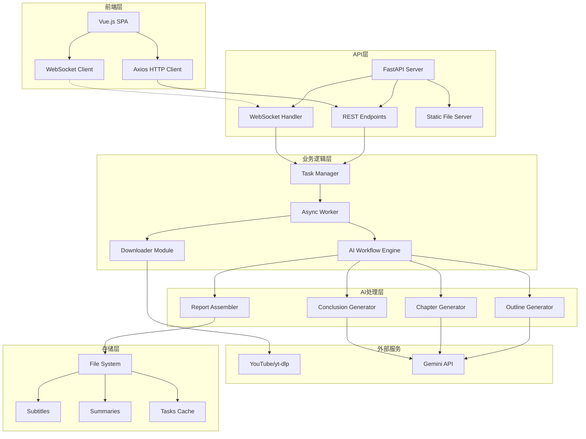
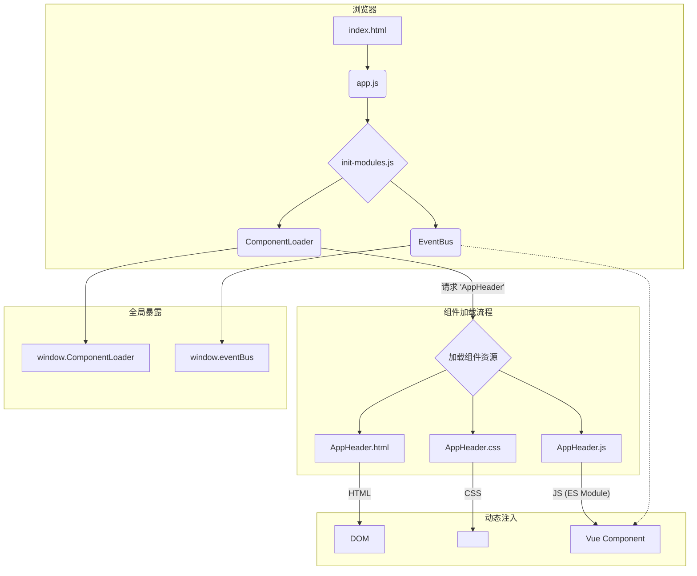
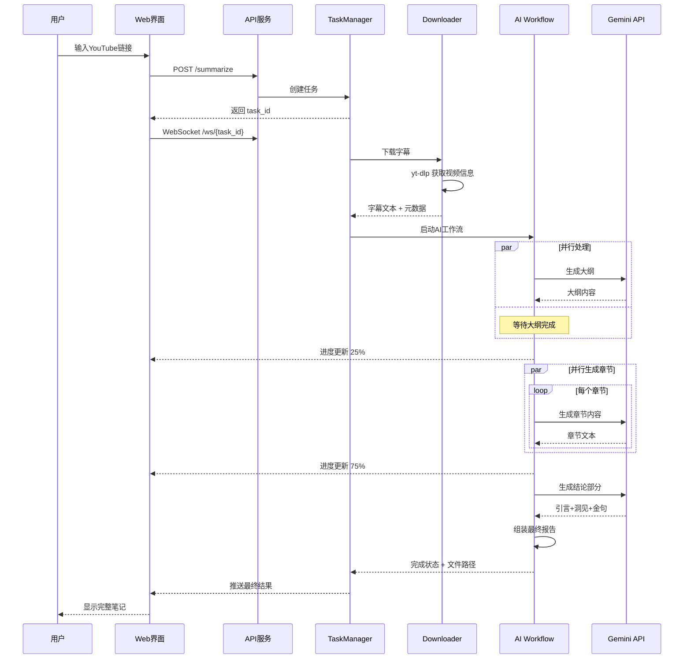

# Reinvent Insight - YouTube视频深度分析平台

<div align="center">

[](https://www.python.org/downloads/)
[](https://fastapi.tiangolo.com/)
[](https://vuejs.org/)
[](LICENSE)
[](https://github.com/benjamin1108/reinvent-insight)

**🚀 基于 AI 的 YouTube 视频深度分析平台**

将长篇技术演讲转化为结构化的深度笔记，让知识获取效率提升 10 倍

[功能特性](#-功能特性) • [快速开始](#-快速开始) • [架构设计](#-架构设计) • [API文档](#-api-文档) • [部署指南](#-部署指南) • [开发指南](#-开发指南)

</div>

---

## 📖 目录

- [项目简介](#项目简介)
- [核心特性](#-核心特性)
- [系统架构](#-系统架构)
- [技术栈](#-技术栈)
- [快速开始](#-快速开始)
- [使用指南](#-使用指南)
- [API文档](#-api-文档)
- [开发指南](#-开发指南)
- [部署说明](#-部署说明)
- [常见问题](#-常见问题)
- [贡献指南](#-贡献指南)

## 项目简介

**Reinvent Insight** 是一个创新的 AI 驱动平台，专门用于分析 YouTube 技术视频（特别是 AWS re:Invent 演讲）并生成可替代观看的深度笔记。通过先进的语言模型和精心设计的提示词工程，平台能够：

- 🎯 **智能提取**：自动下载字幕并清洗优化，减少 80%+ 冗余信息
- 🧠 **深度分析**：使用 Gemini 2.5 Pro 生成结构化的长文笔记
- 📊 **并行处理**：异步架构支持批量视频分析和实时进度反馈
- 🎨 **优雅展示**：科技感 UI 设计，支持 Markdown 渲染和 PDF 导出

## ✨ 核心特性

### 🎯 智能分析能力
- **多层次内容生成**：标题 → 大纲 → 章节内容 → 洞见总结 → 金句提炼
- **Token 优化算法**：智能清洗字幕，大幅降低 API 调用成本
- **并行章节生成**：10-20 个章节同时生成，效率提升 5-10 倍
- **版本管理系统**：同一视频支持多次分析，便于对比迭代

### 🚀 多端交互体验
- **CLI 工具**：支持交互式菜单、批量处理、命令行参数
- **Web 界面**：Vue.js 3 构建的现代化 SPA，响应式设计
- **API 服务**：RESTful API + WebSocket 实时通信
- **分享系统**：短链接生成，无需登录即可查看分享内容

### 🔧 企业级特性
- **异步任务架构**：基于 asyncio 的高性能任务处理
- **实时进度推送**：WebSocket 双向通信，毫秒级状态更新
- **错误恢复机制**：智能重试、断点续传、优雅降级
- **可扩展设计**：模块化架构，易于添加新的 AI 模型和功能

### 💎 前端体验与架构
- **模块化组件系统**: 采用自定义的、免构建的Vue 3组件化方案，实现了UI的快速开发与维护。
- **丰富的组件库**: 包含`TechButton`、`Toast`、`ProgressBar`等一系列可复用、可定制主题的共享组件。
- **动态异步加载**: 组件的HTML, CSS, JS被异步加载，显著提升了首屏性能。
- **响应式设计**: 完美适配桌面、平板和移动设备，确保在所有终端上都有一致的优质体验。

## 🏗 系统架构

### 整体架构图



### 前端架构
项目前端采用了一种创新的 **"免构建" Vue 3 架构**，旨在简化开发流程并最大化性能。

- **核心加载器**: `component-loader.js` 是架构的核心，它负责动态、异步地获取和渲染组件。当需要一个组件时，它会并行请求该组件的 `.html`, `.css`, 和 `.js` 文件。
- **组件化**: 所有UI元素都被拆分为独立的组件（位于 `web/components/`），每个组件都封装了自己的视图(HTML)、样式(CSS)和逻辑(JS)。这种方式使得组件高度内聚和可复用。
- **全局通信**: 使用 `event-bus.js` 实现了一个轻量级的全局事件总线，用于处理跨组件之间的通信，解耦了组件间的直接依赖。
- **原生技术栈**: 该架构不依赖于Node.js、Webpack或Vite等重型工具链，直接使用浏览器原生支持的ES模块、Fetch API等技术，回归了Web开发的本质。



### 核心工作流



## 🛠 技术栈

### 后端技术
| 技术 | 版本 | 用途 |
|------|------|------|
| Python | 3.9+ | 主要开发语言 |
| FastAPI | 0.111.0+ | 高性能 Web 框架 |
| asyncio | - | 异步并发处理 |
| WebSocket | - | 实时双向通信 |
| yt-dlp | latest | YouTube 字幕下载 |
| Google Generative AI | 0.5.4+ | Gemini API 客户端 |
| loguru | 0.7.2+ | 结构化日志 |
| rich | 13.7.1+ | 终端美化输出 |
| questionary | 2.0.1+ | CLI 交互界面 |

### 前端技术
| 技术 | 版本 | 用途 |
|------|------|------|
| Vue.js | 3.0+ | 前端框架 |
| Axios | latest | HTTP 客户端 |
| WebSocket | - | 实时通信 |
| marked.js | latest | Markdown 渲染 |
| highlight.js | 11.9.0 | 代码高亮 |

### AI 模型
- **主模型**: Google Gemini 2.5 Pro (128K context)
- **备选模型**: XAI (预留接口), Alibaba (预留接口)

## 🚀 快速开始

### 1. 环境要求

- Python 3.9 或更高版本
- Git
- 稳定的网络连接（用于访问 YouTube 和 AI API）

### 2. 安装步骤

```bash
# 1. 克隆项目
git clone https://github.com/benjamin1108/reinvent-insight.git
cd reinvent-insight

# 2. 安装 uv 包管理器（推荐）
curl -LsSf https://astral.sh/uv/install.sh | sh   # macOS/Linux
# 或
pip install uv                                     # 使用 pip

# 3. 创建虚拟环境
uv venv                         # 创建 .venv
source .venv/bin/activate       # 激活虚拟环境 (Linux/macOS)
# .venv\Scripts\activate        # Windows

# 4. 安装依赖
uv pip install -e .             # 安装项目和所有依赖
```

### 3. 配置设置

```bash
# 1. 创建配置文件
# 如果项目中有 .env.example：
cp .env.example .env

# 如果没有 .env.example，手动创建：
cat > .env << EOF
GEMINI_API_KEY=your-gemini-api-key-here
ADMIN_USERNAME=admin
ADMIN_PASSWORD=your-secure-password
LOG_LEVEL=INFO
PREFERRED_MODEL=Gemini
EOF

# 2. 编辑配置文件
nano .env                       # 或使用你喜欢的编辑器
```

**必需的配置项：**
```bash
# AI API密钥（至少配置一个）
GEMINI_API_KEY="your-gemini-api-key"         # Google Gemini (推荐)
XAI_API_KEY="your-xai-api-key"               # XAI (可选)
ALIBABA_API_KEY="your-alibaba-api-key"       # 阿里云 (可选)

# Web界面认证
ADMIN_USERNAME="admin"                        # 管理员用户名
ADMIN_PASSWORD="your-secure-password"         # 管理员密码

# 系统配置
LOG_LEVEL="INFO"                             # 日志级别
PREFERRED_MODEL="Gemini"                     # 默认AI模型
```

### 4. 快速体验

```bash
# 方式1：CLI 交互模式
reinvent-insight

# 方式2：Web 界面（推荐） - 开发环境
./run-dev.sh  # 默认运行在 http://localhost:8002

# 或者手动启动（生产环境）
python -m src.reinvent_insight.main web  # 默认运行在 http://localhost:8001
```

## 📘 使用指南

### CLI 使用方式

#### 1. 交互式模式
```bash
reinvent-insight
```
- 通过友好的菜单选择操作
- 支持中文提示和彩色输出

#### 2. 命令行参数模式
```bash
# 分析单个视频
reinvent-insight --url "https://www.youtube.com/watch?v=xxxxx"

# 批量处理
reinvent-insight --file video_list.txt --concurrency 3

# 启动 Web 服务
reinvent-insight web --host 0.0.0.0 --port 8001 --reload

# 重新组装报告
reinvent-insight reassemble <task_id>
```

### Web 界面使用

1. **访问主页**: 
   - 开发环境: http://localhost:8002 (使用 `./run-dev.sh`)
   - 生产环境: http://localhost:8001 (使用 `reinvent-insight web`)
2. **登录系统**: 使用配置的用户名密码
3. **创建分析**:
   - 点击"创建深度解读"
   - 粘贴 YouTube 链接
   - 点击"开始分析"
   - 实时查看处理进度
4. **浏览笔记**:
   - 点击"浏览笔记库"
   - 支持按级别、年份筛选
   - 点击卡片查看详情
5. **分享笔记**:
   - 在阅读界面点击分享按钮
   - 复制短链接发送给他人

### 批量处理指南

创建 `urls.txt` 文件：
```
https://www.youtube.com/watch?v=video1
https://www.youtube.com/watch?v=video2
https://www.youtube.com/watch?v=video3
```

执行批量处理：
```bash
reinvent-insight --file urls.txt --concurrency 5
```

## 📚 API 文档

### 认证

所有需要认证的接口都需要在 Header 中携带 Bearer Token：
```
Authorization: Bearer <your-token>
```

### 核心接口

#### 1. 用户登录
```http
POST /login
Content-Type: application/json

{
  "username": "admin",
  "password": "your-password"
}

Response:
{
  "token": "your-bearer-token"
}
```

#### 2. 获取环境信息
```http
GET /api/env

Response:
{
  "environment": "development",
  "project_root": "/home/user/reinvent-insight",
  "host": "localhost",
  "port": "8001",
  "version": "0.1.0",
  "is_development": true
}
```

#### 3. 创建摘要任务
```http
POST /summarize
Authorization: Bearer <token>
Content-Type: application/json

{
  "url": "https://www.youtube.com/watch?v=xxxxx",
  "task_id": null  // 可选，用于重连
}

Response:
{
  "task_id": "uuid-string",
  "message": "任务已创建，请连接 WebSocket。",
  "status": "created"
}
```

#### 4. WebSocket 连接
```javascript
const ws = new WebSocket(`ws://localhost:8002/ws/${taskId}`);  // 开发环境
// const ws = new WebSocket(`ws://localhost:8001/ws/${taskId}`);  // 生产环境

// 接收的消息类型
{
  "type": "log",      // 日志消息
  "message": "正在下载字幕..."
}

{
  "type": "progress", // 进度更新
  "progress": 50,
  "message": "正在生成章节内容..."
}

{
  "type": "result",   // 最终结果
  "title": "深度解析...",
  "summary": "# 完整的Markdown内容..."
}

{
  "type": "error",    // 错误信息
  "message": "处理失败：..."
}
```

#### 5. 获取摘要列表
```http
GET /api/public/summaries

Response:
{
  "summaries": [
    {
      "filename": "AWS reInvent 2024 - Dive into the depths of routing on AWS (NET318).md",
      "title_cn": "深入解析AWS路由：原理、实践与新功能 (NET318)",
      "title_en": "AWS re:Invent 2024 - Dive into the depths of routing on AWS (NET318)",
      "size": 132048,
      "word_count": 16502,
      "created_at": 1721286000,
      "modified_at": 1721286500,
      "upload_date": "2024-07-18",
      "video_url": "https://www.youtube.com/watch?v=example",
      "is_reinvent": true,
      "course_code": "NET318",
      "level": "300",
      "hash": "d4e5f6a1",
      "version": 1
    }
  ]
}
```

#### 6. 获取摘要内容
```http
GET /api/public/summaries/{filename}
GET /api/public/doc/{hash}  // 短链接方式
GET /api/public/doc/{hash}/{version}  // 指定版本

Response:
{
  "filename": "AWS reInvent 2024 - Dive into the depths of routing on AWS (NET318).md",
  "title": "深入解析AWS路由：原理、实践与新功能 (NET318)",  // 向后兼容
  "title_cn": "深入解析AWS路由：原理、实践与新功能 (NET318)",
  "title_en": "AWS re:Invent 2024 - Dive into the depths of routing on AWS (NET318)",
  "content": "完整的Markdown内容",
  "video_url": "https://...",
  "versions": [
    {
        "filename": "AWS reInvent 2024 - Dive into the depths of routing on AWS (NET318)_v1.md",
        "version": 1,
        "created_at": 1721286000
    },
    {
        "filename": "AWS reInvent 2024 - Dive into the depths of routing on AWS (NET318).md",
        "version": 0,
        "created_at": 1721280000
    }
  ]
}
```

#### 7. 下载 PDF
```http
GET /api/public/summaries/{filename}/pdf

Response: PDF文件流
```

#### 8. 获取摘要列表（需认证）
```http
GET /summaries
Authorization: Bearer <token>

Response: 同 /api/public/summaries
```

#### 9. 获取摘要内容（需认证）
```http
GET /summaries/{filename}
Authorization: Bearer <token>

Response: 同 /api/public/summaries/{filename}
```

## 🔧 开发指南

### 项目结构
```
reinvent-insight/
├── src/reinvent_insight/      # 核心后端代码 (Python)
│   ├── api.py                  # FastAPI 服务与接口
│   ├── config.py               # 应用配置管理
│   ├── downloader.py           # 字幕下载
│   ├── __init__.py             # 包初始化
│   ├── logger.py               # 日志系统
│   ├── main.py                 # CLI 入口与主程序
│   ├── markdown_processor.py   # Markdown处理
│   ├── pdf_generator.py        # PDF生成
│   ├── prompts.py              # 提示词模板
│   ├── summarizer.py           # AI摘要器
│   ├── task_manager.py         # 任务管理
│   ├── worker.py               # 异步工作器
│   └── workflow.py             # 核心AI工作流引擎
│   └── tools/                  # 辅助工具脚本
│       ├── __init__.py         # 包初始化
│       ├── generate_pdfs.py    # PDF生成脚本
│       ├── update_level.py     # 级别更新脚本
│       └── update_metadata.py  # 元数据更新脚本
├── web/                        # 核心前端代码 (Vanilla JS + Vue 3)
│   ├── index.html              # 应用主入口HTML
│   ├── components/             # 可复用的UI组件
│   │   ├── common/             # 页面级通用组件 (AppHeader, Toast)
│   │   ├── shared/             # 跨项目通用组件 (TechButton, ProgressBar)
│   │   └── views/              # 应用视图级组件 (CreateView, LibraryView)
│   ├── css/                    # 全局样式
│   ├── js/                     # JavaScript 核心逻辑
│   │   ├── core/               # 核心模块 (ComponentLoader, EventBus)
│   │   └── vendor/             # 第三方库 (Vue, Axios)
│   └── test/                   # 组件独立测试页面
├── prompt/                     # AI 提示词模板
├── downloads/                  # 数据存储 (字幕, 摘要, 任务缓存)
├── pyproject.toml              # 项目配置与依赖 (uv)
└── .env                        # 环境变量
```

### 添加新的 AI 模型

1. 在 `summarizer.py` 中创建新的摘要器类：
```python
class NewModelSummarizer(Summarizer):
    async def generate_content(self, prompt: str, is_json: bool = False) -> str | None:
        # 实现你的模型调用逻辑
        pass
```

2. 在 `MODEL_MAP` 中注册：
```python
MODEL_MAP = {
    "NewModel": (NewModelSummarizer, config.NEWMODEL_API_KEY),
}
```

3. 在 `config.py` 中添加配置：
```python
NEWMODEL_API_KEY = os.getenv("NEWMODEL_API_KEY")
```

### 自定义提示词

编辑 `prompt/youtbe-deep-summary.txt` 文件，可以调整：
- AI 角色设定
- 输出格式要求
- 内容结构定义
- 写作风格指导

### 调试技巧

1. **启用调试日志**:
```bash
LOG_LEVEL=DEBUG reinvent-insight
```

2. **查看任务详情**:
```bash
ls -la downloads/tasks/<task_id>/
```

3. **手动测试 API**:
```bash
curl -X POST http://localhost:8001/login \
  -H "Content-Type: application/json" \
  -d '{"username":"admin","password":"password"}'
```

## 🚢 部署说明

### 生产环境部署

使用自动化部署脚本进行生产环境部署：

```bash
# 使用部署脚本
./redeploy.sh

# 带选项的部署
./redeploy.sh --port 8080 --host 0.0.0.0
```

详细的部署说明请参考 [部署脚本详解](./docs/DEPLOY_SCRIPTS.md)。

### 生产环境配置

1. **使用环境变量**:
```bash
export GEMINI_API_KEY="your-production-key"
export ADMIN_PASSWORD="strong-password-here"
export LOG_LEVEL="WARNING"
```

2. **使用 Nginx 反向代理**:
```nginx
server {
    listen 80;
    server_name your-domain.com;

    location / {
        proxy_pass http://localhost:8001;
        proxy_http_version 1.1;
        proxy_set_header Upgrade $http_upgrade;
        proxy_set_header Connection "upgrade";
        proxy_set_header Host $host;
        proxy_set_header X-Real-IP $remote_addr;
    }
}
```

3. **使用 Supervisor 管理进程**:
```ini
[program:reinvent_insight_web]
command=/app/.venv/bin/python -m src.reinvent_insight.main web --host 0.0.0.0 --port 8001
directory=/app/
autostart=true
autorestart=true
stderr_logfile=/var/log/reinvent_insight_web.err.log
stdout_logfile=/var/log/reinvent_insight_web.out.log
user=your_user
```

### 性能优化建议

1. **API 并发限制**: 在 `config.py` 中调整 `CHAPTER_GENERATION_DELAY_SECONDS`
2. **缓存策略**: 利用 `downloads/tasks/` 目录缓存中间结果
3. **进程管理**: 使用 systemd 或 supervisor 管理服务进程
4. **并发控制**: 合理设置批量处理的并发数

## 📄 许可证

本项目采用 MIT 许可证

---

<div align="center">
  <sub>Built with ❤️ for the cloud architecture community</sub>
</div>